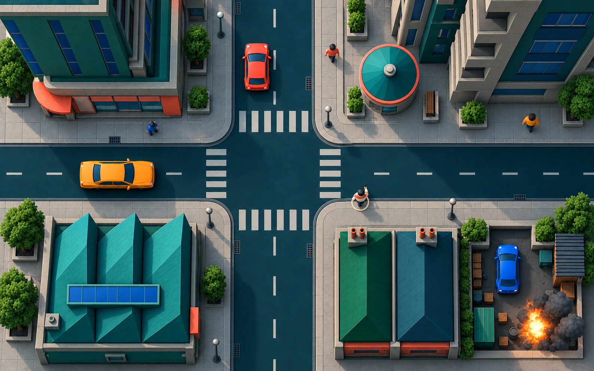
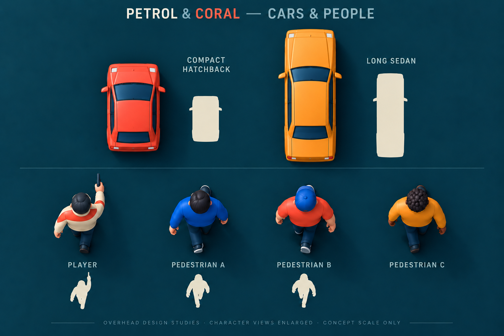
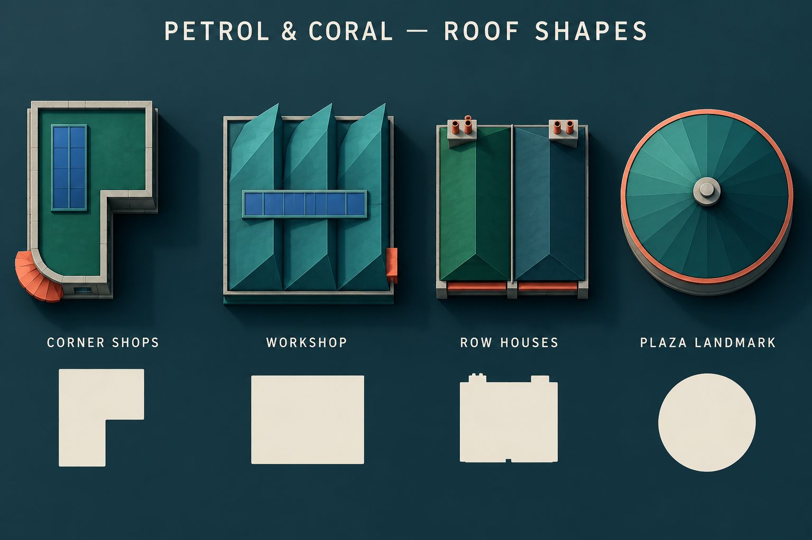
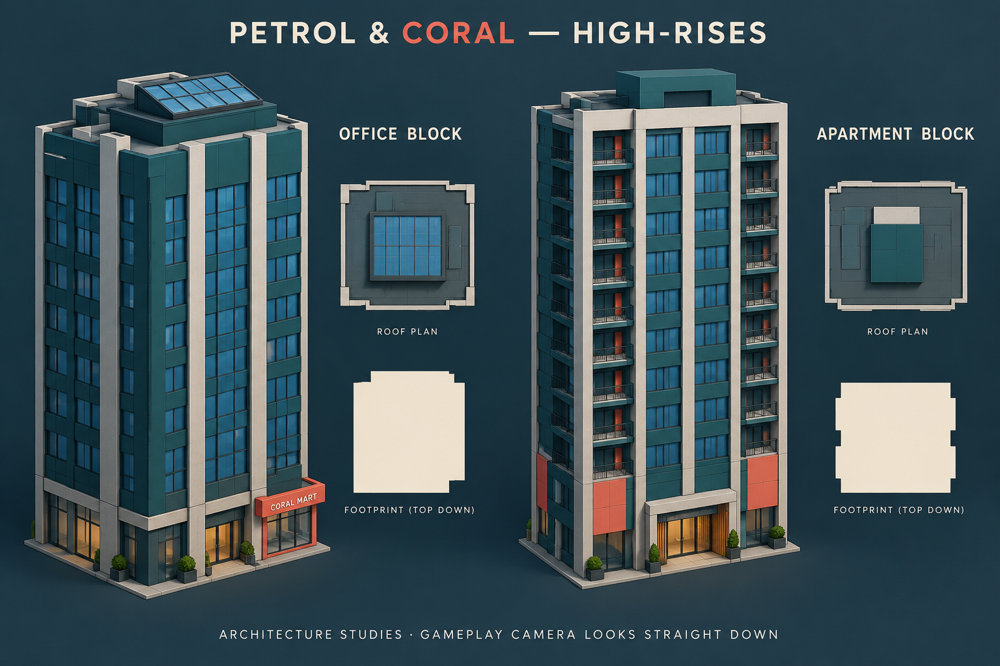
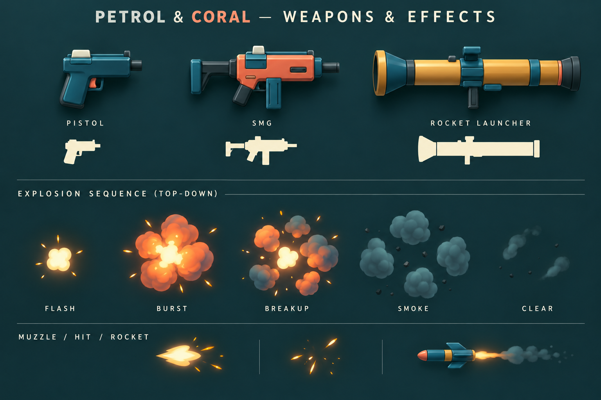

# P0-04 — art direction and concept review

Status, 7 October 2026: **P0-04 is complete under the acceptance below.** Petrol &
Coral, smooth stylized 3D and conventional high-rises are the accepted starting
direction. The gameplay camera points straight down and uses perspective projection.
The six-block city brief is accepted as the starting layout, with measurements
provisional. Codex owns the concepts and records; Regner owns selection.
Effort cap: this concept/refinement session.

Acceptance record: Regner said, “I like where the concepts are and I think it's
enough for us to continue.” This accepts the combined set for foundation work and
ends the current concept round. Actual gameplay-camera captures/paintovers and
held-weapon readability are deferred to S02/S04; M1-C1 refines production designs
using that evidence. These deferrals do not claim measured camera, movement or
performance acceptance. P0-GATE still reconciles the proof results.

[Open the complete visual review](concepts/p0-04/review.html) to see the current
set together, followed by every earlier concept. The [product brief](design.md)
owns gameplay scope; [world layout](world-layout.md) owns proposed dimensions.

## Current visual direction

Dark, rich petrol/teal and emerald surfaces with vivid coral/orange, cobalt and
amber accents. Smooth bevels, continuous shading and broad highlights give depth.
Keep ordinary shops, apartments, offices and workshops; cyberpunk supplies color
energy. Avoid pixel grids, sprite-like models, crunchy texture noise, grime and
dense fine detail. Retain playful signage.

Provisional art swatches: road petrol `#123646`, roof emerald `#15564F`, coral
`#FF725D`, cobalt `#235FCC`, amber `#FFC05A`, warm ivory `#F6F1DC`, sidewalk slate
`#85929D`. These are reference colors, not calibrated engine materials. Keep
streets quieter than actors, sidewalks in readable midtones, and flashes brief.
Fixed daytime lighting remains the scope; ambient fill must keep tower shadows
readable. Bloom must preserve silhouettes.

## Street composition and perspective camera

Regner confirmed **perspective projection**, with the camera looking vertically
down, and requested towers reaching or passing camera height. Fixed world yaw
remains. The earlier orthographic assumption is superseded. In perspective,
off-centre walls and roofs can show height even with zero camera tilt. Roofs close
to the camera may enlarge toward the frame edges; buildings above the camera need
deliberate clipping/occlusion treatment.

The current composition combines the actors, roof families and tall city masses.
A thin broken ivory ring beneath the local player is a presentation proposal,
not a ratified HUD feature. The ivory jacket and aim pose are insufficient to
identify the local player in every state; S02/P0-02 settle this treatment.

Reference inspection: [GTA2 official screenshot 2, mirrored by iGrandTheftAuto](https://www.igrandtheftauto.com/gta2/images/gta2-official-screenshot-2)
and [screenshot 4](https://www.igrandtheftauto.com/gta2/images/gta2-official-screenshot-4)
show tall facades extending to the frame edges while street action stays visible.
This is a visual inference from screenshots, not evidence of GTA2's exact camera
height, field of view or clipping implementation. Screenshots belong to Rockstar
Games; they were inspected as references and are not project assets. Designs here
are original.

The concept is 1586×992, approximately 8:5; it is not a measured 1280×800 capture.
The art still has too much foliage detail and dense smoke. The current sedan also
needs closer fidelity to the long-car sheet. All direction/framing observations
remain illustrative until a linked Blender fixture is tested in Godot at the
actual vertical perspective camera. Test foot/car views, turns, tower clipping,
target visibility and handheld readability in S02/S04.

## Cars and shared people

A short square hatchback and a longer sedan with a separate bonnet and trunk.
Filled silhouettes distinguish shape without paint. Both receive color variants;
geometry must carry recognition. Shapes do not imply different handling rules.
The proposed dimensions live in the world-layout record and remain provisional.

One chunky human rig supports an ivory/coral player and cobalt, coral and amber
pedestrian variants. Broad clothing, hair/cap shapes and poses carry identity.
The sheet enlarges people relative to cars and retains some oblique body visibility.
Its one-handed aiming pose is a visual idea, not a combat/animation contract.
Multiplayer player distinction and local-player indication still need presentation
rules. Rig compatibility and idle/walk/run/death coverage need Blender/S01 evidence.

## Low-rise roofs and tall building families

L-shaped corner shops, repeated sawtooth workshop folds, paired pitched housing
and a circular plaza landmark create recognizable large shapes. Keep roof fittings
sparse; variants should preserve the family's broad silhouette.

Conventional office and apartment blocks add height. Group windows into a few
large rhythms, with restrained concrete framing, dark teal panels and small coral
accents. Regner gave positive feedback on this high-rise treatment. Supporting
architecture views show elevations; they are not gameplay-camera views. Their
pictured storey counts and details are illustrative.

The district should mix low buildings with a few tower masses. Test buildings
below, near and above the camera height in S02. Preserve the central actor/target
view through placement and a documented visual occlusion treatment if needed;
visual clipping/fading must not change authoritative world collision or rebuild
authored placement. The user-requested tall buildings must survive refinement.

## Weapons and effects

The pistol is compact, the SMG has a boxier body and stock, and the rocket launcher
has an obvious long tube. The generated weapon renders and silhouettes are mostly
side profiles: they establish family/material language, but true overhead held
views still need refinement. No additional weapon families are introduced.

Ivory/amber flash → coral/orange burst → separated lobes/sparks → broken slate
smoke → clear. Use gaps and short-lived cosmetic debris so roads and actors stay
visible. The pictured rocket trail should be shorter/sparser at gameplay scale.
Keyframes are appearance references; S05 owns timing, damage radius, chain order,
presentation caps and fallback. Mesh-based effects still require Blender sources.

## Proposed kit for review

| Family | Initial inventory |
| --- | --- |
| Buildings | Corner shops, workshop, paired housing, circular landmark, office tower, apartment tower: six families with restrained variants |
| Cars | Two silhouettes with paint variants and damaged/wreck presentation |
| People | One shared rig; player and three pedestrian outfit studies; final player identification is a separate presentation rule |
| Weapons | Pistol, SMG, rocket launcher |
| Roads | Straight, corner, T-junction, four-way junction and service/yard entry |
| Sidewalks | Straight, corner, crossing and narrower alley foot strip |
| Props/signs | Light, bench, bin, bollard, planter/foliage and sign: six small families |
| Effects | Muzzle/hit/tracer, rocket feedback, explosion/smoke/sparks and bounded cosmetic debris |

This is the accepted starting inventory, not built content or a ratified material,
polygon, performance or animation budget. P0-05 defines handoffs; S01 proves sources,
exports and inherited prefabs; S07 measures cost.

## Review and next evidence

The architectural mix/height, actor shapes, palette family, effect language and
[six-block plan](world-layout.md) supply the starting briefs. The original muted
palettes, noisy treatment and orthographic gameplay projection are superseded.

Then use the selected direction in a small Blender/Godot corner fixture. Actual
gameplay-camera paintovers require its captures; the generated composition is
concept evidence only. Refine dimensions from S02/S04/S06 and record acceptance
at P0-GATE. The user's acceptance closes P0-04 with those explicit proof deferrals;
it does not approve the concept PNGs as finished production assets.

The built-in imagegen tool produced the concept PNGs. Exact prompts and references:
[first pass](concepts/p0-04/prompts.json),
[palette comparison](concepts/p0-04/prompts-v2.json),
[smooth 3D](concepts/p0-04/prompts-v3.json),
[cars/people](concepts/p0-04/prompts-v4.json),
[complete-set refinement](concepts/p0-04/prompts-v5.json).
Earlier art remains in the review page for comparison. The reference directory is
ignored by Godot. Every visible production 3D model still requires committed
Blender sources and linked exports under [the asset workflow](assets.md).
