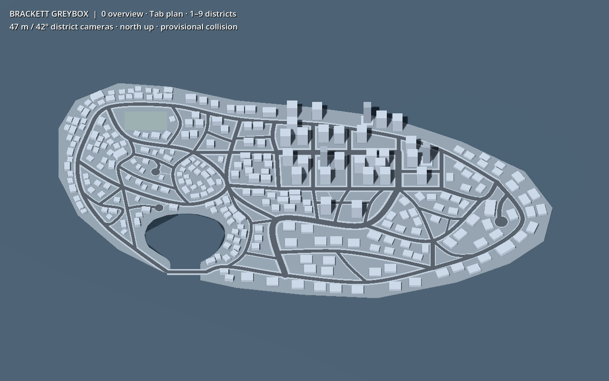
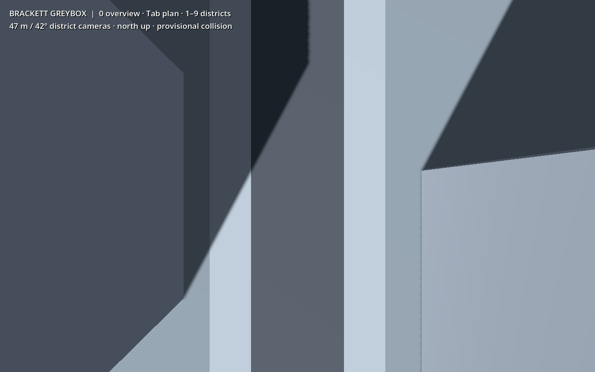

# Brackett whole-city greybox — first checkpoint

9 October 2026. **Reusable whole-island blockout, not production art or gameplay
acceptance.** Base: `c030d66d7d0a9db19c0c2aebf1aa2b83eded6275`. Names are placeholders.

Open [preview.tscn](../../scenes/world/brackett_greybox/preview.tscn) in Godot and
run that scene (F6). `0` selects the overview, `Tab` the north-up plan, and `1–9`
the district cameras. Instantiate [city.tscn](../../scenes/world/brackett_greybox/city.tscn)
for the reusable city without review lighting, cameras, UI or water. The separate
`water.glb` is a decorative preview surface without collision.

## Brief, authorization and authorship

Regner commissioned this track under
[parallel art production](../workflows/parallel-art-production.md):
“Whole-city greybox. Start constructing now, not more district concept design.”
The original track instructions require the full island, the exact exported
district polygons, preserved road/coast/harbour/bridge layout, varied corridor
widths and block sizes, flat terrain, and replaceable district-appropriate massing.
The historical M1 rectangle is not a construction boundary.

The Codex whole-city lead owns source authoring, export, wrappers, placement and
this handoff in its dedicated worktree. Regner owns map/art direction and checkpoint
selection. Another person owns gameplay integration. The vehicle dependency owner
is lead `103de18c-e4b8-4daa-83d8-17d3da68128c`. Independent technical review is recorded
below; it does not substitute for Regner's visual selection.

Original Blender geometry was authored by Codex for this project using the committed
Python authoring tools. No purchased meshes, downloaded textures, real brands,
image-to-mesh service or third-party model generator was used. Project-owned map
references guide the geometry; no additional attribution requirement was introduced.
The tool instructions are preserved as executable source in
[prepare.py](../../tools/brackett_greybox/prepare.py),
[author_blender.py](../../tools/brackett_greybox/author_blender.py), and
[author_editor.gd](../../tools/brackett_greybox/author_editor.gd).
Their operative brief is: preserve the accepted full-map geometry; union road
junction surfaces; reserve corridor and pedestrian-link clearance; author neutral
Blender building types; save finite independent placements in Godot. These are
offline authoring tools, never runtime city generators.

References inspected: the accepted
[island setting](../concepts/world-v1/stage-01-setting/15-long-island-cyberpunk.png),
stage-04 `draw_plan.py`, its saved `01-city-road-block-plan.svg`, and exact
`district-editor/brackett-districts.json`. Frozen hashes also include the stage-02
macro geometry dependency; see `authoring_plan.json` and `review/file_checks.json`.
Existing S01/S06 source, import, wrapper and sector conventions were inspected.
No existing spike, shared material, main scene or gameplay system was modified.

Owner model routing, received 9 October during checkpoint review, applies
prospectively to the lead and all modeling/animation subagents: use **Astra** for
geometry, UV/skin deformation, spatial rig/rest/bone design, keyframes, poses,
motion and spatial VFX animation. Verify the actual effective runtime model before
the next spatial mutation. Non-spatial Godot imports, rig/animation configuration,
resource wiring and bookkeeping may use **Sol 6.1 medium/high**. If a running Sol
turn cannot take the changed model setting, save its checkpoint and end the turn
before spatial work resumes. Preserve unsaved sources/process state during a
transition; no duplicate lead/worktree. The current checkpoint is already saved,
and no further modeling was performed in that initial turn. Before the subsequent
Glassward height revision, Paseo `get_agent_status` confirmed the effective runtime
as `gpt-6-astra`, thinking `high`, in this exact worktree (9 October 2026).

## Layout and replaceable content

The coast is 1,155 × 620 m, matching the approximately 1.2 × 0.65 km concept.
The map coordinate `(630,355)` becomes Godot `(0,0,0)`; map east is Godot +X,
map south is +Z, north is -Z, and ground is Y=0. No centre line or district polygon
was moved. The coastline polygon and sampled harbour curve follow the concept.

All 50 road strokes are retained. Carriageway / total corridor widths are:
avenue **14/24 m**, street **9/17 m**, local **7/12 m**, freight **10/14 m**,
service **4.5/7.5 m**. Buffered carriageways are unioned before triangulation;
sidewalks subtract the carriageway union, avoiding overlapping junction strips.
Concept court-end circles and the three pedestrian links are retained. Rounded
buffer tessellation, the 2 m below-ground island thickness, and the flat bridge
deck are blockout construction decisions, not a lane/traffic kit or boat clearance
specification. Ground, road, walk and field visual datums are respectively
0, 0.025, 0.06 and 0.015 m. There are no raised traversal curbs.

The initial massing has **290 placements**, rather than copying the sparse roof
motifs. Open sports grounds, setbacks, retail courts and dock/workshop yards remain.
Buildings are placed within their exact district polygon and outside buffered
roads and foot links. Whole-footprint tests, not centre-only tests, reject road,
shore and neighbour overlap. This is a finite provisional layout, not validated
parcel planning or final population capacity.

| Discussion/district ID | Placeholder name | Buildings | Source kit and export families |
| --- | --- | ---: | --- |
| 01 | Northpoint | 65 | `district_01_kit.blend`: campus_hall, campus_classroom, campus_annex |
| 02 | The Crescents | 48 | `district_02_kit.blend`: house, semi, terrace |
| 03 | Terrace Ward | 30 | `district_03_kit.blend`: apartment, apartment_slab, apartment_small |
| 04 | Glassward | 29 | `district_04_kit.blend`: tower_high, tower_mid, office |
| 05 | Old Quay | 26 | `district_05_kit.blend`: quay_house, quay_row, quay_hall |
| 06 | Signal Row | 15 | `district_06_kit.blend`: shop, entertainment_hall, shop_row |
| 07 | Broadlot | 20 | `district_07_kit.blend`: retail_large, retail_box, retail_small |
| 08 | Ironreach | 36 | `district_08_kit.blend`: workshop, repair_shed, workshop_large |
| 09 | East Docks | 21 | `district_09_kit.blend`: warehouse, warehouse_small, dock_shed |

There are 27 reusable building types. Not every type is placed: the first Glassward
pass now contains 26 offices at 42 m and three stepped towers at 68 m. A 90 m tower
variant is supplied but unplaced. Ground-centred footprints range from 10 × 12 m
houses to 65 × 38 m retail. The exact X/height/Z dimensions and collision boxes
are listed in `tools/brackett_greybox/editor_input.json`; imported AABBs are checked
to 0.01 m in `review/scene_checks.json`. No claim is made that the taller towers
are already visually resolved at the 47 m camera height.

Each district is a saved sector, with explicit `district_id`, `district_name` and
the original two-digit discussion ID. Buildings have immutable replacement IDs
such as `brackett/district_04/building_0001`. Keep these `world_id` values when
replacing art or reparenting. They are separate from resource UIDs and node IDs.
Godot scenes own placement after this bootstrap; the frozen JSON is provenance,
not a second runtime writer. Authoring bootstraps refuse existing layout/scenes.

## Sources, imports and scene ancestry

All source files live under `art/source/models/brackett_greybox/`, covered by the
existing `art/source/.gdignore`. Runtime exports live under
`art/models/brackett_greybox/`, with their Godot `.glb.import` sidecars.

| Editable source | Explicit outputs | Saved consumers |
| --- | --- | --- |
| Nine district kit `.blend` files above | 27 correspondingly named building GLBs | `scenes/world/brackett_greybox/prefabs/<asset_id>.tscn` → nine district sectors |
| `ground_00_00.blend` through `ground_03_02.blend` (four columns × three rows) | 12 corresponding ground GLBs | `sectors/ground_<column>_<row>.tscn` → city |
| `water.blend` | `water.glb` | preview only |

[source_manifest.json](../../art/source/models/brackett_greybox/source_manifest.json)
enumerates every source, output, `export_<asset_id>` collection and object member.
[fingerprints.json](../../art/models/brackett_greybox/fingerprints.json) binds every
source/output pair by SHA256. Building wrappers follow `Visuals/Model` (linked GLB,
noneditable imported children) and `Collision/Solid/Envelope*`. Surface sectors
have `Visuals/Model` and `Collision/Ground/Surface`. No visible vertex data, primitive
render meshes or CSG is embedded in the authored Godot scenes. Collision data is
deliberately separate. There are no inherited variants, sockets, rigs or clips:
this is static neutral architecture, so these systems are not applicable.

Pinned tools: Blender **5.2.2 LTS**, build `d13f752e3b9c`, and Godot
**4.8-dev7**, `c971f93e7e76b0ef919bf6009e7b868bea04db7f`. Exports use the repository
S01 GLB profile with explicit collection filters and animations disabled. Metric
unit scale 1, applied object scale/rotation, triangulated meshes, exported normals,
Y-up conversion once; Blender +Y maps to Godot -Z. Studio objects are not exported.
Godot's normal GLB import defaults are retained, including automatic LOD generation;
no custom import scripts or material remaps. This is not a selected performance budget.

Materials are source-owned opaque rough flat colours embedded in the GLBs:
`grey_building`, `grey_roof`, `grey_land`, `grey_road`, `grey_walk`, `grey_field`,
`grey_water`. Each mesh uses its named material slot. There are no external textures,
UV-dependent appearances, emission, transparent layers or inherited overrides.
This palette makes road/mass separation reviewable; district cyberpunk polish is
explicitly deferred until its concept approval.

## Collision, camera and integration limits

Buildings use simple box envelopes, with separate podium/shaft boxes for towers.
Static World layer 1 / mask 0 is provisional, compatible with the inspected spike
World bit but not a migration of its gameplay rules. Each ground sector has one
concave surface collider derived from its imported land mesh; roads/walks add no
duplicate ground colliders. Sea has no collision. Neither these shapes nor the
eight passing ray queries establish character movement, vehicle contacts, turning,
spawn/exit safety, seams under motion, lifecycle or multiplayer correctness.

All nine saved district cameras are vertically down, north-up perspective,
47 m above ground, FOV 42°, near/far 0.1/2400 m, native 1280×800. The overview/plan
cameras are explicitly orthographic review views. Captures use Compatibility/OpenGL
on GTX 1070; metadata is in `review/capture.json`. The preview caps at 60 FPS with
VSync, but no sustained performance or Deck claim is made. Downtown façades and roofs
occupy substantial screen area: further camera-follow/roof-occlusion decisions and
matched actor/vehicle readability checks belong to integration. No roof hiding or
collision-changing camera workaround is implemented.

**Large-vehicle dependency, recorded 9 October:** Regner approved the three car
concepts and requested larger bus and dock/workshop-truck concepts. The vehicle
lead proposes **12 m bus** and **7.2 m truck visual lengths**; these concepts are
still awaiting approval, axle count is unresolved, and collision/turning envelopes
are not approved. Future checks must cover swept turns, opposing traffic clearance,
court-end turning, bridge approaches, loading/yard access and parked-vehicle blockage
using approved production envelopes. Current road accommodation is **unverified**.
No road width, district or city scale was changed in response to those proposals.

No AI/navigation, lane graph, minimap bake, gameplay entities, main launch replacement,
networking, population, weapons or vehicle integration is included. Source-linked
geometry and saved identities are the handoff to the external integrator, who owns
derived topology/collision compatibility and real traversal acceptance.

## Checks and authoring recovery

- All 40 GLBs re-exported from the saved Blender sources byte-for-byte.
- All 50 scenes have linked dependencies, source/import/script UIDs and editor node
  identities; 290 unique saved building IDs match the frozen authoring record.
- Actual imported dimensions of all 27 building types meet the 0.01 m tolerance.
- Eight independent physics rays check streets/bridge hits and harbour/sea misses.
- A fresh bounded graphical process captured the overview, plan and nine district
  views with no runtime warnings/errors in its final log.
- The five owned GDScripts pass the pinned formatter/linter and Godot compilation.
- Direct serial MCP calls opened, saved, closed, reopened and saved all 50 scenes.
  The first editor pass normalized standalone serialization; the subsequent
  pass kept all **50/50 files byte-identical**, including their saved identities.

Evidence is under
[review/](../../art/source/models/brackett_greybox/review/): `file_checks.json`,
`scene_checks.json`, `reexport_check.json`, `editor_roundtrip.json`,
`editor_stability.json`, `capture.json`,
the raw final logs and PNGs. These receipts cover this asset only.

The default Godot/Blender MCP endpoints were unavailable. A private Godot editor
was bound to `127.0.0.1:16650`, with private settings/registry under
`/tmp/brackett-greybox`; Blender used private bounded background processes. No shared
service/configuration was changed. The private editor batch helper initially lost
its scene-tree context, and an overlapping preview edit subsequently wrote the
preview into one new `quay_row` wrapper. That was an authoring failure, not a passed
check. The editor was stopped, the wrapper rebuilt through Godot's resource API,
and standalone save/reload used as the fallback. Standalone serialization omitted
UID metadata; the original editor-saved UIDs and dependency UIDs were restored from
the retained snapshot, then checked and saved/reopened in a fresh actual editor.
All other placed IDs and authored node identities were preserved; the repaired new
wrapper's node identities were regenerated before the first commit. The failed
helper was removed. Direct sequential MCP scene operations passed afterward.
The retired repair script and original UID map are retained as recovery evidence,
not repeatable build commands. Early failed logs are not acceptance evidence.

The final headless editor log contains 202 `Parameter "t" is null` diagnostics
from the dummy renderer's thumbnail creation during saves, one stale owned-process
registry diagnostic, and the toolkit's existing 4.8-versus-4.7-tested warning.
Every direct save returned success and the final files are byte-stable. The fresh
graphical capture and physics-check processes have none of those errors. The raw
editor log is retained; these environment diagnostics are not suppressed or called
a clean editor log.

## Handoff status and next work

| Stage | Status and owner |
| --- | --- |
| Whole-island construction brief | Authorized by Regner's commissioning; asset-local scope |
| Layout/art direction | Existing owner-approved map/reference used; greybox visual checkpoint awaits owner review |
| Blender blockout and source/export | Technical checks passed; independent review recorded separately |
| Saved wrappers/placement/preview | Asset checks passed; gameplay acceptance pending external integrator |
| Detailed production art | Not commissioned in this checkpoint; later district concept approval required |
| Rig/clips/textures/sockets | Not applicable to these static neutral masses |
| Movement/network/device/performance | Pending; not exercised or claimed |

Next work: owner review of massing density/height; independently approved district
concepts and asset lists; replace individual masses while keeping placement IDs;
external integration of actors/vehicles and approved clearance envelopes; matched
camera occlusion/readability and performance checks. Material road geometry changes
require an explicit map decision, not quiet source regeneration.

Small catalogue/TODO delta for the coordinator to reconcile later (shared files
intentionally untouched): add `brackett_greybox` linking this handoff; record the
first full-island source/GLB/saved-placement checkpoint; retain traversal, large-
vehicle turning/yard access, production district art replacement and integration
as pending. Do not close foundation, gameplay, device or production tasks.

## Independent review of the original checkpoint

**Accepted as a technical whole-island greybox checkpoint**, 9 October 2026,
by clean-context reviewer `/root/greybox_review` using Sol 6.1 high. Reviewed
candidate `93cf06137fbfa0ad931432291a7c3045fffb371e` against base
`c030d66d7d0a9db19c0c2aebf1aa2b83eded6275`. No observed P1/P2 defects.

The reviewer independently checked exact road/district references, decoded GLB
geometry, measured all 27 building bounds, validated all 290 saved transforms and
footprints, inspected all 11 images, reconciled source/export/consumer membership,
and matched all 50 final scene hashes and 301 successful editor commands. Actual
land/road/walk unions match concept-derived surfaces within 1 mm; the largest
aggregate symmetric area difference was 0.1192 m² across 61,997 m² of walk surface.
The reviewer's fresh Blender re-export reproduced all 40 GLBs byte-for-byte.
Its outputs completed, but Blender lingered during PipeWire/`pa_write` shutdown and
was interrupted/reaped with exit 130: output reproducibility passed; a clean process
exit is not claimed. Optional MeshOptimizer was absent and no compression extension
was used.

Independent evidence is retained under `review/independent/`. The reviewer did not
rerun Godot movement tests and relied on the disclosed producer ray/capture/editor
receipts for those bounded checks. Owner approval of density/height, camera-follow
and actor/vehicle readability, roof occlusion, all traversal/large-vehicle envelopes,
networking and device/performance acceptance remain pending. This follow-up commit
records the review/routing policy and adds evidence only; it does not change the
reviewed Blender, GLB, scene or script bytes.

## Glassward height revision — 9 October 2026

Owner instruction: “The buildings in the high rise area should be taller.”
Codex authored the height change under verified effective **Astra/high**, using
[raise_glassward.py](../../tools/brackett_greybox/raise_glassward.py). This is a
one-time source revision from `cf6dae7a420ec477dd85654b615e0fb296ed8aaa`, not a runtime
resizer or placement generator. Offices changed **22 → 42 m** (26 placements),
stepped towers **30 → 68 m** (three placements), and the supplied unplaced high-tower
variant **38 → 90 m**. Podiums remain 6 m. Horizontal dimensions, 0.12 m bevel widths,
materials, object/collection names, source membership and all placement IDs remain.
Only `district_04_kit.blend`, its three GLBs and the three wrapper collision sizes /
vertical centres changed; all district scene bytes and map geometry are unchanged.
Metadata and bootstrap defaults match the revised heights. No detailed art was added.

Actual saved-source re-export completed with Blender exit 0: three changed GLBs,
37 byte-identical GLBs. Import and file checks passed (27 measured building bounds,
40 exports, 50 scenes, 290 IDs). The six affected prefab/sector/city/preview consumers
were opened, saved, closed and reopened through the verified private editor;
a second save retained identical hashes for all six. A fresh bounded Godot process
passed the eight existing ground/bridge/harbour rays, and another captured all
11 views at 1280×800 with unchanged cameras and lighting. Both exited 0 without
runtime warnings/errors. These rays do not test walking, driving or tower traversal.
Evidence and raw logs: `review/height_revision/`; refreshed current measurements and
images: `review/scene_checks.json`, `review/capture.json` and the review PNGs. Older
`review/independent/`, re-export and editor receipts describe the original checkpoint,
not this revision. Renewed independent review is recorded below when complete.

The overview now shows a substantially taller downtown skyline. At the fixed 47 m
camera, office roofs are only 5 m below the lens and the placed tower roofs are 21 m
above it. The saved downtown street view shows deep walls/shadows and roof projection
near the frame; it does **not** prove camera-follow visibility around or through
all tower sites. Roof clipping/hiding, actor visibility, camera-follow transitions,
traversal, vehicle clearance/turning and networking remain integrator-owned and
unvalidated. No collision was hidden to improve the screenshot, and no camera height
was changed. Owner approval of this height choice and density remains open.

The revision's source save completed, but its first sandboxed Blender process
lingered during audio shutdown after a blocked external thumbnail-cache write.
A second approach used private XDG directories and `ALSOFT_DRIVERS=null`; the fresh
saved-source export completed and quit cleanly. Three older greybox Blender shutdown
waiters were also discovered still alive (52459, 52805, 66150); the earlier report of
all processes being reaped was inaccurate. They were waiting with completed outputs,
not performing ongoing authoring; no process was killed or another workspace touched.
The headless editor still emits dummy-renderer thumbnail diagnostics during successful
saves. The successful fresh graphical capture is the visual evidence.
