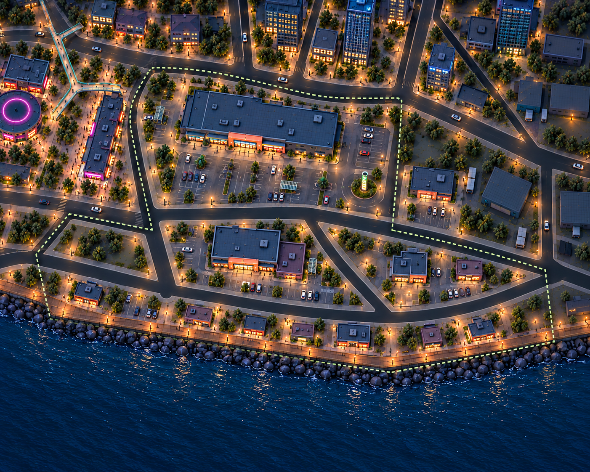
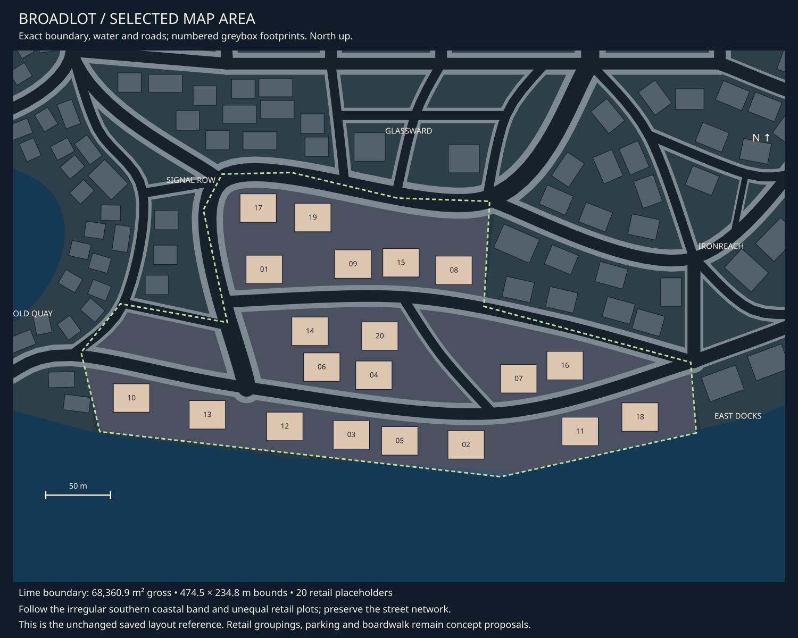

# Broadlot concept review

9 October 2026 · **District asset pass requested and recorded; individual designs remain to refine.**

[Detailed asset breakdown](broadlot-assets.md) · [Central registry](asset-register.md#07-broadlot-assets) ·
[District queue](README.md) · [Exact selected area](map-context.md#district-07).

## Current concept

Broadlot uses large low retail roofs and open parking areas to contrast with
Glassward's towers and the residential districts. Blue/slate and muted plum boxes
have broad coral entrances, with restrained lime wayfinding. The main northern
store fronts a parking forecourt and detached circular sign island. A secondary
store occupies the middle plot; smaller pads fit the eastern triangle and shallow
coastal strip. The shared boardwalk continues along the southern shoreline.

Signal Row's long shopping parade remains alongside the main site in the west,
with its hall and pedestrian bridge in neighbouring context. Glassward is north;
Ironreach and East Docks remain subdued future-review context to the east.
Surrounding render details are illustrative, not replacements for their accepted
maps or district concepts.

## Fit to the selected area

Broadlot measures **68,360.9 m² gross**, with a **474.5 × 234.8 m bounding box**.
Its 20 saved retail placeholders occupy a large northern plot, smaller middle
plots, an eastern triangle and a narrow coastal band. The bounding rectangle is
not the available land; existing roads and the shoreline divide the actual sites.

The main-store proposal consolidates the vicinity of footprints 17/19 and clears
or reduces 01/09/15/08 for its forecourt. The middle store combines 14/20, freeing
06/04 for parking and approach space. The eastern triangle uses smaller shops at
07/16. Selected coastal pads remain compact to leave a continuous walking edge.
The western empty triangle remains open rather than receiving another large store.

The prompt explores a roughly 65 × 38 m main-store envelope for visual scale only;
the raster does not establish that dimension. It varies footprints, parking layouts
and setbacks. No saved road, placement, boundary or coastline data was edited.
Road surfaces and their future automatic tooling remain outside this work.

## Asset families

| Family | Direction |
| --- | --- |
| [Large retail buildings](../../assets/d07_retail_buildings.md) | Main stepped box, secondary low box and entrance annex; reuse wall/roof/frontage language |
| [Circular sign island](../../assets/d07_sign_island.md) | Detached low base and restrained directory support |
| [Trolley shelter](../../assets/d07_trolley_shelter.md) | Repeated simple shelter near store entrances |
| [Retail graphics](../../assets/d07_retail_graphics.md) | Entrance identity, parking directions and promotional artwork; copy unselected |
| [Shared small-shop shells](../../assets/city_small_shop_shells.md) | Compact coastal/eastern shop pads, rather than unique buildings for every placement |
| [Shared boardwalk](../../assets/city_boardwalk.md) | Existing coastal kit, rail and lights; Broadlot use recorded in the shared kit |

Reuse shared shop fittings, roof details, lights, planting, parking furniture and
shore edges. The detailed asset pass now records needed uses, with supporting service props
kept to confirm. Parking bays are illustrative layout/artwork,
not a commission for a road-surface kit or traffic system. Cars remain shared vehicles.

## Visual review and next iteration

The main roof and broad parking forecourt read clearly, with smaller buildings
along the coast. The boardwalk remains continuous. Planting, lamps and parked cars
are denser than requested, reducing the intended exposed/open character. A next
pass can reduce planted islands, parked-car clusters and repetitive light spacing.
The lime sign is more upright/prominent than the low restrained cue in its brief.
The main roof's stepped character also needs closer asset refinement.

Bay sizes, turning/access clearances and boardwalk connections are unmeasured.
Review the balance of large shops, open parking and coastal pads before refining
assets. No modelling, implementation or gameplay-camera acceptance is implied.

## Provenance

Built-in imagegen used the [exact map](07-broadlot-map.svg),
[Glassward](04-glassward-v01.png), [Signal Row](06-signal-row-v03.png) and
[Old Quay](05-old-quay-v03.png) for style and neighbouring context.
[Exact prompt](prompt-broadlot-v01.json) · [Image receipts](generation.json).
