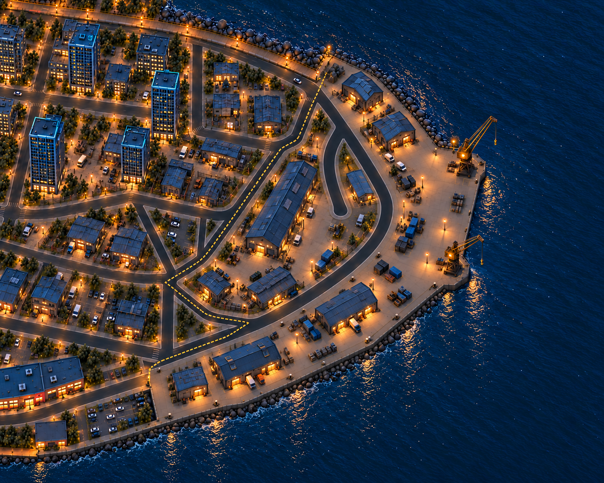
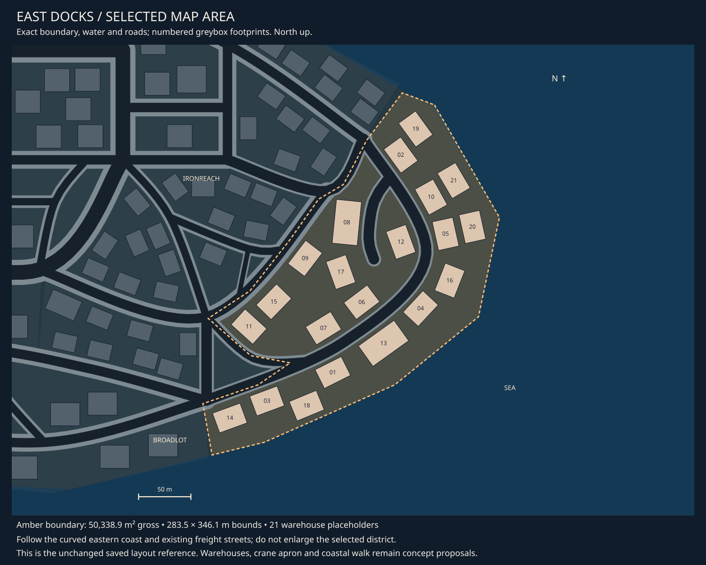

# East Docks concept review

9 October 2026 · **District direction liked; revision 02 ends the boardwalk at both boundaries.**

East Docks uses long blue warehouse roofs, an open freight apron and two unequal
amber cranes along the eastern shore. Its larger working blocks contrast with
Ironreach's smaller, weathered repair yards. The concept fits the selected coastal
area. The shared boardwalk ends on the Ironreach and Broadlot sides of the district,
leaving the East Docks waterfront as a working quay.

[Detailed asset breakdown](east-docks-assets.md) ·
[Central registry](asset-register.md#09-east-docks-assets) ·
[District queue](README.md) · [Selected area](map-context.md#district-09).

## Current concept

A long ridge warehouse occupies the landward curved plot, with smaller related
buildings around it and compact groups along the northern and southern coastal
strips. Repeated loading-door bays and roof sections should form a reusable kit.
Containers, covered stacks and crates stay grouped at loading edges, leaving space
between the two crane silhouettes. The neighbouring Ironreach context retains
patched roofs, warm workshop doors and selected chain-link enclosures.

The owner requests that the boardwalk end at either side of East Docks. The
Ironreach section terminates at the northern boundary and the Broadlot section
terminates at the southwestern boundary. There is no public coastal boardwalk or
landward boardwalk bypass through East Docks. Normal street footways remain.
Use the existing shared deck fascia/trim and rail language to finish the two ends,
with landward pedestrian connections outside the freight working area.

## Fit to the selected area

The selected area is **50,338.9 m² gross**, with a **283.5 × 346.1 m bounding box**
and 21 saved warehouse placeholders. Its narrow coastal curve and landward lobe
are divided by the existing freight road and inner dead-end service spur. The
bounding rectangle is not an available rectangular port site.

The proposal consolidates around footprints 08/09 for the long warehouse, uses
06/07 for a smaller related group and opens the coastal area at 05/20/16, with 04
reduced, for the crane apron. Northern 19/02 and southern 13/01/03/14 support more
compact warehouse/annex groups. These are illustrative replacements and removals,
not applied changes to saved placements or an exact asset count.

The image retains the broad road and shoreline arrangement, including the service
spur. Raster roof lengths, coastline details and setbacks are not measurements.
The original boundaries, roads, coast and saved placements remain unchanged.
Road surfaces and their future automatic tooling remain outside this work.

## Asset families

| Family | Proposed direction |
| --- | --- |
| [Warehouses](../../assets/d09_warehouses.md) | Long ridge warehouse, wide low warehouse and loading annex with shared bays and roof parts |
| [Unequal crane pair](../../assets/d09_cranes.md) | Larger and smaller static amber structures, widely separated with booms directed over water |
| [Storage](../../assets/d09_storage.md) | Long/short containers, covered stack and crate group; low sparse arrangements |
| [Freight graphics](../../assets/d09_freight_graphics.md) | Fascia, container identification and loading signs; copy remains unselected |
| [Shared boardwalk](../../assets/city_boardwalk.md) | Ends in neighbouring Ironreach and Broadlot; no East Docks deck demand |
| [Shared barriers](../../assets/city_barriers.md) | Reuse Ironreach's chain-link language where yard separation is useful; exact uses to review |

Reuse shared quay edges, bollards, lights, sign supports and service furniture.
Required designs and shared district uses are now recorded in the detailed asset
pass; supporting small props remain to confirm. The cranes
are static landmark concepts; no ships, freight simulation, crane controls or
new warehouse interiors are implied.

## Visual review

The owner likes the warehouses, cranes and open apron. Revision 02 removes the
continuous timber promenade, decorative shoreline rail and repeated promenade
lamps within East Docks, exposing a utilitarian quay edge. Buildings, roads,
cranes and the broad coastline arrangement remain consistent with revision 01.
The public walk no longer needs a route through the working apron.

Exact end-cap geometry and the neighbouring boardwalk connections are not clearly
resolved in the overview; refine those two terminals in closer concepts. Sparse
quay fittings and task lights remain. Crane-base, boom and vehicle clearances
still require measured fit before any separately commissioned production. The
image does not validate fixed-camera visibility. No modelling or implementation
has been commissioned.

## Provenance

Built-in imagegen used the [exact map extract](09-east-docks-map.svg) as the layout
reference and [Ironreach revision 02](08-ironreach-v02.png) for style and neighbouring
context for [revision 01](09-east-docks-v01.png). Built-in imagegen edits that image
for the requested boardwalk endpoints in revision 02.
[Original prompt](prompt-east-docks-v01.json) · [Revision prompt](prompt-east-docks-v02.json) ·
[Image receipts](generation.json).
