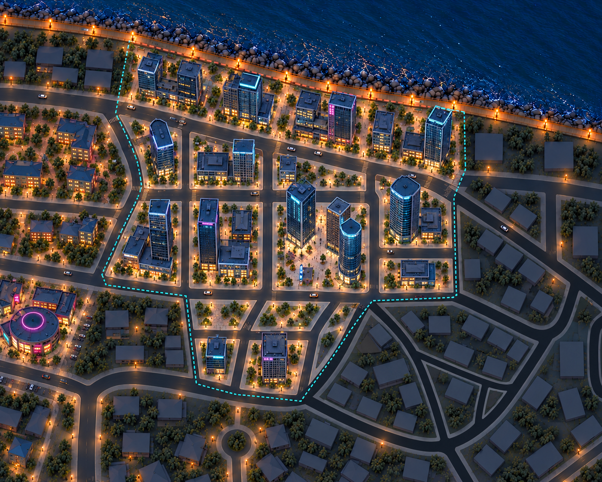
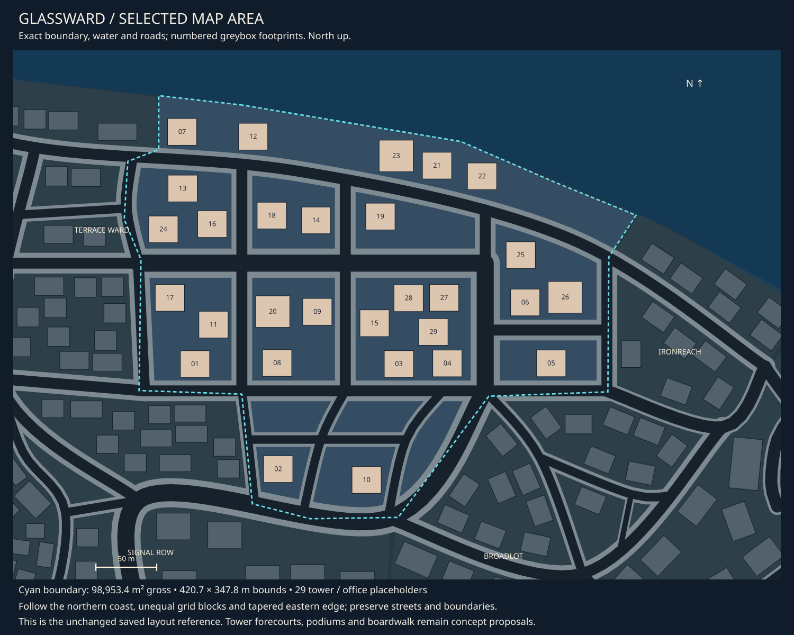

# Glassward concept review

9 October 2026 · **Downtown direction liked; detailed asset pass recorded.**

[Detailed asset breakdown](glassward-assets.md) · [Central registry](asset-register.md#04-glassward-assets) ·
[District queue](README.md) · [Exact selected area](map-context.md#district-04).

## Current concept

Glassward brings a taller, cooler office district into the city: indigo glass,
slate podiums, selective cyan crowns and occasional magenta panels. Three unequal
towers gather around a visible central forecourt. Other plots mix tall and medium
towers with lower offices, setbacks and walking gaps. The southern extension stays
lower, with open planted plots north of its two office buildings.

The boardwalk continues along the entire northern coast. Terrace Ward is the lower
apartment neighbour to the west; Signal Row's magenta-ring hall appears at the
lower-left crop edge. Ironreach and Broadlot remain subdued future-review context.
That surrounding context is illustrative and does not establish new district layouts.

## Fit to the selected map

The selected area is **98,953.4 m² gross**, with a **420.7 × 347.8 m bounding box**
and 29 saved tower/office placeholders. The northern coastal strip, unequal grid
blocks, tapered eastern edge and narrow southern extension control the concept.
Existing roads and coastline remain the reference, not the earlier island image.

The landmark proposal uses the large central-southeastern grid block: three towers
near footprints 28, 03 and 04, with the vicinity of 15, 27 and 29 opened into a
forecourt and modest edge elements. The southern extension keeps a lower office
near 02 and a medium tower near 10; the small plots above them remain open.
These are proposed concept arrangements only. Generated positions, tower counts,
heights and clearances are not measured acceptance, and saved layouts are unchanged.

## Asset families

| Family | Direction |
| --- | --- |
| [Towers](../../assets/d04_towers.md) | Rectangular, chamfered, rounded and medium-height forms; repeated facade/floor rhythms with distinct crowns |
| [Podiums and offices](../../assets/d04_podiums.md) | Low offices, setback bases and short service wings, with gaps between sites |
| [Forecourt artwork](../../assets/d04_forecourt_graphics.md) | Broad paving bands, entry-axis motif and restrained inset identity |
| [Corporate graphics](../../assets/d04_corporate_graphics.md) | Facade panels, directories and entrance identity; copy remains provisional |
| [Shared boardwalk](../../assets/city_boardwalk.md) | Existing kit continues along the northern coast; district use remains to review |

Reuse city lights, planters, seating, sign hardware, roof details and shore edges.
Tower families should share facade/floor and podium language where practical;
the image is not a commission for a unique sculptural building on every site.
Exact modular part selection awaits the tower direction review and detailed asset
pass. The explicit Terrace Ward module kit remains recorded in its own brief.
No road-surface assets or automatic tooling are included.

## Visual review and next iteration

The three crown silhouettes and open forecourt read clearly, and the buildings
are visibly taller than the adjacent apartments. Ground and lobby lighting remains
warmer and planting denser than the intended cooler, sparse corporate direction.
The central directory/feature should stay small and avoid becoming a monument.
The forecourt and street sightlines need review as actual heights are selected.

This high overview does not validate the fixed gameplay camera. Near/above-camera
towers remain an unresolved visibility constraint; no cutaway, transparency or
other implementation is implied. The owner likes the tower direction. The detailed set is recorded; refine its
individual designs and ground-level fit before any separately commissioned production. No modelling or implementation was performed.

## Provenance

Built-in imagegen used the [exact map](04-glassward-map.svg),
[Terrace Ward](03-terrace-ward-v02.png), [Signal Row](06-signal-row-v03.png) and
[original island skyline](../world-v1/stage-01-setting/15-long-island-cyberpunk.png).
[Exact prompt](prompt-glassward-v01.json) · [Image receipts](generation.json).
