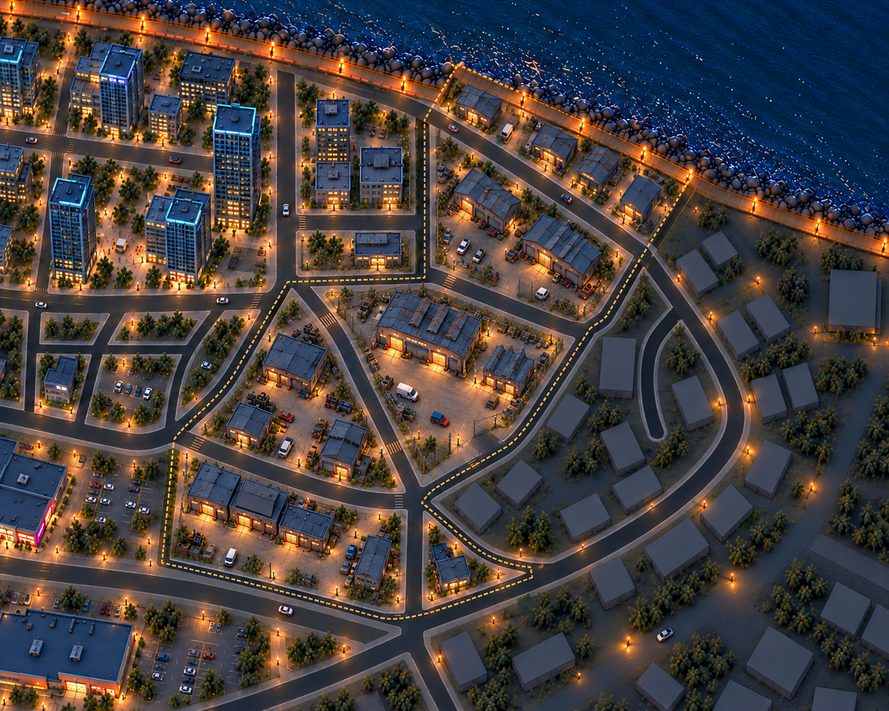
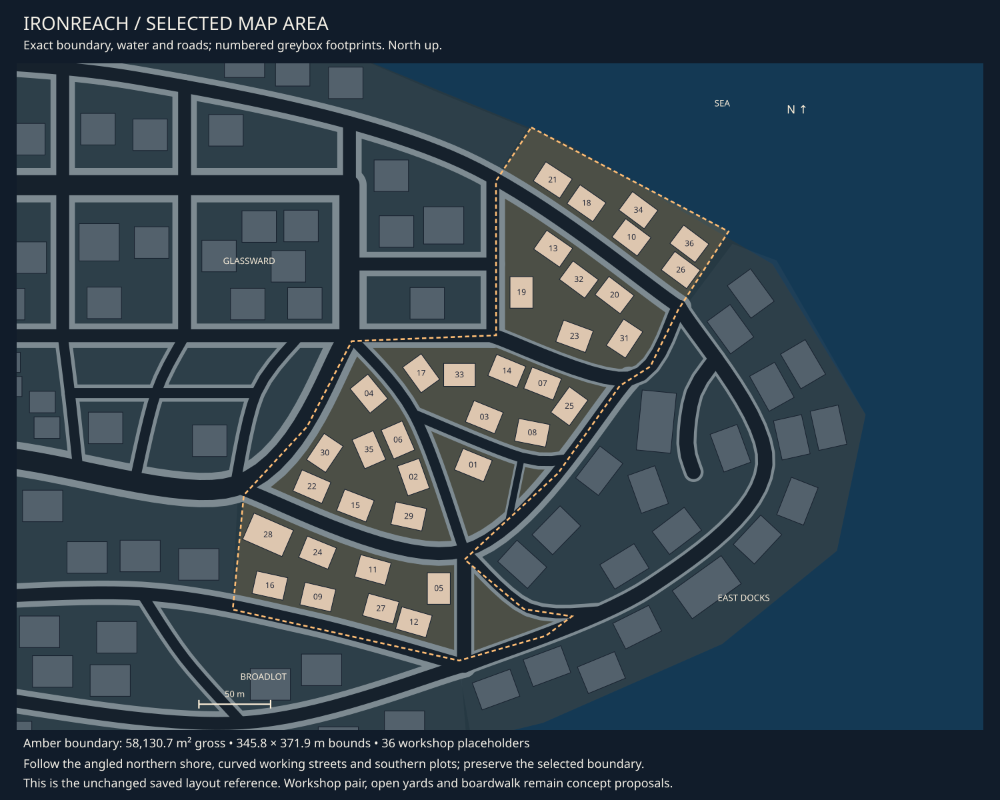

# Ironreach concept review

9 October 2026 · **Revision 02 liked; detailed asset set recorded.**

Ironreach is a working repair district of low sheds and open yards. The owner
requested chain-link fences around some properties and a more rundown character.
The current revision adds patched roofs, faded petrol paint, rust and weathered
workshop fronts while retaining warm task lighting and the selected map layout.

[Detailed asset breakdown](ironreach-assets.md) · [Central registry](asset-register.md#08-ironreach-assets) ·
[District queue](README.md) · [Selected area](map-context.md#district-08).

## Current concept

Two unequal offset sheds frame the main repair yard. Smaller workshops occupy the
upper inner block, southwest triangle and southern block. Chain-link runs separate
selected service plots, using repeatable panels, posts and vehicle gates. Public
streets and the northern boardwalk stay outside the enclosures. Gate openings and
a separate foot bypass must remain clear in later layout refinement.

Wear belongs to the buildings and props: mismatched roof patches, faded fascia
panels, scuffed cabinets and localized rust. Retain functioning entrances and
readable silhouettes. Shared material treatments should create variation across
repeated buildings without turning every worn shed into a separate asset.

## Fit to the selected area

The district measures **58,130.7 m² gross**, within a **345.8 × 371.9 m bounding box**.
Roads divide its irregular land into several plots; the rectangle is not its
buildable area. The current map contains 36 workshop placeholders, not a fixed
quota of new buildings. The short northeastern coastal strip carries the shared
boardwalk. Glassward lies west, Broadlot southwest and East Docks east.

The central proposal consolidates the area around footprints 17/33/14/07/25/03/08
into the unequal shed pair and open yard. Two drive openings connect to existing
bounding streets, with a separate walking route. These are concept intentions;
the image does not establish measured access or fence/gate clearances. No saved
boundaries, coastline, roads or placements changed. Road surfaces remain excluded.

## Asset briefs

| Family | Current direction |
| --- | --- |
| [Repair sheds and depot](../../assets/d08_workshop_buildings.md) | Pitched shed, sawtooth workshop, depot and attached office; shared parts and weathered finishes |
| [Repair furniture](../../assets/d08_repair_furniture.md) | Tool cabinet, tyre rack, parts trolley and workbench; scuffed static dressing at edges |
| [Repair graphics](../../assets/d08_repair_graphics.md) | Faded fascia, directions and warning faces, kept readable |
| [Work apron graphics](../../assets/d08_work_apron_graphics.md) | Preliminary yard artwork; road surfaces and tooling excluded |
| [Shared barriers and chain-link kit](../../assets/city_barriers.md) | Panel, post/bracing set and vehicle gate needed for Ironreach; exact enclosure lengths pending |
| [Shared boardwalk](../../assets/city_boardwalk.md) | Continue the existing coastal language across district boundaries |

The central registry records the district building/prop set and shared uses,
including fencing, lights, shore edges, waste, boardwalk and rough planting.
The detailed breakdown distinguishes required designs from supporting props
and deferred surface artwork. Individual asset designs remain to refine.

## Visual review

Revision 02 preserves the main building arrangement and surrounding context, with
visible roof patches and mesh fences. Yard centres remain largely open and the
boardwalk continues along the shore. Some fence runs and gate leaves are difficult
to distinguish at this scale; two usable exits and the foot bypass still need a
closer concept. Weathering on walls is subtler than on roofs, and dense lamps and
planting remain refinement items. The image is an illustration, not gameplay-camera
or measured access acceptance.

## Provenance

Built-in imagegen produced [revision 01](08-ironreach-v01.png) from the
[exact map](08-ironreach-map.svg), [Glassward](04-glassward-v01.png) and
[Broadlot](07-broadlot-v01.png). Revision 02 edits that image for the owner's
fencing and wear request. Both versions are retained.

[Original prompt](prompt-ironreach-v01.json) · [Revision prompt](prompt-ironreach-v02.json) ·
[Image receipts](generation.json). Concepts and briefs only; no modelling or implementation.
