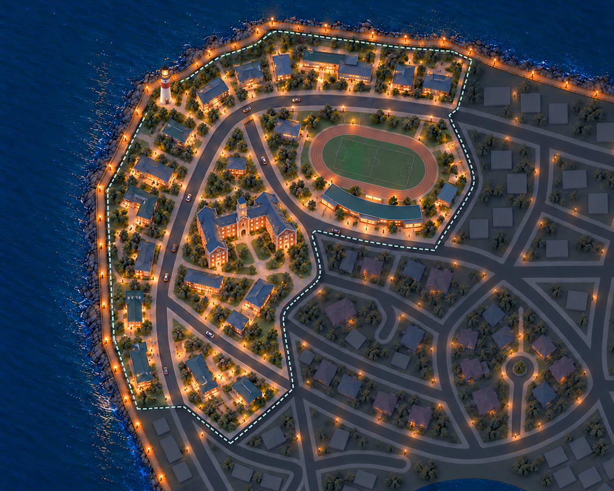
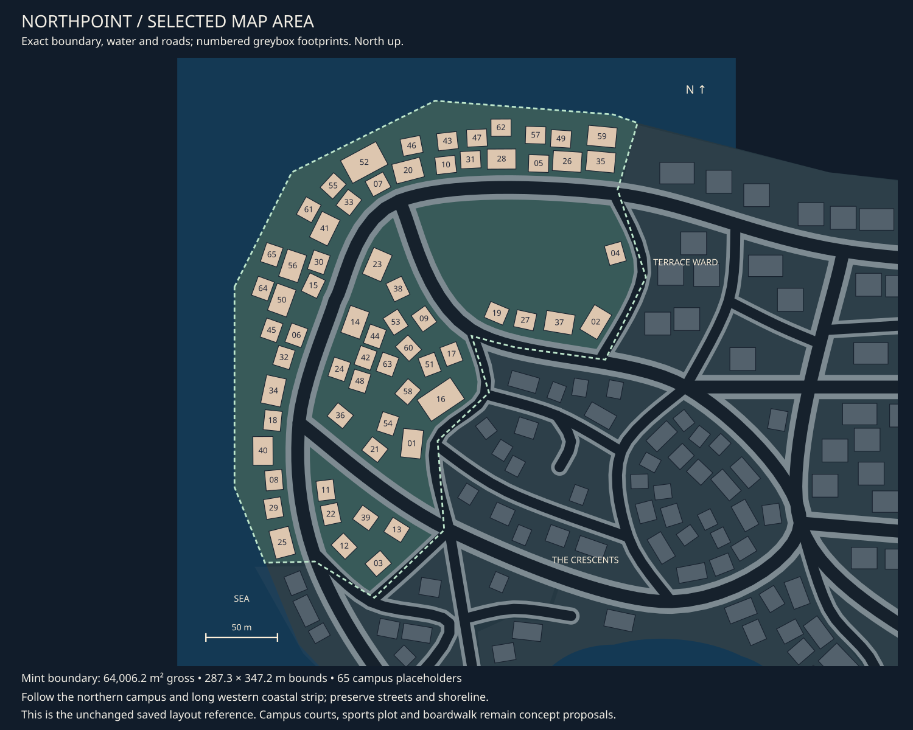

# Northpoint concept review

9 October 2026 · **University/lighthouse revision in review; field-side pavilion liked; asset pass recorded.**

[Detailed asset breakdown](northpoint-assets.md) ·
[Central tracker](asset-register.md#01-northpoint-assets) · [District queue](README.md)
· [Exact selected area](map-context.md#district-01).

## Current concept

Northpoint is the quieter campus district: low academic halls, teaching wings and
annexes grouped around walking courts. Slate and field-green roofs, restrained mint
accents and warm entries continue the Brackett style. An oval track and low crescent
sports pavilion anchor the large inner northeastern plot. Smaller courts and
unequal building groups occupy the western and southwestern plots.

Revision 03 restores the original island concept’s collegiate character in one
substantial main university hall west/southwest of the field. Brick and pale stone,
connected pitched-roof wings, a formal entrance and a modest clock tower frame an
open U-shaped court. The owner likes the arena-looking building beside the field;
that is the existing crescent sports pavilion and is retained separately.

Revision 04 restores the traditional red-and-white lighthouse on the northwestern
coastal strip, landward of the boardwalk. It replaces a small annex/planting patch,
with a compact walking approach and no new shoreline or offshore platform.

The shared timber boardwalk follows the western and northern coastline, continuing
past the district boundary. The Crescents stays subdued in the southeast, with its
new eastern cul-de-sac retained. Northpoint follows The Crescents to explore the
next coastal section; this ordering is not acceptance of the campus asset set.

## Fit to the selected area

The selected polygon measures **64,006.2 m² gross**, with a **287.3 × 347.2 m
bounding box** and 65 saved campus placeholders. It includes a northern cap,
narrow western coastal strip and smaller inner/southern plots. The streets and
coast remain the spatial reference; the 65 placeholders are not a unique-model quota.

The oval occupies the large open inner northeastern plot. The crescent pavilion
proposes replacing the group near footprints 19, 27 and 37 along its southern edge.
The prompt explores an approximately 80 × 45 m track footprint for visual scale,
not a regulation sports facility or an accepted measured fit. Campus buildings
are grouped/reduced locally to provide courts. Revision 03 groups several central placeholders around 14/44/42/63/60/51/58/16
into the main university hall. Its roughly 45 × 50 m prompt envelope is an
illustrative proposal, not a measured clearance result. No saved placements were changed.

## Assets from the district pass

| Family | Concept direction |
| --- | --- |
| [Lighthouse](../../assets/d01_lighthouse.md) | Requested coastal tower assembly, including lantern, gallery rail and cap |
| [Academic buildings](../../assets/d01_academic_buildings.md) | Requested collegiate main hall with connected wings and modest clock tower; separate teaching wings/annexes also needed |
| [Sports pavilion](../../assets/d01_sports_pavilion.md) | Liked curved arena-looking building retained; separate end-wing remains a candidate |
| [Sports surface artwork](../../assets/d01_sports_surface.md) | Oval track, field and small court markings; exact sports specification undecided |
| [Campus graphics](../../assets/d01_campus_graphics.md) | Campus map faces, entry panels and directions on shared hardware |
| [Island boardwalk](../../assets/city_boardwalk.md) | Same deck, corners, fascia, supports and shore connections as The Crescents |

Reuse shared rails, lamps, seating, cycle stands, planting, roof details and shore
edges. The detailed breakdown records five building designs, track/field finishes and
shared boardwalk, shore, lighting, seating, planting and ground assets. Small campus
maps, wayfinding, cycle stands and bins remain supporting uses to confirm. The central tracker owns
demand and progress; this overview does not commission additional sports equipment.
Road surfaces remain excluded.

## Visual review

The university hall now reads as a single collegiate landmark with an open court,
distinct from the retained curved sports pavilion. The field, boardwalk, roads and
neighbouring cul-de-sacs remain recognisable. Trees and lights are still dense;
roof/tower height, exact footprint and walking clearances need later refinement.
The image does not demonstrate game-camera acceptance, regulation sports dimensions
or a complete island circuit.

The owner requested the completed district asset breakdown and lighthouse addition.
Review the new lighthouse/main-hall designs while the registered set guides later
asset concept refinement. No modelling or implementation follows automatically.

## Provenance

Built-in imagegen used the [exact map](01-northpoint-map.svg) and
[The Crescents v02](02-the-crescents-v02.png) as references.
[Initial prompt](prompt-northpoint-v01.json) · [Context correction](prompt-northpoint-v02.json)
· [University restoration prompt](prompt-northpoint-v03.json) · [Lighthouse prompt](prompt-northpoint-v04.json) · [Image receipts](generation.json).

[Revision 01](01-northpoint-v01.png) is retained. Revision 02 extends the boardwalk
beyond the district boundary and restores the neighbouring cul-de-sac. Revision 03
uses the [original island concept](../world-v1/stage-01-setting/07-island-ribbon.png)
as an architectural reference for the main university hall, preserving the sports
pavilion the owner likes. Revision 04 adds the requested lighthouse, using the same
original island reference. Earlier revisions are retained. Original
boundaries, road data, models and saved scenes remain unchanged.
