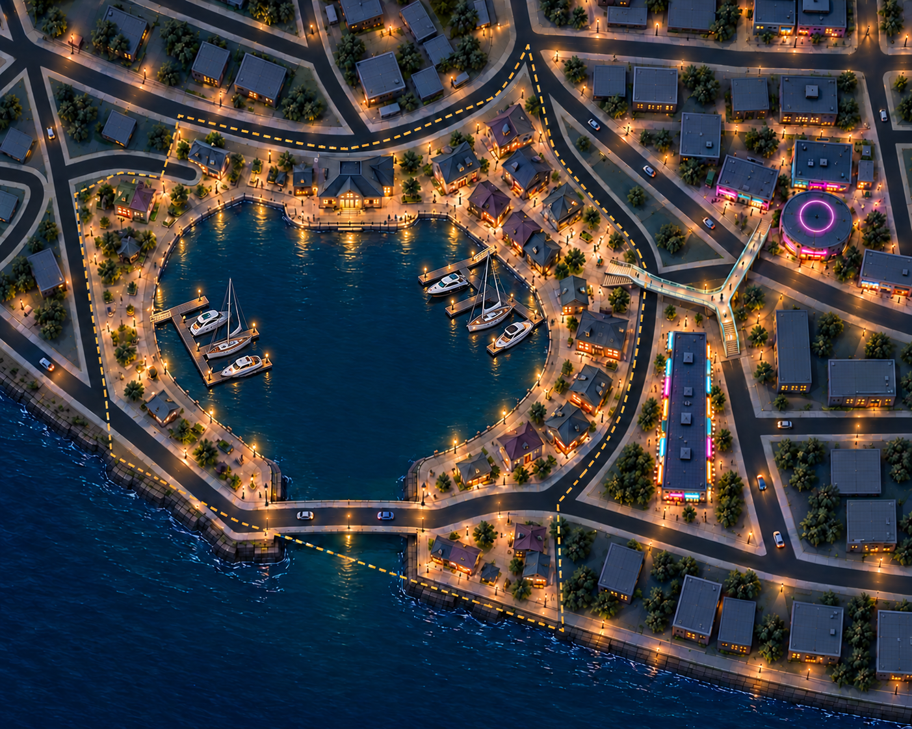
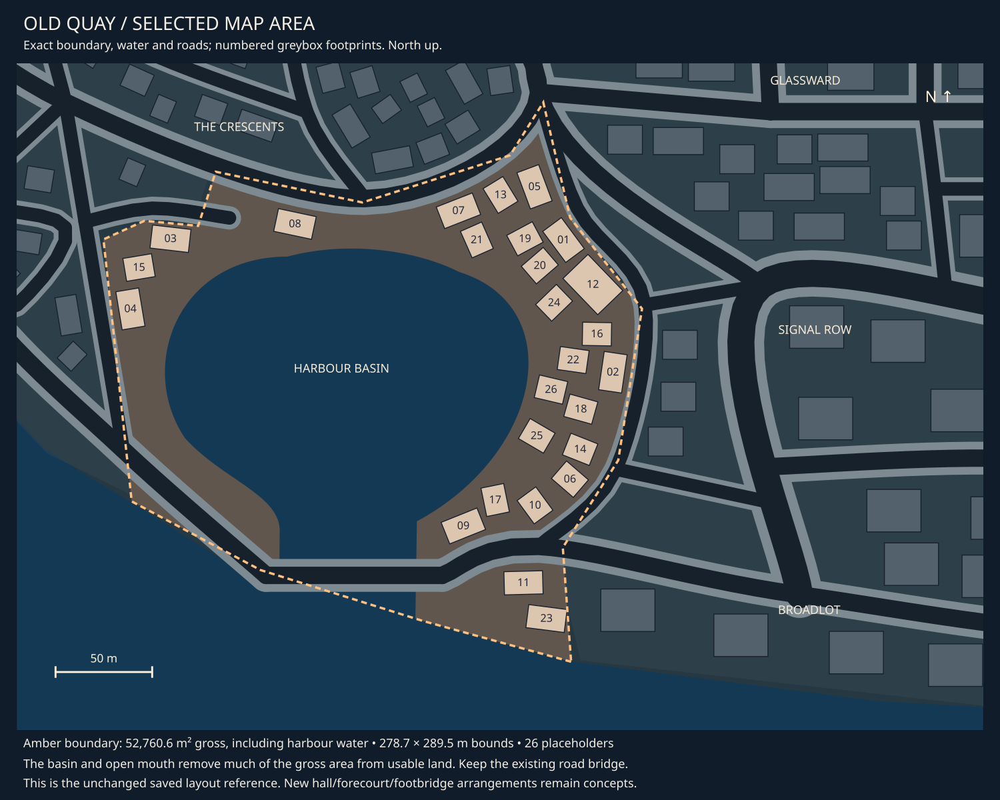

# Old Quay concept review

9 October 2026 · **Warm harbour direction liked; dock/yacht addition in review.** Old Quay follows Signal Row because
the new pedestrian bridge needs a coherent harbour-side arrival.

[Detailed building and prop breakdown](old-quay-assets.md) ·
[Central asset tracker](asset-register.md) · [District queue](README.md) ·
[Exact selected area](map-context.md#district-05) · [Signal Row](signal-row.md).

## Current concept

Warm shop-homes and short rows wrap around the harbour, with slate/plum roofs,
amber entrances and quieter waterfront walking space. A modest harbour hall and
small civic square anchor the northern shore. The eastern side is busier; the
western promenade leaves more open space. Signal Row remains brighter and more
commercial beyond the eastern boundary. Two small dock clusters now hold six
illustrative moored yachts: four compact motor yachts and two sailing yachts.
The centre of the basin and the southern entrance remain open.

The raised pedestrian bridge connects to a landing forecourt on Old Quay's eastern
side. It is the same bridge tracked for Signal Row, not another bridge asset. The
existing road bridge remains at the southern harbour entrance, with water continuing
under it to the sea. The southern Signal Row shopping parade is shown as one long
building in the neighbouring context.

## Fit to the selected area

The selected polygon has **52,760.6 m² gross area** and a **278.7 × 289.5 m bounding
box**. Much of that gross area is water, not space for buildings. The land wraps
around the basin in narrower strips; the concept must preserve the basin, open
mouth, coast and existing roads. The saved greybox provides 26 numbered placeholders.
The extract retains their positions; it does not include new proposed placement.

The concept brief proposes a harbour hall near northern footprint 07 and a civic
forecourt around 21. It also proposes clearing the original hall placeholder 12
on the eastern side for the pedestrian bridge's arrival. These are concept changes
to discuss, not saved-scene edits or an approved identity migration.

The rendering moves the civic hall farther west along the northern shore than the
requested 07 anchor and varies the surrounding houses. Its broad district/water
arrangement is useful for review, but the hall's exact site and the square's usable
dimensions need a subsequent fit study. The exact map remains the geometry reference.

## Asset implications

The [central tracker](asset-register.md#05-old-quay-assets) owns live demand,
status and district usage. The dock/yacht addition is needed; the two silhouette choices remain proposals.
The detailed breakdown now covers buildings, bridges, waterfront structures, boats,
props and fittings. Required demand is reconciled with that breakdown; individual
designs and supporting props still need refinement.

| Asset family | Direction to explore |
| --- | --- |
| [Quay frontages](../../assets/d05_quay_frontages.md) | Narrow shop-homes, short attached rows, plum infill and deeper corner buildings with varied roof profiles |
| [Harbour hall](../../assets/d05_harbour_hall.md) | Modest broad roof and warm water-facing civic entry |
| [Civic graphics](../../assets/d05_civic_graphics.md) | Hall identity, municipal notices and directions; names/copy provisional |
| [Marina dock kit](../../assets/city_marina_docks.md) | Connected main/finger pontoons, shore gangway, end/edge treatment and small cleats |
| [Moored yachts](../../assets/city_moored_yachts.md) | Two proposed reusable designs: compact motor yacht and sailing yacht |
| [Quay paving artwork](../../assets/d05_quay_paving.md) | Quiet square/border motifs, without creating a road-surface kit |

Reuse city lamps, benches, bins, planting, sign supports, shop fittings and roof
details where needed. Waterfront mooring bollards, low rails and ladders belong to
the shared quay-furniture brief. East Docks needs the mooring bollard; its
selective rail/ladder uses remain to confirm. The road bridge
uses its existing separate family. The cross-district pedestrian bridge is already
needed by both 05 and 06 and is tracked only once.

The owner explicitly requested docks with yachts after liking the warm harbour
direction. Their new briefs cover static scenery; boat gameplay is not commissioned.
No crane, fountain or cafe-furniture set is implied. Small incidental objects are identified in the linked breakdown, with uncertain
supporting items explicitly left to confirm.

## Visual review and next iteration

- The warm waterfront is distinct from Signal Row's stronger cyan/magenta frontage.
  The land/water pattern, harbour mouth and southern road crossing remain recognisable.
- Two shore-connected dock clusters and six moored boats are visible in v03. Open
  water separates the clusters from each other, the civic hall and the harbour mouth.
  Their apparent scale and boat/deck gaps still need a later fit study.
- The west footbridge landing is visible on land, and the corrected neighbouring
  shopping parade remains continuous. Exact support/landing clearance is unresolved.
- The current houses lean toward detached pavilion shapes. If a denser old-town
  character is preferred, increase attached short rows and narrow shopfronts within
  the same land strips rather than enlarging the district.
- Repeated dormers, roof details, trees and evenly spaced lamps are too uniform in
  places. Building/prop concept sheets should simplify and vary these deliberately.
- Generated road edges, building counts, setbacks and hall placement drift from the
  reference. This image is not measured placement or gameplay-camera acceptance.

The owner likes the warm harbour character and has requested the dock/yacht addition.
The next review concerns the amount and arrangement of marina activity and whether
the two yacht silhouettes fit the city. No modelling or implementation follows
automatically from that visual choice.

## Provenance

Built-in imagegen used the [exact map extract](05-old-quay-map.svg) for geometry and
[Signal Row v03](06-signal-row-v03.png) for style and the shared bridge context.
[Initial prompt](prompt-old-quay-v01.json) · [Correction prompt](prompt-old-quay-v02.json)
· [Dock/yacht edit prompt](prompt-old-quay-v03.json) · [Image receipts](generation.json).

[v01](05-old-quay-v01.png) reverted the neighbouring southern shopping parade to a
shorter standalone building. v02 corrects that local inconsistency. Both images
are retained. v03 adds the owner-requested docks and yachts to v02 and is now the
current review image. Original maps, roads, boundaries,
models and saved scenes remain unchanged.
