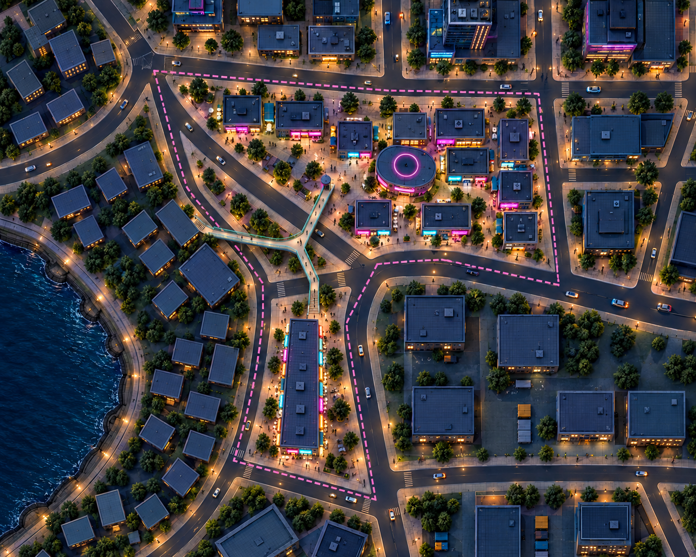
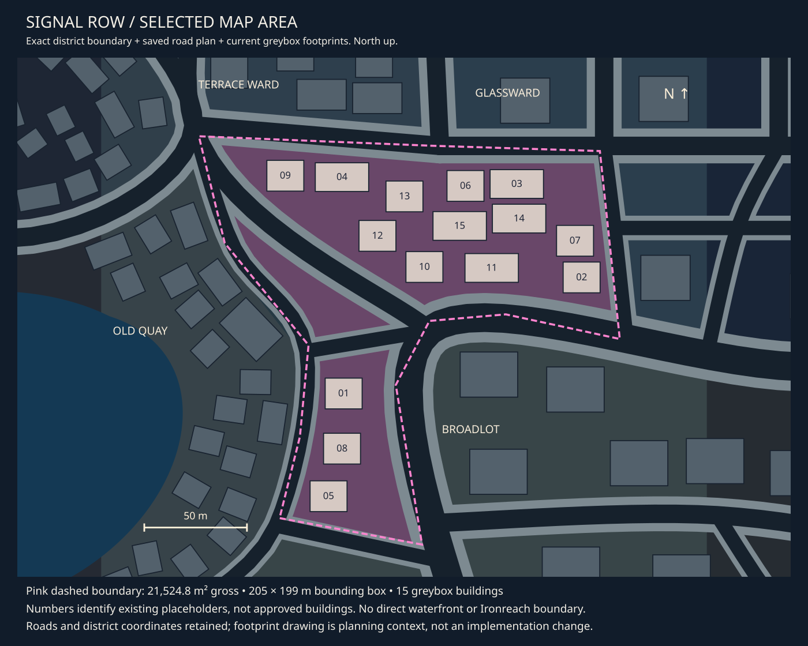

# Signal Row — concept revision 03

9 October 2026 · **In review. Nothing selected for production.**

[District queue](README.md) · [All asset briefs](asset-register.md) ·
[Selected map area and measurements](map-context.md#signal-row-findings).

[Building and prop breakdown from this image](signal-row-assets.md): five proposed
building designs, one bridge assembly, reusable fittings/props and separately
identified supporting items. This explains the Signal Row starting set; the [central tracker](asset-register.md)
owns live district demand and progress, including candidates not needed by this rendering.

## Current concept

A compact electric shopping district: quiet blue roofs, varied plum shopfronts,
cyan/magenta signs, a small rounded entertainment hall and an open plaza immediately
west of it. The broad northern area contains the main activity. The southern strip
now holds one continuous long building with multiple shops. A three-arm pedestrian
bridge links the main area, the southern forecourt and Old Quay to the west. Trees
and roof equipment remain candidates for later simplification. Names and sign copy
remain placeholders.

The thin pink line shows the intended selected area. Surrounding towers, retail
buildings and the water farther west are context. The district does not gain its
own waterfront or marina. The requested pedestrian bridge crosses into Old Quay
on land; it does not cross the harbour water or introduce a link to Ironreach.

## Map reference and proposed arrangement

The map drawing is the geometry reference; imagegen is an illustration. The exact
polygon is 21,524.81 m² gross with a 205 × 199 m bounding box, not a rectangular
buildable plot. Current saved Signal Row has 15 shop/row placeholders. Streets and
district boundaries remain fixed in this study.

Proposed change for discussion: replace the row at `building_0015` with the hall
and use the footprint around `building_0012` as its plaza. The owner now requests
consolidating southern `building_0001`, `building_0008` and `building_0005` into one
shopping parade, with a northern forecourt connecting to the three-way footbridge.
Keep existing roads and district boundaries; the bridge intentionally crosses the
western boundary. A later production commission would need to resolve affected
saved identities and placement; none is changed here.

The generation prompt explored a 26 × 22 m hall. A subsequent simple footprint
comparison leaves only about 1 m to shop 0006, so the brief now proposes about
26 × 18 m for refinement. That leaves about 3 m to the north and 4.5 m to row 0011
to the south before overhangs. These are planning gaps, not gameplay clearance
acceptance. Do not measure the final model from the generated roof.

## Owner-requested changes in this revision

- One long multi-store building replaces the three isolated southern shops. The
  image explores a continuous quiet roof and six illustrative storefront bays.
- One connected pedestrian bridge links the main northern area, the southern
  building’s forecourt and the harbour district on the left. The Y-shaped deck and
  three ground landings are a design proposal; connectivity is the owner requirement.
- Road surfaces are excluded from the art inventory. The owner plans to generate
  them through future tooling; their existing layout remains reference context.

## Signal Row-specific briefs

| Family | What it supplies |
| --- | --- |
| [Shopping blocks](../../assets/d06_shopfront_blocks.md) | Broader exploration; v03 can use shared shells instead |
| [Southern shopping parade](../../assets/d06_southern_shopping_parade.md) | One long shell with multiple storefronts and a north forecourt interface |
| [Harbour-area footbridge](../../assets/d06_harbour_footbridge.md) | Three-way deck, spans, ground-access landings and supporting details |
| [Mixed-use infill](../../assets/d06_mixed_use_infill.md) | Broader exploration; distinct infill designs not established by v03 |
| [Entertainment hall](../../assets/d06_entertainment_hall.md) | Rounded shell, roof ring and entry canopy |
| [Poster drum](../../assets/d06_poster_drum.md) | Low cylindrical support and cap variant |
| [Commercial graphics](../../assets/d06_commercial_graphics.md) | Hall/shop artwork, poster wraps and passage wayfinding |

Ordinary standalone shops reuse [shared shop shells](../../assets/city_small_shop_shells.md).
Canopies, fascias, shutters and entry surrounds reuse
[shared fittings](../../assets/city_shop_fittings.md). Sidewalks, paving,
markings, lights, sign supports, seating, bins, bollards, planting, roof details,
service furniture and parking details use the [shared register](asset-register.md#shared-city-assets-and-candidates).
No extra fountain, marina, boat, rooftop terrace, cafe-furniture kit or new vehicle
is commissioned by incidental details in an image.

The illustrated plaza is an arrangement of paving, seating and open ground, not a
new monolithic asset. Shop copy and colours are graphic/material variants; repeated
benches and bins do not each need a new model. Existing actor/vehicle tracks retain
their approved designs rather than adopting imagegen's incidental figures/cars.

## Self-review and next decision

- v03 visibly replaces all three detached southern shops with a single uninterrupted
  roof and building mass. Multiple fascia panels distinguish the stores.
- The bridge visibly branches to the northern activity area, the southern forecourt
  and Old Quay on the left; roads remain visible beneath the spans. It crosses land
  and streets, not water. The overall district silhouette and road arrangement are
  retained from v02; exact geometry remains owned by the map reference.
- The southern and western stairs read most clearly. The main-area descent near
  the poster drum is not clearly resolved at this scale; the next bridge detail
  study must separate that landing from the drum and show ground access explicitly.
- Deck height, supports, road headroom, landing extents and walking clearances are
  illustrative. This is not engineering, navigation or gameplay acceptance.
- The continuous building's approximately 18 × 60 m prompt proportions and six bays
  are proposals. Generated dimensions, roofs, cars, trees and markings cannot serve
  as measured authoring data. Tree and roof-detail density remain high.

Next visual review concerns the long building's proportions and shop rhythm, plus
whether the three-way bridge arrangement matches the desired connection. The owner
requested these changes but has not yet selected this particular rendering. No
concept approval automatically begins modelling or implementation.

## Provenance and superseded image

The built-in imagegen tool produced v01, v02 and v03. [Exact prompts](prompts.json),
[v02 map-based prompt](prompt-v02.json), [v03 edit prompt](prompt-v03.json) and
[file receipts](generation.json).
The project-owned selected island image supplies style; the exact-coordinate map
extract supplies v02 geometry. v03 edits v02 with the map as supporting reference.
SVG source is retained beside the unchanged map PNG.

[v02](06-signal-row-v02.png) remains the previous map-based comparison; its three
separate southern shops and lack of pedestrian bridge are superseded.

[v01](06-signal-row-v01-superseded.png) is superseded: it placed the entertainment
area directly beside a marina and used a generic grid. It began generating before
the owner emphasized the selected polygon and must not guide placement or scope.

Validation is document/link and reference-geometry checking plus visual self-review.
No models, game implementation, saved scene edits, imports or gameplay tests were
performed. Actual-camera, movement, traffic and performance acceptance remain open.
