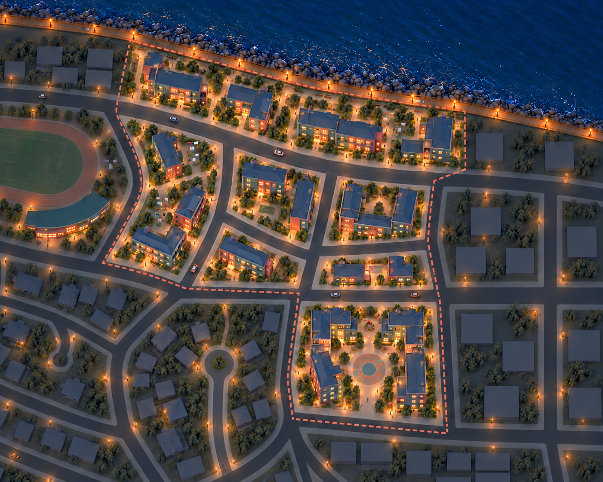
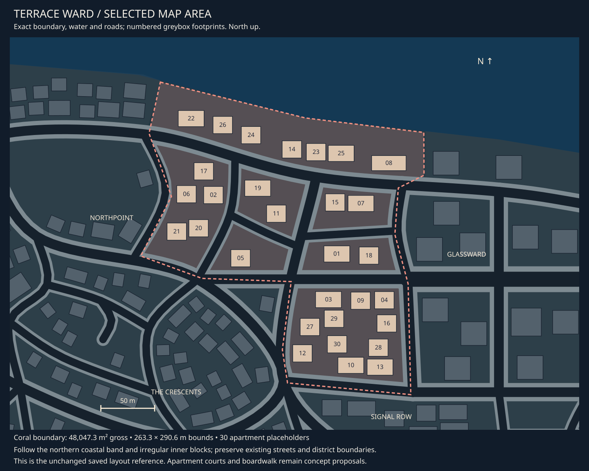

# Terrace Ward concept review

9 October 2026 · **District direction liked; modular apartment kit required.**

[Detailed asset breakdown](terrace-ward-assets.md) ·
[Central asset registry](asset-register.md#03-terrace-ward-assets) ·
[Apartment kit brief](../../assets/d03_apartment_family.md) ·
[District queue](README.md) · [Exact area](map-context.md#district-03).

## Current concept

Terrace Ward explores stepped apartments, shared courts and shorter pedestrian
links. Blue-grey roofs, muted teal, coral corners and warm entries distinguish it
from Northpoint's campus and The Crescents' smaller homes. The southern plot has
the largest communal court, with a circular paving motif and broad open ends.
Smaller inner blocks contain compact L/U groups, infill and side courts with
laundry frames. The boardwalk continues along the northern shore beyond both
district boundaries.

The owner likes the first Terrace Ward direction and explicitly requests that the
buildings use modular parts. Revision 02 preserves this district design and
corrects the neighbouring Crescents cul-de-sac omitted in revision 01.

## Fit to the selected area

The selected polygon measures **48,047.3 m² gross**, with a **263.3 × 290.6 m
bounding box**. Thirty saved apartment placeholders establish scale and plot
locations. A northern coastal band, irregular inner blocks and larger southern
plot remain separated by the existing roads. The district is not a rectangular
land allocation; surrounding neighbourhoods stay outside its coral outline.

The concept consolidates southern side/northern placeholders into apartment groups
and clears the vicinity of central footprints 29/30 for the communal court.
Southern infill is reduced to leave a generous opening. That arrangement is a
proposal, not a saved-layout edit. The current raster reads as two facing stepped
groups with an additional northern gap, rather than one fully connected U.
Preserve those useful open links when refining a modular composition.

The exact map retains original saved roads and footprints. The Crescents' new
cul-de-sac appears only in the concept context. Northpoint's track and curved
pavilion remain at the left crop edge. Image counts, setbacks, height and walking
clearances are illustrative and not game-camera or geometric acceptance.

## Asset direction

| Family | Scope |
| --- | --- |
| [Modular apartments](../../assets/d03_apartment_family.md) | Seven proposed module records; L, U, short-infill and stepped-bar compositions reuse them |
| [Laundry frames](../../assets/d03_laundry_frames.md) | Short/corner frames and restrained static cloth shapes |
| [Court artwork](../../assets/d03_court_graphics.md) | Circular communal paving and small play markings |
| [Community graphics](../../assets/d03_community_graphics.md) | Neighbourhood notices and identity on shared supports |
| [Island boardwalk](../../assets/city_boardwalk.md) | Existing shared deck, corners, fascia, supports and access pieces |

The four apartment composition IDs are layout references, not four one-off building
models. The kit proposes straight bays, corners, ends, entrance bays, balcony
inserts, roof caps and height-step closures. Vary bay count, storeys, setbacks and
materials while keeping compatible joins. Exact module dimensions remain pending.
No modules, scenes or procedural building system have been implemented.

Shared lights, planting, benches, ground finishes, shoreline and railings retain
their existing briefs and registry entries. The completed detailed asset pass records laundry frames/cloth, court artwork,
entrance numbers and shared city uses, with uncertain supporting items kept separate. Road surfaces remain excluded.

## Review and next work

The district and main court read clearly, and the corrected context keeps both
Crescents dead ends. The image still uses more trees and uniformly spaced lamps
than the brief requests. Many roofs remain low-pitched; roof modules need to
respect the liked silhouette while making stepped joins practical. Court openings
and side walking links must remain visible as building parts are refined.

Next asset review: a module concept sheet showing the same kit in at least two
different apartment compositions, including a height change. That is a future
concept refinement, not permission for modelling or implementation. The current
overview does not prove modular compatibility.

## Provenance

Built-in imagegen used the [exact map extract](03-terrace-ward-map.svg) and
[Northpoint revision 04](01-northpoint-v04.png) for city style and neighbour context.
[Initial prompt](prompt-terrace-ward-v01.json) · [Context correction](prompt-terrace-ward-v02.json)
· [Image receipts](generation.json). [Revision 01](03-terrace-ward-v01.png) is retained.
Original district boundaries, roads, model sources and saved scenes are unchanged.
