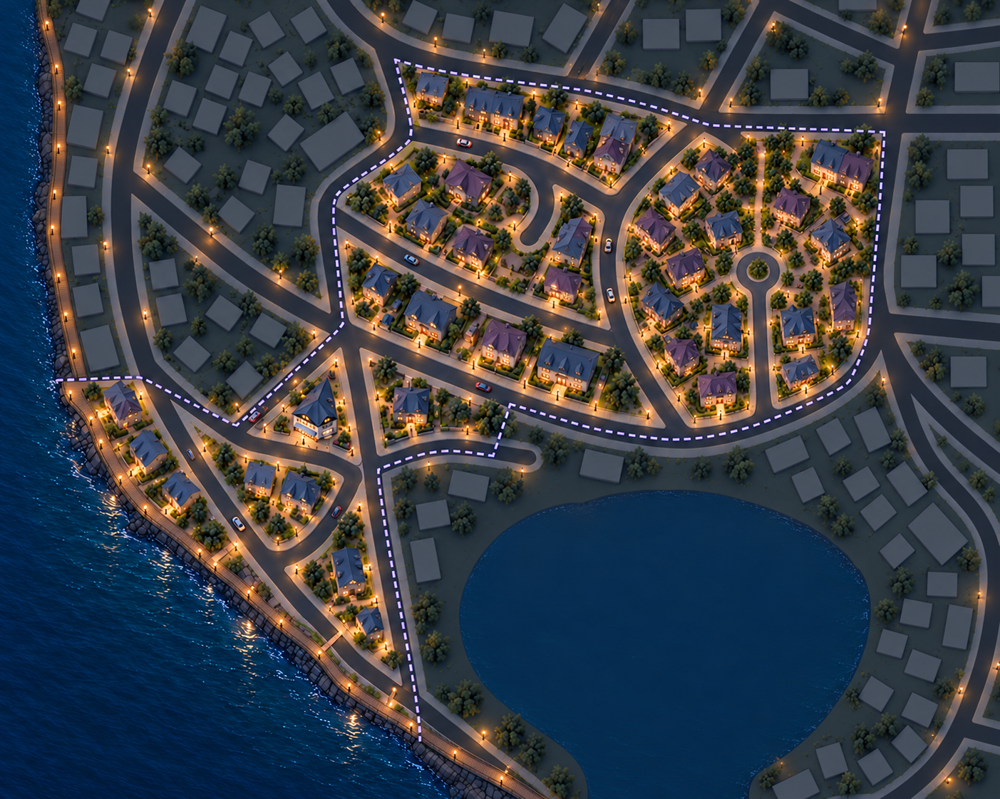
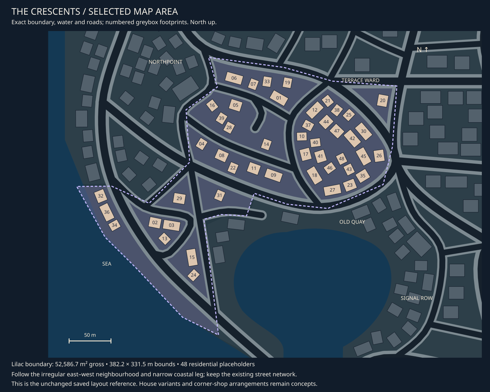

# The Crescents concept review

9 October 2026 · **Revision 02 direction liked; asset breakdown recorded.**

[Central asset tracker](asset-register.md#02-the-crescents-assets) ·
[Detailed asset breakdown](the-crescents-assets.md) · [District queue](README.md) · [Exact selected area](map-context.md#district-02).

## Current concept

A quieter residential neighbour to Old Quay: detached and paired homes, short rows,
warm porches, low garden walls and irregular planted plots. Slate blue and muted
plum roofs carry the established Brackett palette. A modest corner shop anchors
the triangular junction toward the southwest of the main neighbourhood.

The existing central cul-de-sac, new eastern cul-de-sac and narrow coastal tail
give the district its shape. The new access street enters the eastern housing pocket
from its southern curve and ends at a circular turning head. A shared timber boardwalk
follows the outer coast, continuing toward neighbouring districts. Small pedestrian paths run between gardens. The harbour and
surrounding districts are subdued context outside the lilac outline.

## Fit to the selected area

The unchanged selected polygon measures **52,586.7 m² gross**, with a
**382.2 × 331.5 m bounding box**. Its irregular shape is not a rectangular land
allocation. The saved layout has 48 residential placeholders; those are location
references, not a requirement for 48 unique building designs.

The concept proposes replacing footprint 29 in the small triangular junction plot
with the corner shop and garden arrangement. This is a review proposal only.
The broad northern neighbourhood, eastern curve, original central cul-de-sac and
coastal leg follow the map reference. Revision 02 adds the owner-requested eastern
cul-de-sac and rearranges its immediate plots. The map extract deliberately retains
the original saved layout for comparison; that new access is a concept proposal. Generated building counts, setbacks, edges and
path widths are illustrative; the map remains authoritative. No road or scene
layout was changed, and road surfaces are outside this asset work.

## Assets and briefs

| Family | Proposed coverage |
| --- | --- |
| [House family](../../assets/d02_house_family.md) | Detached, paired, short terrace and compact corner homes; distinguish footprints and roof silhouettes |
| [Corner shop](../../assets/d02_corner_shop.md) | Small wedge-shaped shell; rear annex remains a candidate, not clearly resolved in v02 |
| [Domestic details](../../assets/d02_domestic_details.md) | Low garden-wall runs/returns, mailbox and porch canopy |
| [Neighbourhood graphics](../../assets/d02_neighbourhood_graphics.md) | Local notices and corner-shop fascia artwork on shared supports |

Reuse shared planting, lamps, waste bins, shop fittings, sign supports and selected
roof details. The coastal edge uses the shared shore-edge family. Gardens are
arrangements of planting and ground finishes, not bespoke models for every plot.
The [detailed breakdown](the-crescents-assets.md) records four core building designs,
domestic details and the [shared boardwalk kit](../../assets/city_boardwalk.md).
All demand and progress remain in the central tracker; this page explains the concept.

## Visual review and next iteration

The triangular shop and the selected district's broad shape read clearly. The
rendering retains blue/plum roofs and warmer domestic entrances, with little neon.
House variety still leans toward repeated hipped and dormered forms; a closer
iteration should distinguish paired homes and short terraces more strongly.
Planting and lights are denser than the brief requests and can be reduced.
Small mailboxes, bins and notices are not identifiable enough to count from this
overview. No measured clearance or gameplay acceptance is implied.

The owner likes revision 02 and requested the asset breakdown and next district.
Refine individual asset designs from the recorded set, with uncertain supporting
items kept explicit. The boardwalk is needed here; other coastal uses await fit. No modelling or implementation follows
automatically from concept acceptance.

## Provenance

Built-in imagegen used the [exact map extract](02-the-crescents-map.svg) as the
layout reference and [Old Quay v03](05-old-quay-v03.png) for the city's visual style.
[Initial prompt](prompt-the-crescents-v01.json) · [Revision prompt](prompt-the-crescents-v02.json)
· [Image receipts](generation.json). Revision 01 is retained; revision 02 adds the
requested eastern cul-de-sac and boardwalk using the built-in imagegen tool.
Maps, model sources and saved scenes remain unchanged.
