# UI v1 — a little city, a lot of trouble

**First concept pass · 8 October 2026 · awaiting owner review.**

[Open the visual gallery](review.html) · [Start with the 200 px HUD](02-foot-balanced.png) ·
[Compare minimaps](08-minimap-directions.png) · [Main menu](09-main-menu.png)

Twenty-one **1280 × 800** screens, each supplied as an editable, standalone SVG and an
Edge-rendered PNG. Open the PNG links at **100%**, not the thumbnail size. The SVGs
embed their background PNGs, use system sans fonts, and need no network or sibling
assets to render. The gallery uses the adjacent PNG files.

This is a visual proposal, **not implemented UI, approved size/look, a gameplay capture
of the proposed HUD, or Steam/Deck acceptance**. No Godot scenes, themes, gameplay code,
product rules, TODOs or task requirements were changed. Documentation assets were
written directly: the editor was not running and no MCP editor tools were available.
`.gdignore` keeps this concept pack out of Godot's asset import scan.

## Current scope — ENet only

**Current M1 is ENet-only**, per owner decision 9 (8 October). There are no current
Steam-specific features, selectable Steam transport, friend invites or Steam testing.
The default/current multiplayer flow is **10 Host → 13 Lobby**, or **12 Join direct →
18 Admission**. These drawings now show only ENet, not a transport picker.

**FUTURE ADAPTER EXPLORATION:** sheets **11, 19, 20 and 21** preserve the Steam concepts
solely to inform abstractions/APIs for a later adapter. Each carries that visible title
tag and an explicit ENet-only-current-M1 footer. They are not current feature commitments,
implementation tasks or authorization for Steam-specific testing. The earlier Steam-default
presentation was rejected in review; this revision supersedes it without discarding the art.

## Direction

**Quiet instruments, playful city.** Broad petrol panels, warm ivory type, coral actions
and restrained amber focus echo the accepted smooth Petrol & Coral art. Rounded corners
are modest, not pill-shaped everywhere. No scanlines, pixel fonts, ornamental telemetry,
score, wanted meter, mission tracker or fake minimap objectives.

- **Recommend trying the 200 px roads + blocks candidate first**, not accepting it yet.
  It adds place cues without the 240 px panel's intrusion into the street. All three
  variants remain top-right and north-up; only position is already accepted.
- Keep player health bottom-left in both foot and vehicle states. Swap the bottom-right
  weapon panel for vehicle condition/speed instead of adding a second competing stack.
- Reserve bottom-center for a single contextual action. Do not cover the actor or mouse
  aim point with a permanent interaction bubble. Name tags are separate placement studies.
- Use opacity on the **backdrop**, not the text. Give numerals a stable visual position.
  Colour is reinforced by shape, number, label, outline or bar length.
- Amber outlines show **focus**, coral fills show **primary action/selected tab**.
  Focus is visible on a secondary action too, as in the join-error dialog.

### Palette and type tokens

These are proposal tokens, not new calibrated Godot material values. Exact reference
swatches come from [art direction](../../art-direction.md); UI-specific lighter/darker
variants keep text and small symbols readable over the city.

| Token | Value | Intended use |
| --- | --- | --- |
| Ink | `#0C222B` | Page, input wells, tag backplates, dark text on coral |
| Panel petrol | `#102F3A` | Opaque HUD and menu surfaces |
| Road petrol | `#123646` | Minimap ground; accepted art reference |
| Block emerald | `#20504F` | Muted map blocks, derived from reference `#15564F` |
| Warm ivory | `#F6F1DC` | Primary text, outlines, weapon and car symbols |
| Coral | `#FF725D` | Primary action, local marker, health bar and damage |
| Amber | `#FFC05A` | Focus, vehicle damage state, warning/event symbols |
| Pale cobalt | `#8AB8FF` | Player 2, lightened from reference `#235FCC` |
| Pale teal | `#80D4C5` | Player 3, audio fill and saved state |
| Muted text | `#AEC3C6` | Secondary readable copy; not disabled opacity |
| Outline | `#45616B` | Decorative panel separation, not the focus indicator |
| Map roads | `#74929A` / `#64858D` | Roads-only / block-map strokes |
| Font stack | `Segoe UI, system-ui, Arial, sans-serif` | No downloaded or bundled fonts |
| Display | 100 px / 850 | Menu wordmark only |
| Speed | 64 px / 750 | Vehicle speed, illustrative units `km/h` |
| Screen titles | 40–48 px / 750 | Dialog / full-screen headings |
| Ammo | 36 px / 750 | Current magazine / capacity |
| Actions and values | 22–26 px / 650–750 | Buttons, player health, fields, lobby names |
| Body | 18–20 px / 400–600 | Instructions and recovery messages |
| Compact copy | 16–17 px | World tags, HUD secondary labels, list details |
| Micro-labels | 12–14 px / 650 | Design annotations, map frame, section labels |
| Player numbers | 13 px / 800 | On 20 px outlined discs; actual Deck check needed |
| Space and corners | 8 px rhythm; 8–12 px corners | 24 px HUD side margins; 48 px menu margins |
| Focus | 3 px amber, 4 px outside button | Distinct from hover/selection; no colour-only focus |
| Buttons | Normally 52–56 px tall | Compact Back 48 px; Refresh 42 px. Focus navigation, not touch-only |

Micro-labels are not where action instructions or essential numeric values live. The
smallest map/car/event symbols remain a **handheld legibility risk**, despite native-size
render checks. This is not an accessibility certification or permission to shrink
critical text in implementation.

## Screen index

Every thumbnail opens the full native PNG. Each source link opens its self-contained SVG.
Questions below are design-review prompts, **not blocking decisions or approved changes**.

### Gameplay and minimap

| Preview / source | Rationale and 1280 × 800 readability | Owner review question |
| --- | --- | --- |
| [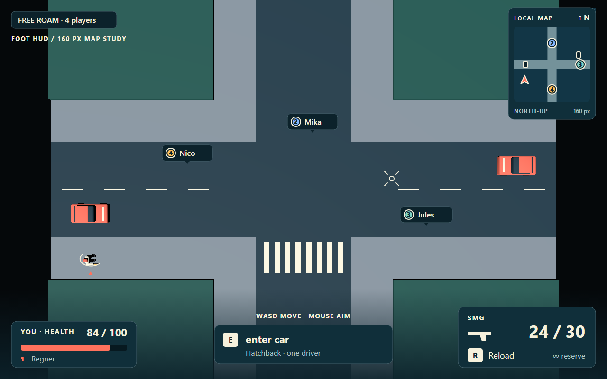](01-foot-compact.png)<br>**01 · Compact** · [SVG](01-foot-compact.svg) | 160 px map keeps the accepted prototype's inner size but adds a legible frame, north label and outlined markers. Opaque backplates protect 16 px tags from pale pavement. Least place detail. | Is the smaller footprint worth losing block shapes? |
| [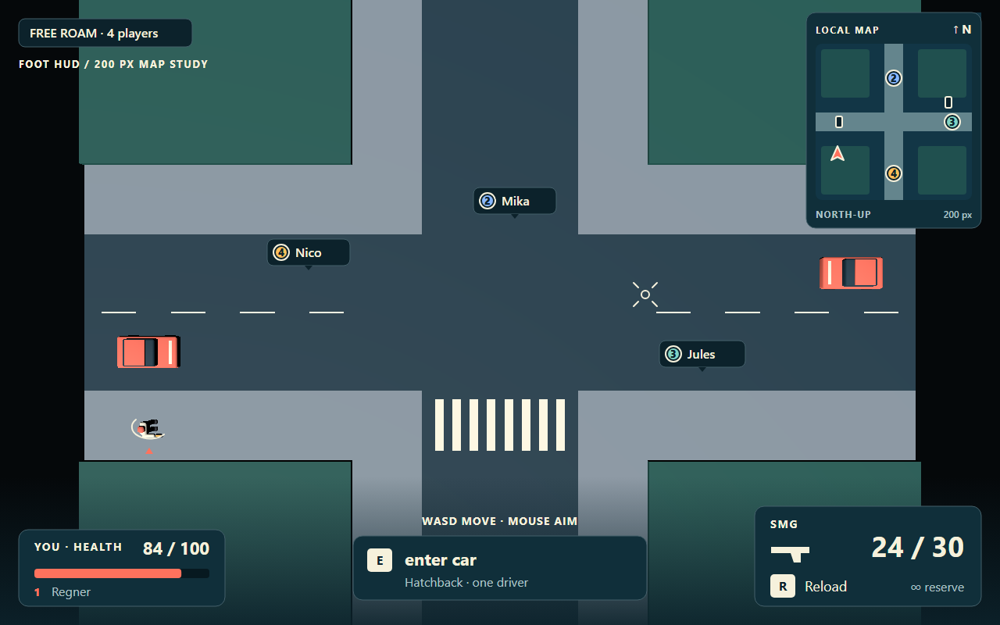](02-foot-balanced.png)<br>**02 · Balanced candidate** · [SVG](02-foot-balanced.svg) | 200 px roads + blocks; health, SMG magazine and E — enter car share a stable bottom band. Larger action type stays separate from the central aim reticle. | Is this the right map/HUD balance for the first playable pass? |
| [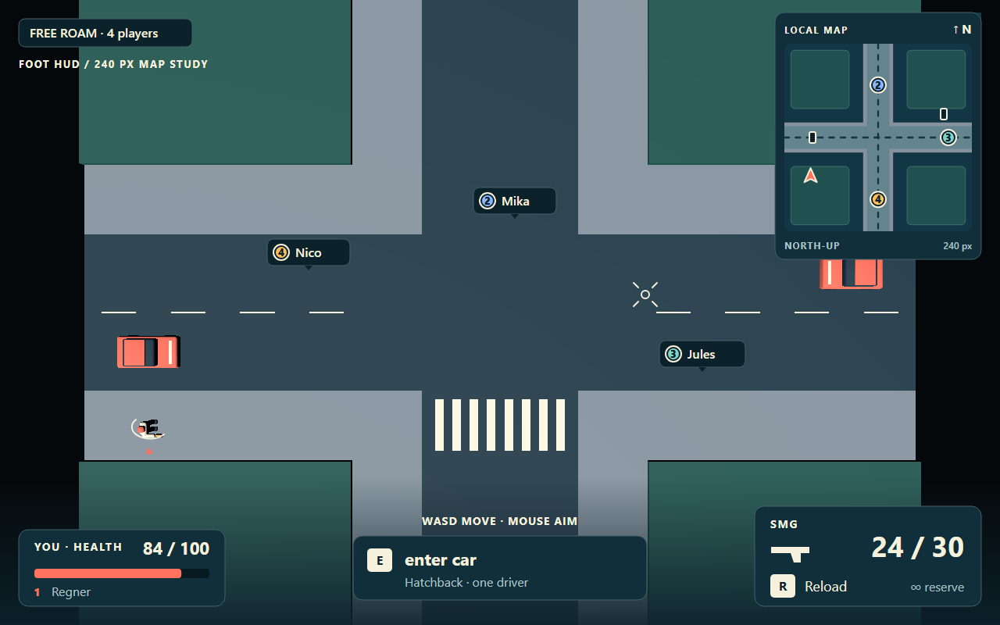](03-foot-wide.png)<br>**03 · Street atlas** · [SVG](03-foot-wide.svg) | 240 px inner map adds block outlines and lane-center detail. The frame visibly overlaps the top of the right-hand car in this capture: a real comparison cost, not hidden by moving the background. | Does the extra detail justify that loss of street view? |
| [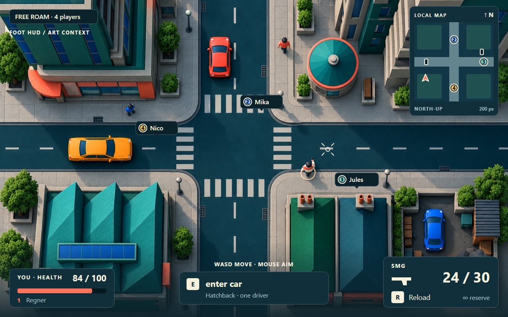](04-foot-art-context.png)<br>**04 · Art-context overlay** · [SVG](04-foot-art-context.svg) | Same balanced HUD over accepted high-rise artwork tests the palette against a much busier image. Not a new camera angle or production-art proposal. Backplates stay opaque. | Does the HUD feel part of Petrol & Coral without competing with the cars? |
| [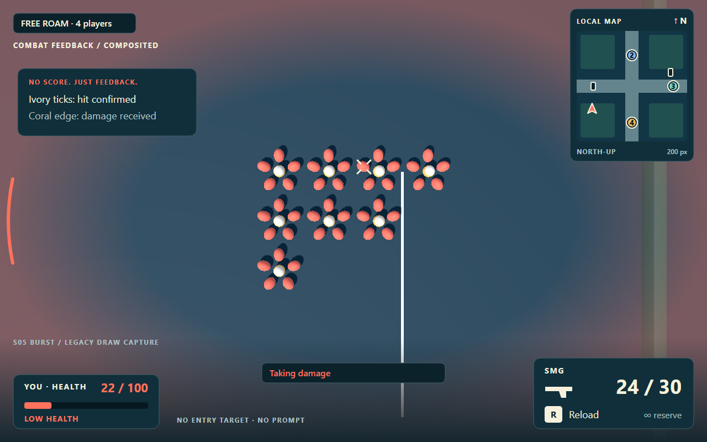](05-foot-damage.png)<br>**05 · Combat feedback** · [SVG](05-foot-damage.svg) | Ivory hit ticks contrast with coral incoming-damage edge, LOW HEALTH label and numeric health. No score, floating damage totals or kill feed. The large explanatory card is a design annotation, not proposed permanent HUD. | Is the coral edge restrained enough around explosions? |
| [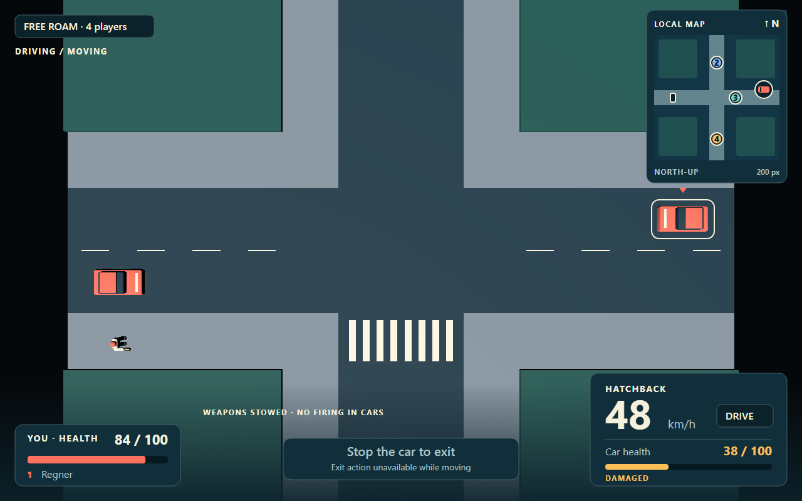](06-car-moving.png)<br>**06 · Car moving** · [SVG](06-car-moving.svg) | 64 px speed, car-health bar and DAMAGED label replace weapon/ammo. Player health stays put. Exit explanation has **no E key** while moving; local map marker becomes a car. | Is keeping player health visible useful, or visually redundant in the car? |
| [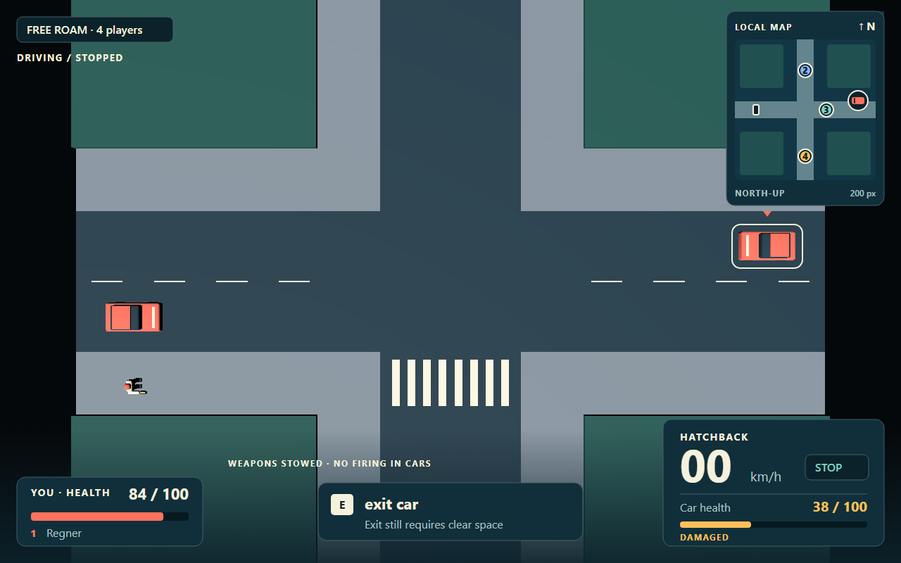](07-car-stopped.png)<br>**07 · Car stopped** · [SVG](07-car-stopped.svg) | E — exit car appears only in the eligible stopped state. Clear-space qualifier prevents the mockup from promising an unsafe exit. STOP is separate from rounded speed. | Is this enough explanation when exit is blocked, or should that state use a short reason toast? |
| [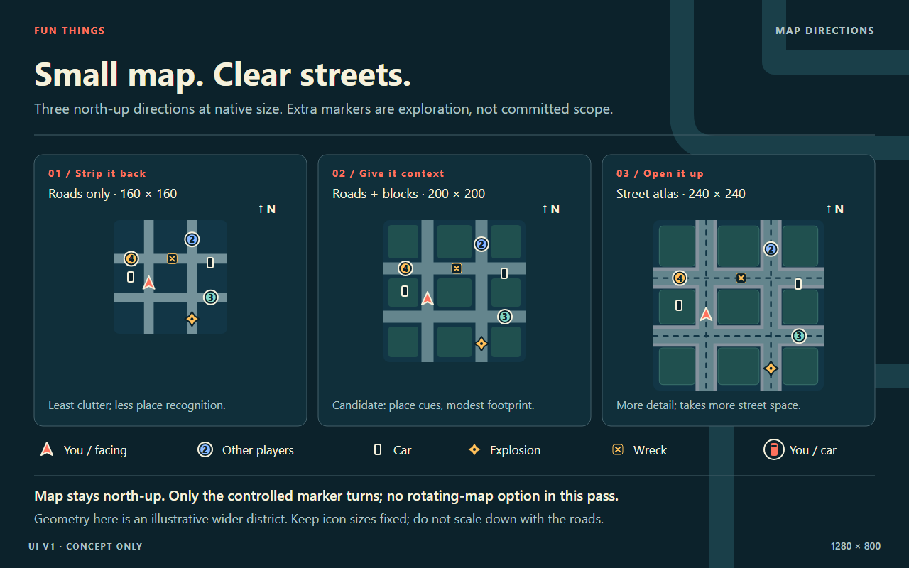](08-minimap-directions.png)<br>**08 · Map detail sheet** · [SVG](08-minimap-directions.svg) | All three maps shown at their actual 160/200/240 px sizes in one native frame. Icons do not shrink with geometry. Foot = coral pointer; peers = numbered discs; car = outline; explosion = amber diamond; wreck = crossed square. | Which optional peer/car/event markers are useful enough to pursue beyond the committed roads + local marker? |

### Front end, session and local menus

| Preview / source | Rationale and 1280 × 800 readability | Owner review question |
| --- | --- | --- |
| [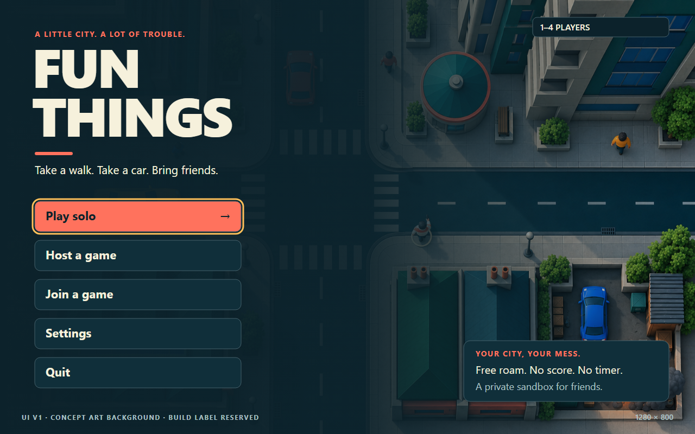](09-main-menu.png)<br>**09 · Main menu** · [SVG](09-main-menu.svg) | The city supplies personality; a left-side scrim makes the five 56 px actions readable. Solo is independent of Steam. A build/revision area is reserved, not populated with a fake build number. | Does the playful copy fit the game's tone? |
| [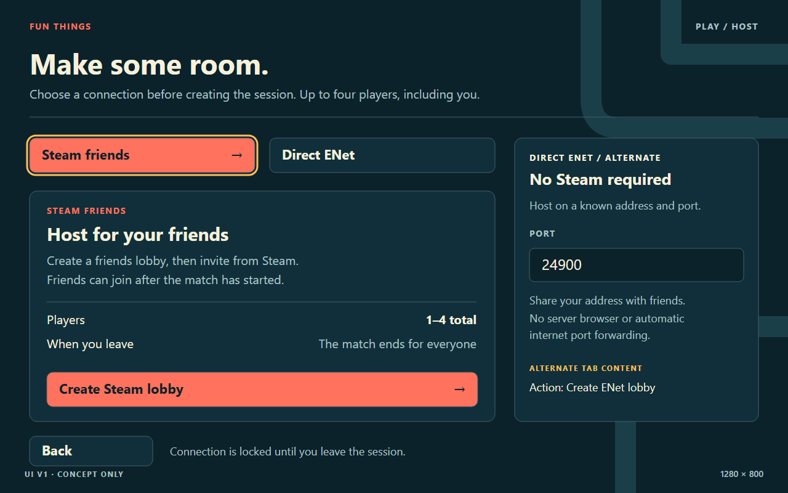](10-host.png)<br>**10 · Current M1: ENet host** · [SVG](10-host.svg) | Default/current host presentation: explicit port and Create ENet lobby. No Steam selector. Port focus and 26 px text stay clear. Prior Steam host retained in 19. | Are the port and address-sharing instructions clear enough? |
| [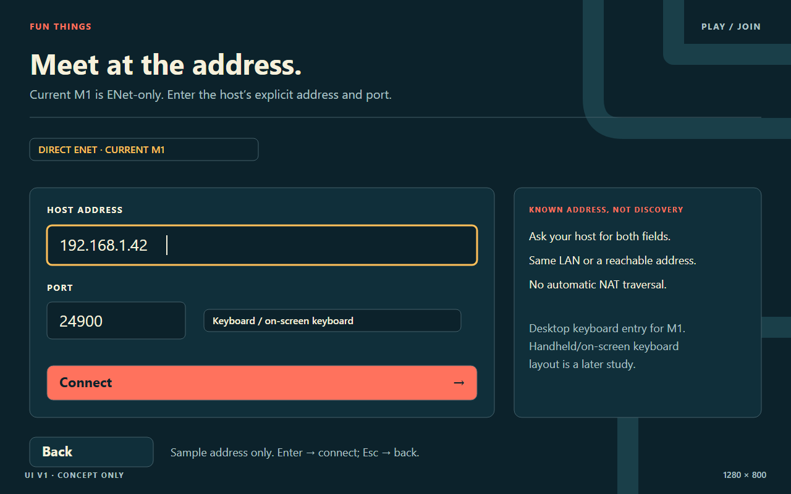](12-join-direct.png)<br>**12 · Current M1: ENet join** · [SVG](12-join-direct.svg) | Default/current join presentation: 26 px address/port text, separate fields and visible focus. No Steam tab, LAN browser or NAT-traversal promise. Handheld keyboard layout is a later study. | Is the connection guidance clear for a friend who has never used direct ENet? |
| [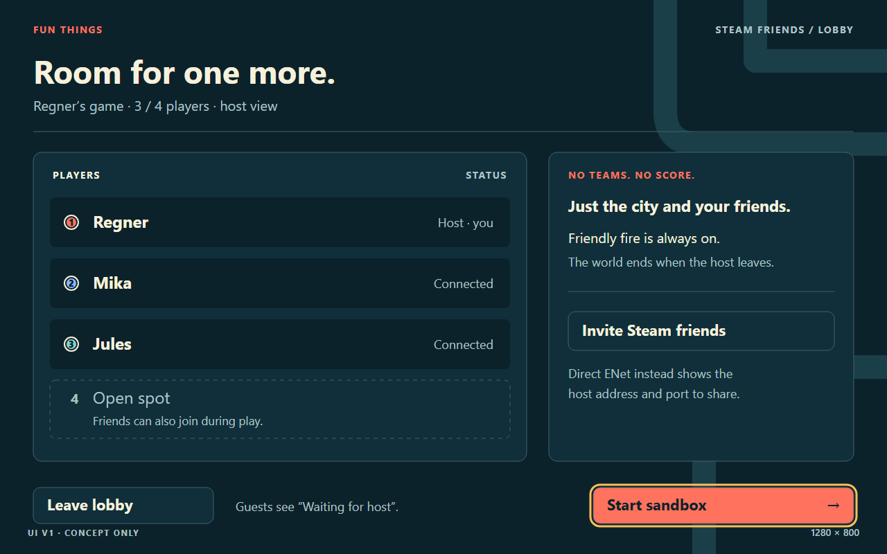](13-lobby.png)<br>**13 · Current M1: ENet lobby** · [SVG](13-lobby.svg) | Four slots maximum; number + name + status, no teams or speculative ready mechanic. Host starts; guests wait. Explicit address/port sharing replaces Steam invites; prior Steam lobby retained in 20. | Does the lobby need anything beyond people, invite/share and Start? |
| [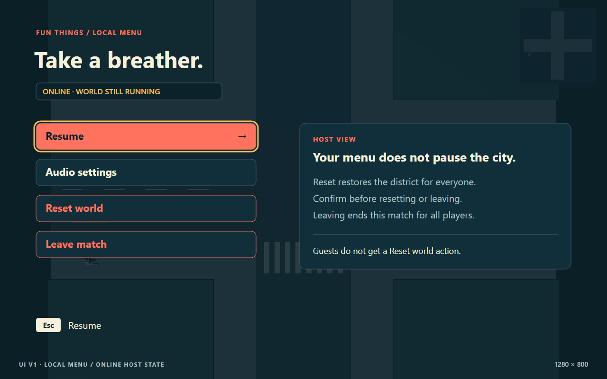](14-pause.png)<br>**14 · Local pause menu** · [SVG](14-pause.svg) | Unambiguous ONLINE — WORLD STILL RUNNING message. Resume is initially focused. Reset/leave are separated from benign actions; right card explains the host-only state. | Is the live-world warning prominent enough without overwhelming Resume? |
| [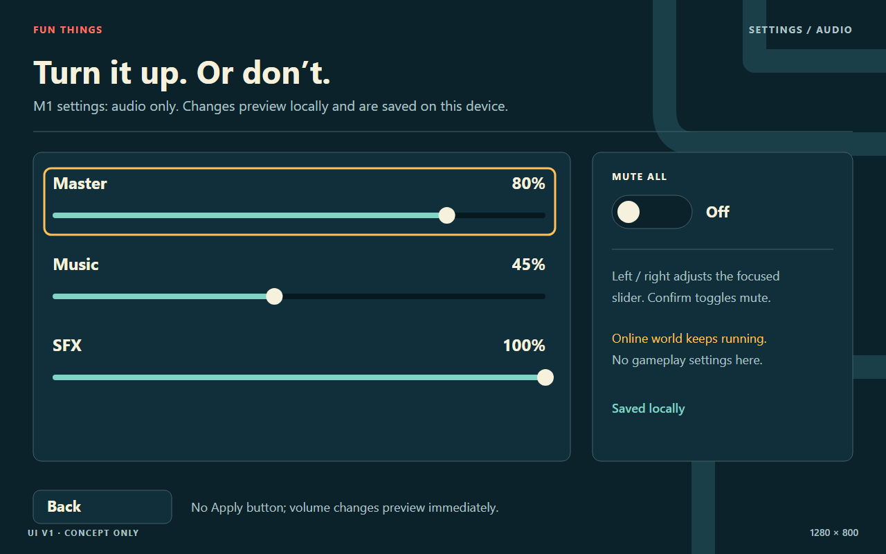](15-audio-settings.png)<br>**15 · Audio settings** · [SVG](15-audio-settings.svg) | Master/Music/SFX and mute only. Wide sliders, numeric percentages, amber focus, immediate local preview/persistence. No graphics or gameplay tabs. | Do these slider proportions and the separate mute control read comfortably? |
| [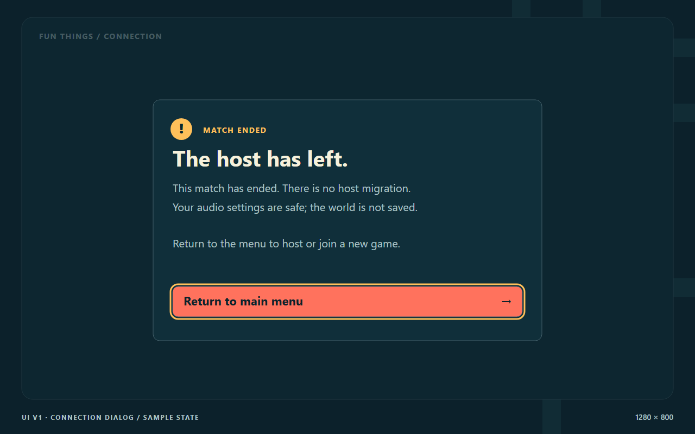](16-host-lost.png)<br>**16 · Host lost** · [SVG](16-host-lost.svg) | A single recovery action, explicit match end and no migration promise. Critical message 40 px; supporting copy 20 px. No ambiguous Resume or reconnect countdown. | Does the wording explain the loss without sounding like a crash? |
| [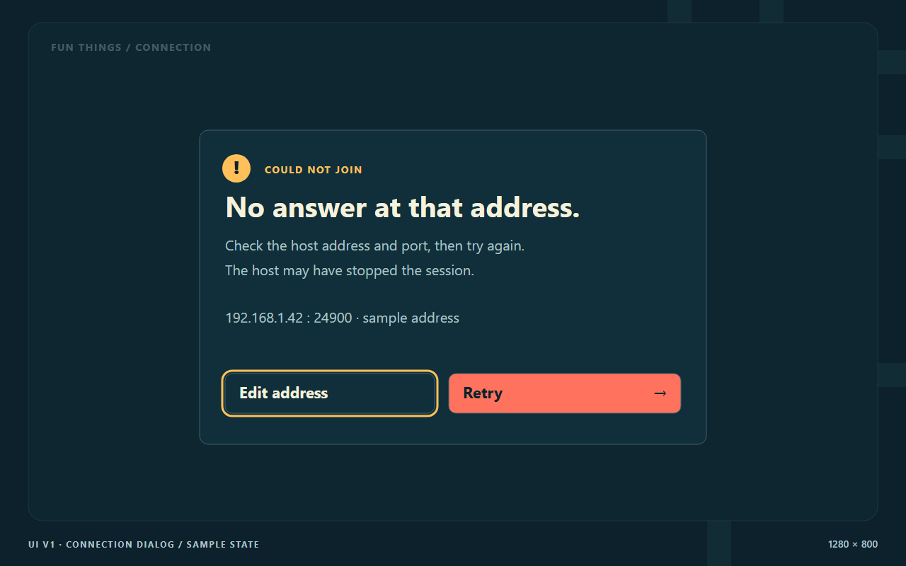](17-join-error.png)<br>**17 · Join error** · [SVG](17-join-error.svg) | Unreachable case keeps the sample address visible. Edit address is focused; Retry is available after attempt cleanup. The same shell can carry accurate Full/Incompatible messages. | Is Edit address the most helpful initial focus on this failure? |
| [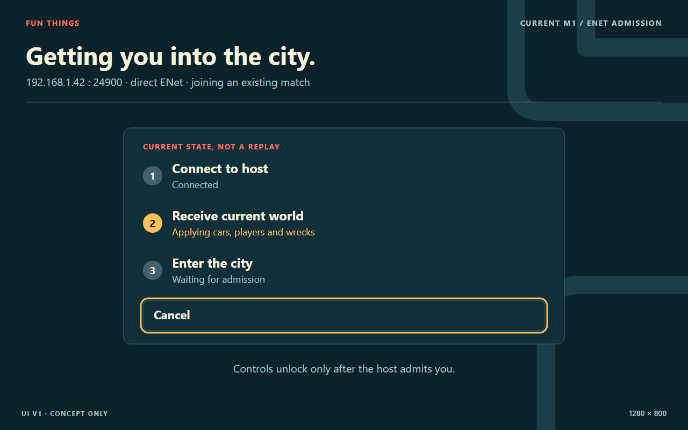](18-join-loading.png)<br>**18 · Current M1: ENet admission** · [SVG](18-join-loading.svg) | Direct ENet connection, current-state installation and admission are distinct. No invented percentage or ETA. Large reachable Cancel; controls unlock only after admission. Prior Steam version retained in 21. | Is this amount of progress detail reassuring rather than technical noise? |

### FUTURE ADAPTER EXPLORATION — not current M1

These retained drawings are separate from the ENet-only flow above. The labels apply to
all controls shown inside them, including any Steam/ENet comparison tabs.

| Preview / source | Rationale and 1280 × 800 readability | Future-only review question |
| --- | --- | --- |
| [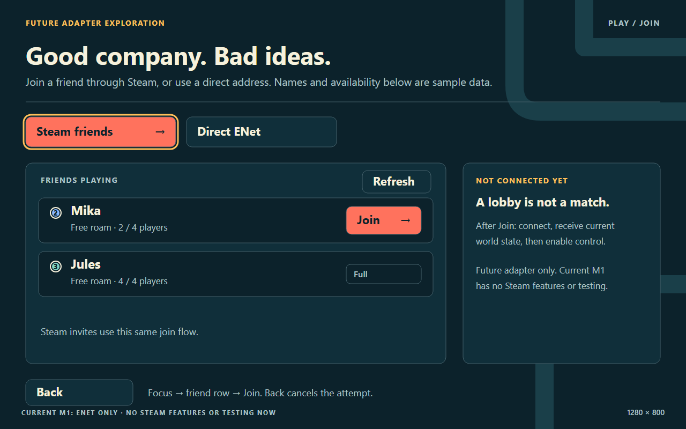](11-join-steam.png)<br>**11 · FUTURE ADAPTER EXPLORATION: friends join** · [SVG](11-join-steam.svg) | Preserved broad friend rows, player counts and Full badge. Visible future-only title and current-M1 ENet-only footer prevent treating this as a current selectable service. | For a later adapter, are name and count enough? |
| [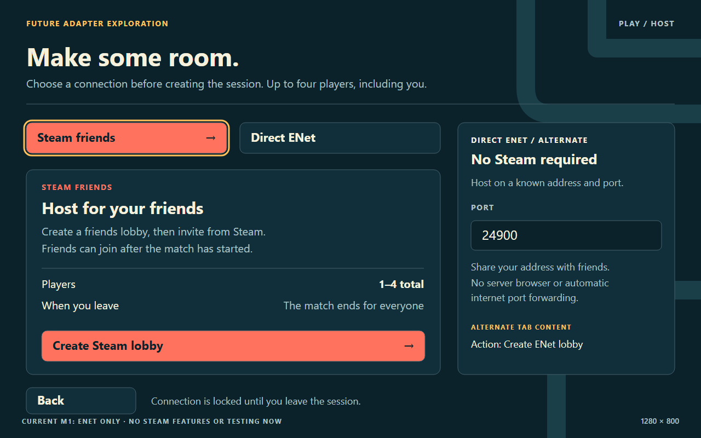](19-host-steam-future.png)<br>**19 · FUTURE ADAPTER EXPLORATION: Steam host** · [SVG](19-host-steam-future.svg) | Preserves the original Steam host study and comparison card, with the future-only title and ENet-only-current-M1 footer. Main port/action spacing remains native size. | Could a later adapter reuse the same host/session boundary? |
| [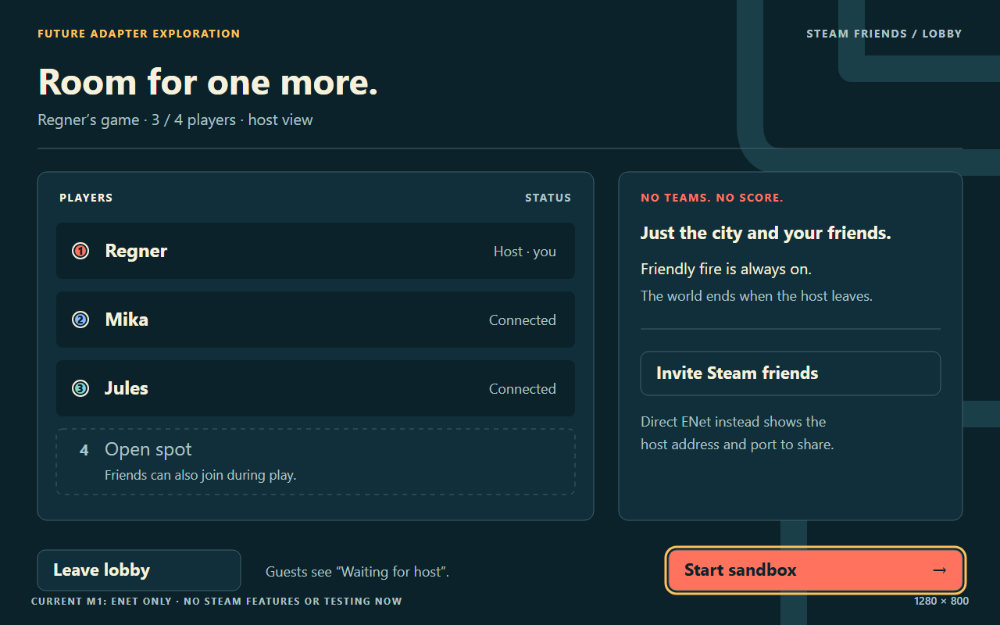](20-lobby-steam-future.png)<br>**20 · FUTURE ADAPTER EXPLORATION: Steam lobby** · [SVG](20-lobby-steam-future.svg) | Preserves the original four-slot Steam invite layout with explicit future-only labelling. Name/status hierarchy stays identical to the current ENet lobby. | Can future identity/invite presentation stay separate from admission? |
| [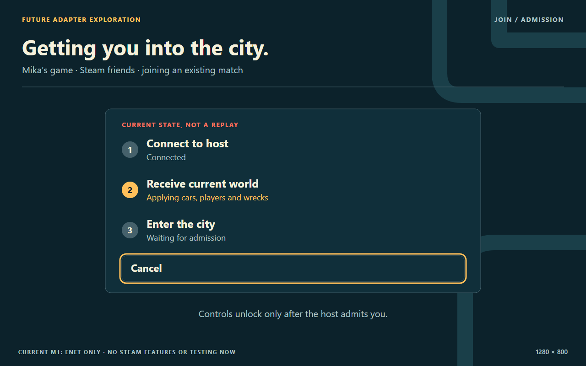](21-loading-steam-future.png)<br>**21 · FUTURE ADAPTER EXPLORATION: Steam admission** · [SVG](21-loading-steam-future.svg) | Retains the original Steam progress/cancel study with explicit future-only title and footer. No percentage or ETA is invented. | Can a later adapter retain the common cancel/admission lifecycle? |

## State and presentation notes

The [product brief](../../design.md) owns gameplay/session scope. For this pass, the
8 October owner handoff supersedes its older camera/control wording: **42° FOV, 47 m,
vertically top-down, fixed north-up; WASD movement plus mouse aim; no building cutaway;
no firing from cars; exit only when stopped; four players**. No camera rotation is
proposed. Decision 9 supersedes the older Steam feature scope: **current M1 is ENet-only**.
Decision 10 places desktop M1 before later Deck work. This README does not reconcile other
lanes' product records.

- **Foot:** show weapon name + magazine/capacity, unlimited reserve for pistol/SMG;
  launcher would use the same slot for cooldown, not finite rocket inventory. Values
  84 HP and 24/30 rounds are illustrative, not tuning decisions. Hit ticks represent a
  confirmed hit, not every shot. Timing, hit confirmation plumbing and damage direction
  are not specified by a static mockup. Do not add a flash/strobe policy on this basis.
- **Interaction:** enter only for an eligible nearby car; empty/invalid target = no action
  prompt. Losing a contested seat may use short reason copy, without changing host authority.
  Prompt placement here demonstrates a state; the captured actor is not proved within entry
  range of the illustrated car. This is not an interaction-range test.
- **Car:** no weapon panel, ammo, fire prompt or firing reticle. Show separate driver and car
  health. Speed unit is a display proposal, not a simulation change. The stopped decision
  comes from gameplay (handoff default speed below 0.5 m/s), **never a rounded `00` display**.
  Moving has no actionable exit key; eligible stopped has E. A blocked exit leaves the
  driver seated and should say why. No health-state thresholds are ratified here.
- **Map:** map image stays north-up; the local entity marker changes shape when driving
  and turns with the entity. Geometry in the street HUD abstracts the cross; detail-sheet
  geometry illustrates a wider district and is not a new city bake. Art-context and burst
  maps are layout placeholders, not geographic reconstructions. Numbered peers, car and
  event markers are requested exploration **beyond** the currently committed map scope.
  No enemy visibility, off-screen reveal, marker lifetime or event replication rule is chosen.
- **World tags:** three numbered/coloured peer tags are synthetic overlays, not actors
  detected in these screenshots. Numbering is a visual sample, not a network identity or
  host-always-1 rule. Names must eventually handle truncation/localization; hide/occlusion
  behaviour and simultaneous tag clutter need a real scene, not these scattered samples.
- **Current sessions:** ENet only; no transport selector or Steam-specific features/testing.
  Solo is independent of the network. Host/join use explicit port/address and the common
  session lifecycle. Membership is not gameplay admission. Late join installs current state
  before control; it does not replay historical explosion effects. Cancel/retry drains the
  old attempt. Current host/join/lobby/admission sheets are 10, 12, 13 and 18.
- **Future adapter exploration only (11, 19–21):** Steam friend joins, lobby identity mapping,
  message lanes and connection lifecycle may inform abstractions/APIs for a later adapter.
  The invite/leave-confirmation concept is not a current M1 feature or testing requirement.
- **Host loss and local menu:** no migration; clients return to a usable menu. Online
  settings/local menu never pause shared simulation. Only host/standalone can reset, with
  explicit destructive confirmation; guests omit Reset. Host leave warns that everyone
  will be disconnected. No new standalone pause rule is decided by the online screenshot.
- **Input:** keyboard/mouse labels reflect the current owner decision. Menu focus is
  designed for D-pad/stick navigation + confirm/back; runtime must swap prompt glyphs to
  the active device and provide an on-screen keyboard. **Deck gameplay mapping is deferred**,
  and no controller, keyboard, Steam Input or Gaming Mode functionality was tested here.

### Size comparison and readability limits

| Candidate | Inner map | Full framed HUD panel | Share of native frame |
| --- | --- | --- | --- |
| Compact | 160 × 160 | 184 × 236 | 4.24% |
| Balanced | 200 × 200 | 224 × 276 | 6.04% |
| Atlas | 240 × 240 | 264 × 316 | 8.15% |

Full-panel footprint, not just the inner map, determines the occlusion cost. The existing
prototype is a largely unframed 160 px map. The 240 px study deliberately exposes a bad
edge case against the right-hand car. The 200 px candidate keeps more separation in this
still, but none is proven with camera motion, four players, explosions or a moving car.
A future real-scene pass must check label growth, long names, controller focus, collision
between markers, effects behind the reticle, physical LCD/OLED readability and frame cost.

## Background provenance

Only already committed project artwork/captures are embedded, byte-for-byte:

| Input | Screens | Treatment |
| --- | --- | --- |
| [S06 camera-42 static](../../spikes/s06-windows-evidence/captures/camera-42/static.png) | 01–03, 06–07, 14 | Full native capture; HUD overlays + bottom scrim. New map panels cover the old map. The local-menu screen deliberately leaves the old map dimly visible behind the overlay. |
| [Accepted perspective/high-rise concept](../p0-04/i-perspective-high-rise.png) | 04, 09 | Proportionally scaled/center-cropped from 1586 × 992 to 1280 × 800. Not a new Godot render. |
| [S05 client burst](../../spikes/s05-windows-draw-evidence/client/burst.png) | 05 | Full native capture with composited edge tint and HUD. Legacy effects count is **not** a proposed or approved explosion cap. |

The smooth-corner, low-rise street, cars/people, weapons/effects, roof and tower sheets
and [complete review](../p0-04/review.html) informed the palette and shape language.
All HUD primitives and typography were authored as 2D SVG. No new 3D models or external
icons/logos/fonts were introduced. Vehicle-state screenshots reuse the same **static**
street frame; they do not claim measured motion, speed or occupied-car state.

## Validation and reproduction

[Evidence index](../../spikes/ui-v1-evidence/README.md) records source hashes, exact Edge
commands, render exit statuses, native dimensions, static SVG/link checks and repository
checks. Every final PNG was opened for visual review. Actual Deck inspection, dynamic
behaviour, animation timing and owner preference remain untested/unaccepted.

To render a single final SVG from Git Bash, choose a **fresh directory outside the repo**
and an isolated Edge profile. Example (substitute a new output path on every run):

```sh
mkdir -p /c/tmp/ft/lanes/ui-mockups/my-render
"/c/Program Files (x86)/Microsoft/Edge/Application/msedge.exe" \
  --headless --disable-gpu --no-first-run --disable-extensions \
  --disable-background-networking --disable-sync --hide-scrollbars \
  --force-device-scale-factor=1 \
  --user-data-dir=C:/tmp/ft/lanes/ui-mockups/my-render/edge-user \
  --screenshot=C:/tmp/ft/lanes/ui-mockups/my-render/02-foot-balanced.png \
  --window-size=1280,800 \
  file:///C:/GameDev/git/ft-lanes/ui-mockups/docs/concepts/ui-v1/02-foot-balanced.svg
```

The evidence index separates the original 18-screen render manifest from the review-R1
manifest for eight revised/new screens; together they bind the current 21-screen pack. Do not use a shared personal
browser profile. An initial shared scratch-profile run timed out after its third PNG was
written; the failed attempt and clean isolated-profile rerun are retained separately.
No runtime application code or automated gameplay tests were added for this concept pass.

**Next review:** pick a map direction/size and a HUD density from 01–08, then review menu
wording/focus in the current ENet-only flow (10, 12, 13, 18). Future Steam sheets 11 and
19–21 are abstraction references only, not selectable M1 features. Take the chosen candidate
into a separately assigned saved-Godot-UI pass; physical Deck work is later, not an M1 blocker.
