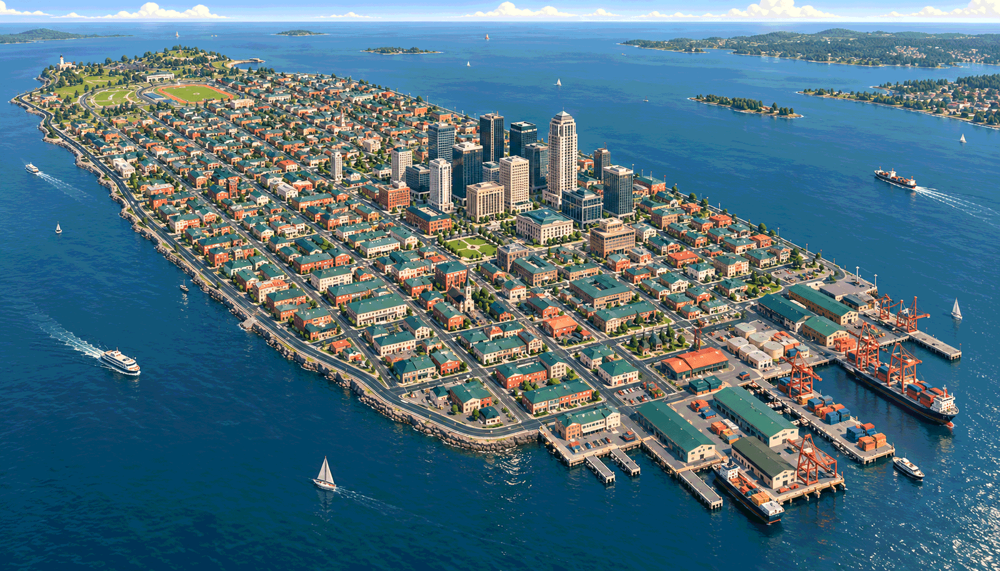
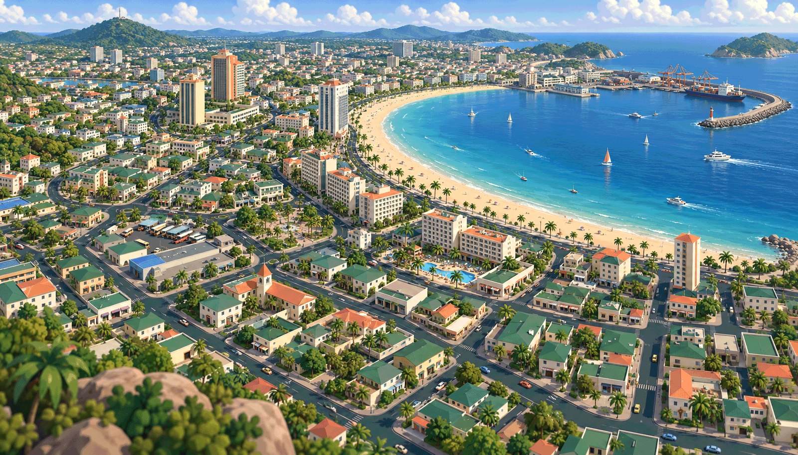
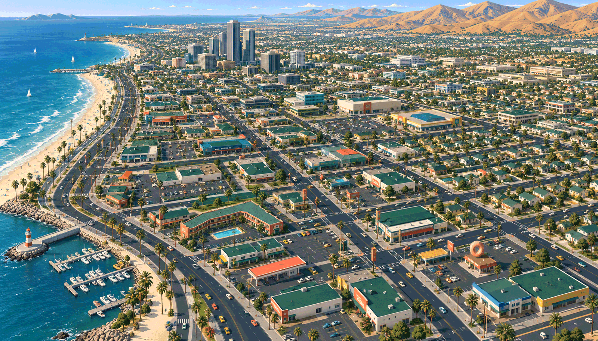
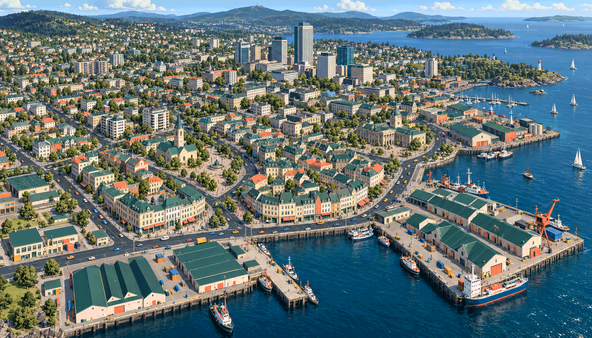
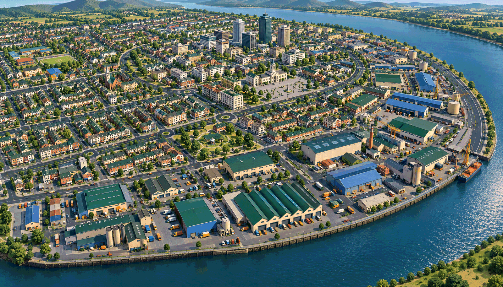
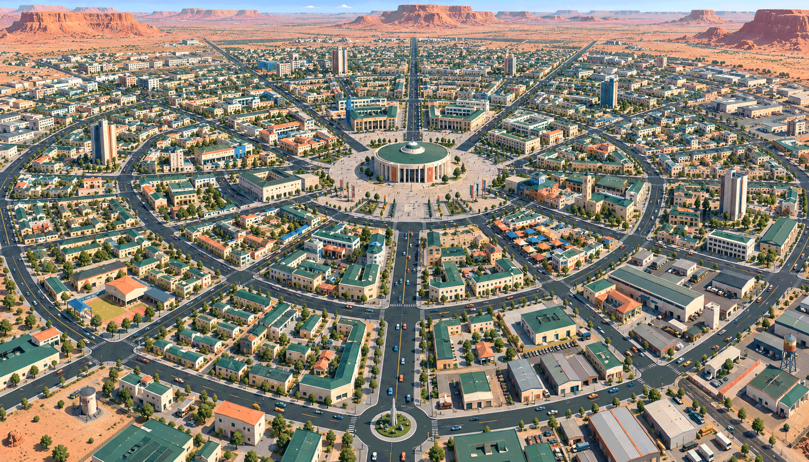

# Stage 1 — Six whole-city settings

**Naming note:** Brackett and all later district names are placeholders, likely to
change. The selected setting and art direction do not lock down final names.

**Selected direction:** [Round 4 — cyberpunk Long Island](round-4.md), approved by
the owner on 9 October 2026. **Stage 1 complete:** the city is **Brackett**, with the
working tone **electric, irreverent, workaday**. Stage 2 is authorized. Earlier material
below is history; its recommendations and constraints must be read alongside the
latest [owner decision](../decisions.md#9-october-2026--cyberpunk-long-island-selected).

9 October 2026 · **Historical first-round options; see the selected direction above.**

Question: where and what is the whole city? These are broad alternatives for geography,
climate, urban character and tone. No district is selected or designed in detail.
Names are original working proposals, not approved names or trademark-clearance claims.

[Open the visual gallery](../review.html) · [Decision log](../decisions.md) ·
[Exact image prompts](prompts.json)

All options use ordinary architecture, smooth stylized 3D, Petrol & Coral and fixed
daytime lighting. They suggest a contemporary city with late-twentieth-century bones.
The aerial establishing views are deliberately oblique to explain each setting;
the gameplay camera remains vertically down, perspective, north-up, at 47 m / 42°.
These are generated reference illustrations, not measured layouts or production art.

The whole city is a vision, not an expansion of the roughly six-block M1 commitment.
Differences within each city are possible neighbourhood characters, not an approved
district list. Water stays at city edges and playable ground stays flat in these
proposals. No bridges, ramps, water traversal or new gameplay systems are required.

## 1. Brackett — Dense island metropolis

A compact island metropolis that thinks it is the centre of everything. Long avenues tie a busy commercial core to ordinary neighbourhoods, waterfront workshops and recreation grounds. Its identity comes from a clear grid, an unmistakable island outline and a few proud tower clusters.

- **Tone:** Brisk, crowded, self-important.
- **Gameplay:** Straight driving runs, frequent right-angle escapes and perimeter loops; ordinary roads retain the 9 m carriageway and 4 m sidewalks. Crowds concentrate at commercial corners. Delivery courts and small parking lots provide car-chain opportunities.
- **Palette:** Petrol grid, emerald roof carpet, ivory tower faces; coral storefronts and cobalt waterfront sheds, with amber taxis/sign accents.
- **Signage humour:** Status anxiety and city bureaucracy: “Department of Important Corners.”
- **Trade-off:** Strong navigation and urban density, but repeated grids could feel interchangeable. Towers need generous setbacks and actual vertical-camera checks.
- **Image review:** The image is more suburban and tree-heavy than the dense premise; retain the island/grid structure, then strengthen ordinary commercial blocks if shortlisted.

## 2. Swayhaven — Tropical resort city

A tropical city selling permanent holiday happiness while an ordinary working town keeps it running. A crescent beach and hotel frontage give it a clear public face; inland homes, shopping streets, garages and a working harbour give the whole place depth beyond a resort.

- **Tone:** Sunny, brazen, cheerfully transactional.
- **Gameplay:** Curving seafront drives connect to shorter inland loops. Keep ordinary streets at the established corridor width. Crowd hotspots sit at beach access and shopping corners; hotel parking courts and service yards support chains.
- **Palette:** Petrol streets and emerald roofs anchor ivory hotels; coral sunshades, cobalt water-facing details and amber signs add holiday colour.
- **Signage humour:** Overpromising hospitality: “Almost Ocean View.”
- **Trade-off:** Strongest cheerful contrast with chaos, but palms and hotel shadows could obscure actors. Water stays at the boundary; swimming, boats and slopes are not proposed.
- **Image review:** The image includes too much foliage and some hilly foreground/background massing. Treat hills as distant scenery and keep any future playable streets flat; simplify palms substantially.

## 3. Sunspoke — Dry coastal sprawl

A dry coastal city built around the promise that the next boulevard leads to a better life. Motels, repair strips, bungalow grids and office parks spread between the ocean and distant hills, with one modest business centre. Roadside commercial absurdity supplies its personality.

- **Tone:** Laid-back, aspirational, shameless.
- **Gameplay:** Long boulevards favour fast driving; parallel streets and commercial courts offer escapes. Ordinary roads retain the proven corridor, with any larger arterial dimensions deferred. Crowds need compact shopping nodes; motel and retail parking offer chain hotspots.
- **Palette:** Dark petrol roads and emerald flat roofs sit against warm ivory walls; coral sign shapes, cobalt shop panels and amber dry landscape accents.
- **Signage humour:** Sales pitches and car culture: “Luxury Adjacent.”
- **Trade-off:** Best car-first identity, but wide empty areas could make on-foot play thin at 64 pedestrians district-wide. A selected district would need compact activity rather than uniform sprawl.
- **Image review:** The image contains wide multilane roads, abundant cars and more planting than the game budget implies. These suggest character only; neither road widths nor population are accepted.

## 4. Bellquay — Compact temperate port

A temperate port where old commercial streets, working docks and newer civic ambition rub shoulders. Broad workshop roofs and modest courtyard blocks give the city a readable texture; a few modern towers announce its latest attempt to become important. It has room for both everyday life and industrial mischief.

- **Tone:** Practical, cheeky, quietly pompous.
- **Gameplay:** Quayside loops meet cross-linked commercial and residential streets. Irregular blocks must still preserve 9 m carriageways and 4 m sidewalks. Market streets support crowds; loading courts and repair yards support chains and alternate exits.
- **Palette:** Emerald pitched and sawtooth roofs, petrol roads, slate walks and ivory masonry; coral loading doors, cobalt dock details and amber civic accents.
- **Signage humour:** Local pride and petty institutions: “Quay Improvement Authority — Still Improving.”
- **Trade-off:** Best overall variety within a coherent setting. The danger is charming but cramped old streets; avoid medieval lane widths and solve waterfront routes as returning loops.
- **Image review:** Judge the roof-family and waterfront contrast, not exact street topology or tower clearance. Detailed roof fittings and any dense trees are illustration detail to simplify.

## 5. Rivetford — Industrial river city

An inland river city determined to convince everyone its best years are ahead. Working factories and distribution yards sit beside sturdy housing grids, corner shops and an overconfident civic centre. The river bend gives the city an outline without making bridges the organising mechanic.

- **Tone:** Sturdy, warm, stubbornly optimistic.
- **Gameplay:** Industrial ring routes and worker-neighbourhood cross-links offer a strong mix of fast and tight driving. Keep ordinary streets at the established width. Crowds cluster at commercial/civic corners; depot parking creates natural chain spaces.
- **Palette:** Broad emerald sawtooth roofs and petrol streets, ivory civic fronts; coral doors, cobalt industrial panels and amber safety markings.
- **Signage humour:** Municipal reinvention: “Tomorrow Opens Monday.”
- **Trade-off:** Strongest natural home for car chains and service-yard escapes. Huge sheds could create monotonous blocks and long walks, so smaller commercial/residential areas must interrupt them.
- **Image review:** The setting must remain clean and colourful rather than ruined or grim. The overview cannot establish flat-ground clearance, usable warehouse shortcuts or real car spacing.

## 6. Coppermesa — Arid planned civic city

A planned desert city with enormous confidence in its own master plan. Radial avenues and connected ring streets link courtyard neighbourhoods, service districts and an oversized civic centre. Distant mesas frame a completely flat urban plateau; the city’s cheerful bureaucracy supplies the joke.

- **Tone:** Orderly, grandiose, absurdly confident.
- **Gameplay:** Radials offer direct driving lines, while ring routes create alternate circuits. Segment lengths and intersections need later checks; ordinary streets retain the established corridor. Shaded shopping courts concentrate pedestrians, and civic/service parking provides chain locations.
- **Palette:** Petrol roads and emerald roofs counter the amber landscape; ivory walls with coral and cobalt shade structures give crisp accents.
- **Signage humour:** Planning pride: “Unplanned Fun Requires a Permit.”
- **Trade-off:** Most distinctive city silhouette and only fully dry inland option. Radials can produce awkward junctions, while generous civic space risks sparse gameplay; keep geometry simple and activity compact.
- **Image review:** The rings are a setting idea, not an approved traffic graph. Large plazas, trees, tower spacing and suggested road widths need simplification and scale checks.

## Comparison and recommendation

| Option | Whole-city identity | Main strength | Main trade-off |
| --- | --- | --- | --- |
| Brackett | Dense temperate island grid | Legible urban loops and skyline | Repetition and tower occlusion |
| Swayhaven | Tropical bay and working town | Cheerful setting for irreverent chaos | Foliage and resort frontage can hide actors |
| Sunspoke | Dry coastal sprawl | Car culture and roadside humour | Sparse on-foot activity |
| Bellquay | Compact temperate port | Varied city life in one coherent setting | Irregular streets need generous widths |
| Rivetford | Inland industrial river bend | Yards, chains and service-route escapes | Large roofs and long blocks can repeat |
| Coppermesa | Planned arid civic city | Distinctive urban shape and civic satire | Complex junctions and empty civic space |

**Recommendation: Bellquay.** Its working waterfront, older commerce, ordinary housing
and newer towers give us contrasting places without making the city feel like a
collection of unrelated themes. It naturally accommodates driving loops, pedestrians,
service escapes and car clusters. Swayhaven is the strongest alternate if a sunnier,
more openly playful personality appeals more.

## Review boundaries

Self-reviewed in this session; no independent agent review requested or performed.
The six options answer the setting question. They do not fix a map, district count,
building kit, M1 location or city size. No changed binding rule is proposed.

The illustrations are more detailed and populated than an eventual game view, and
some are more naturalistic than the accepted smooth art references. Use them to judge
geography and overall character; foliage, small facade detail, apparent traffic and
street widths are not production targets. Bellquay and Rivetford offer useful roof
family contrast; Sunspoke and Coppermesa emphasise broad flat silhouettes; Brackett
needs the strongest tower discipline; Swayhaven needs the strongest foliage discipline.
All require later actual-camera validation for actor contrast and tower occlusion.
No cutaway is assumed. Quiet roads and bright actors remain the readability rule.

Car clusters are opportunities, not measured chain layouts: later placement must
respect the 4.1 m blast radius and the population budget of 32 cars / 64 pedestrians
plus four players district-wide. Painted routes do not prove a no-dead-end traffic
graph. Boats, distant hills and background structures are setting cues only.

## Owner decision still open

First, identify the most appealing setting or combination. Then refine that direction
and agree a working city name and tone words. Record the owner's approval before
Stage 2 maps the whole city's structure. Only after that broader structure is understood
will we choose the small area to develop in detail. No stage completion or TODO update
is warranted yet.
