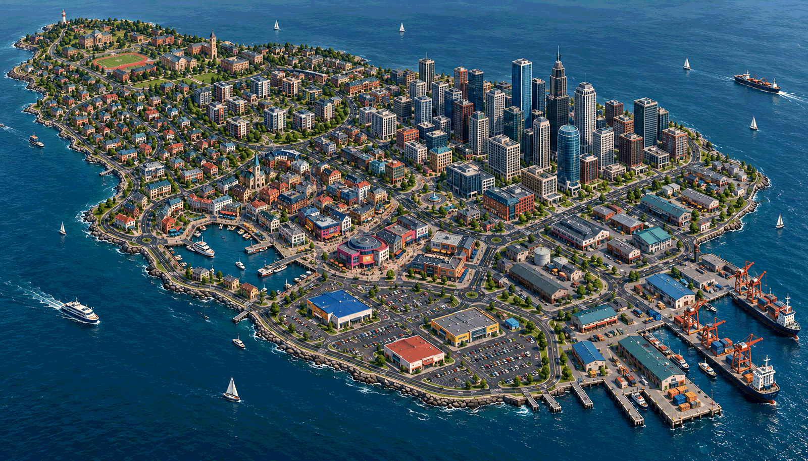
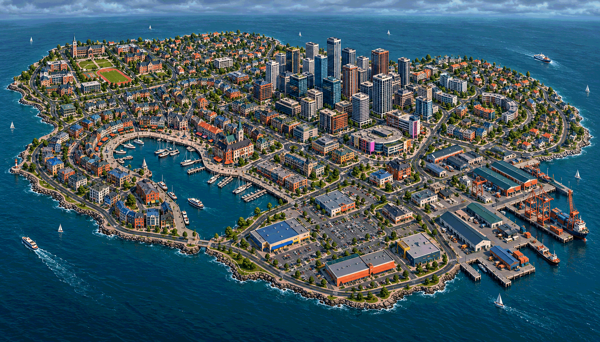
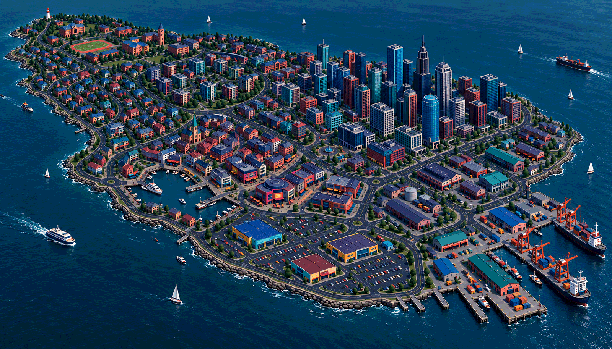

# Stage 1, round 2 — a richer island city

9 October 2026 · Whole-city composition and palette refinement; selection pending.

[Current gallery](../review.html) · [Owner feedback](../decisions.md#9-october-2026--island-refinement-after-the-first-six-options) · [Exact prompts](prompts-v2.json)

The owner preferred Brackett and Bellquay, liked the campus/fields, warehouses and
high-rises, and requested more variety, a larger downtown, more districts, darker
vibrant colour, curves and dead ends. Flat terrain and an island are current working
constraints. Swayhaven supplies street-layout inspiration; Sunspoke supplies large
commercial buildings with large car parks. Palette experimentation is explicitly allowed.

## A — The long island

An extended island gives the city a clear progression from university grounds through
contrasting residential areas to a substantial downtown, older harbour, commercial
car parks and working docks. It keeps Brackett's readable overall silhouette while
borrowing Bellquay's older urban character. This is the recommended composition:
the campus and port remain recognisable anchors, and the foreground car parks now
give a visibly different kind of urban space.

The trade-off is the temptation to route everything along the length of the island.
Keep bent cross-links and alternate circuits when the topology is designed; the
image does not validate route redundancy.

## B — The harbour island

A wider island wraps older streets around a prominent sheltered bay, with the campus
at one end, a larger downtown behind, and docks and commercial car parks toward the
near right. The bay is the strongest shared landmark, and neighbourhood transitions
feel more concentrated. This is a good alternative if the harbour should dominate
the city's identity.

The trade-off is the bay consuming land and potentially pinching routes around its
head. No bridge is proposed; the island is one continuous flat land mass.

## A — stronger colour exploration

Same overall composition as A, with deeper blue, plum and teal roofs/facades, brighter
coral/cobalt/turquoise accents and quieter dark asphalt. This responds more directly
to the owner's colour request than the first two revised illustrations, which still
carried too much pale, naturalistic treatment from round 1.

**Recommendation: A's long-island composition with this stronger colour direction.**
Materials carry the darker mood; this is intended as overcast daytime, not acceptance
of night lighting. Small windows and tower shadows are not validated gameplay contrast.

## Broad character menu

These are nine proposed urban characters used to break up repeated infill, not an
approved district count, formal map, naming scheme or production kit.

| Character | Whole-city visual difference | Potential play character |
| --- | --- | --- |
| Downtown | Large cluster of varied towers and midrise blocks | Urban loops and dense intersections; occlusion risk |
| Working docks | Cranes, broad sawtooth sheds, loading courts | Service drives and parked-car clusters |
| University | Institutional quadrangles, fields and running track | Open contrast and linked campus paths |
| Old port | Irregular courtyard blocks and civic squares | Curving streets, crowds and pedestrian escapes |
| Shopping / entertainment | Broad halls, rounded landmark forms, bold sign colours | Compact activity and commercial corners |
| Apartment neighbourhood | Slabs, L-shaped buildings and shared courts | Crescent access roads and courtyard passages |
| Lower-rise housing | Terraces, varied homes and shorter branching streets | Local loops and physical dead-end courts |
| Repair / light industry | Long sheds, service courts and vehicle yards | Alternate service routes and chain opportunities |
| Retail / office park | Large low buildings behind broad surface car parks | Open driving space and deliberate car clusters |

These characters can merge or split after the city direction is accepted. Large car
parks are concentrated in a distinctive area rather than applied uniformly across
the city. The images' apparent number of cars does not change the 32-car M1 budget.

## Self-review and remaining weaknesses

- Both compositions visibly increase the downtown footprint, preserve an island
  silhouette, and introduce broad parking areas and more curved streets.
- The colour pass is the stronger response to the desired darker, more vibrant look.
  Palette values are exploratory; no replacement material swatches are ratified.
- Some housing still repeats and remains tree-heavy. Roof/massing variety improves,
  but a next pass should strengthen contrasts within residential areas if needed.
- Curves are clear; the requested physical dead ends are not consistently legible at
  this scale. Their detailed placement remains unresolved. The proposed turning courts
  and foot exits are design intent, not verified graph connectivity or AI behaviour.
- Flat ground is intended. Aerial perspective, seawalls and shadows do not prove
  elevations or drivable clearance. No slope, bridge or water-traversal system is added.
- Downtown roof overlap and tower heights need actual vertical-camera validation.
  The skyline is a mood reference, not approval of the pictured heights or individual
  tower designs. No cutaway is assumed.
- Retail car parks suggest clusters, but blast spacing and escape clearance are not
  measured. Painted population, block count and city scale are not M1 commitments.
- Sources are project-generated, documented in prompts-v2.json. No independent agent
  review was performed; all work remains in this session.

Stage 1 remains in review. No M1 district has been selected and no stage is complete.

