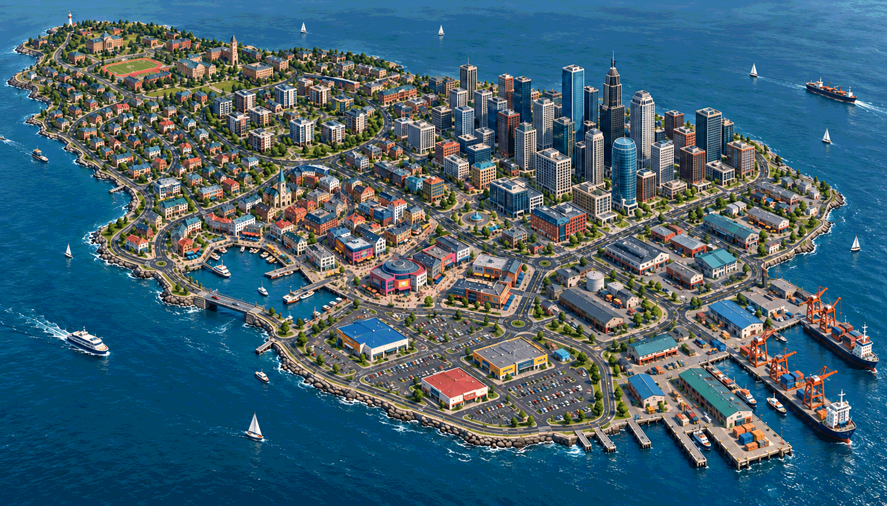
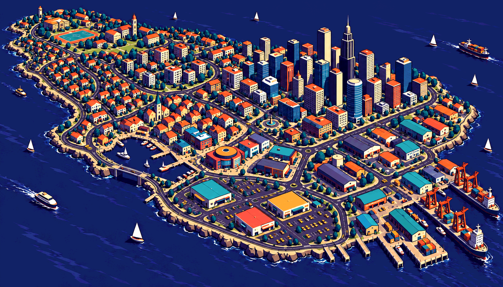
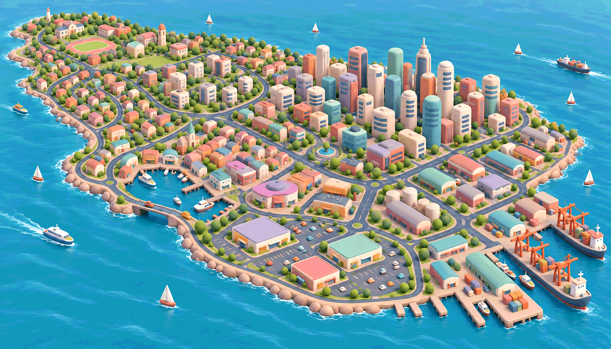
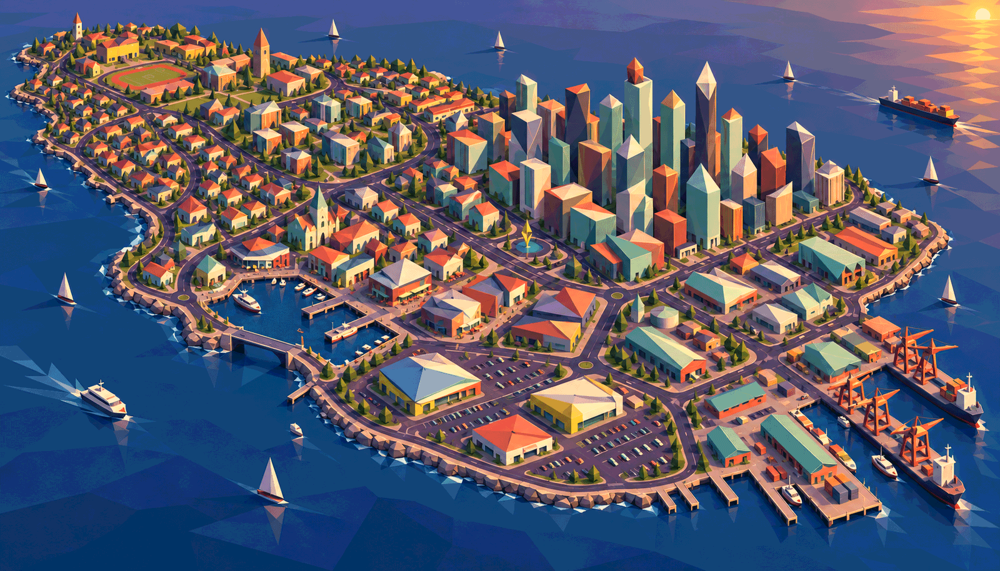
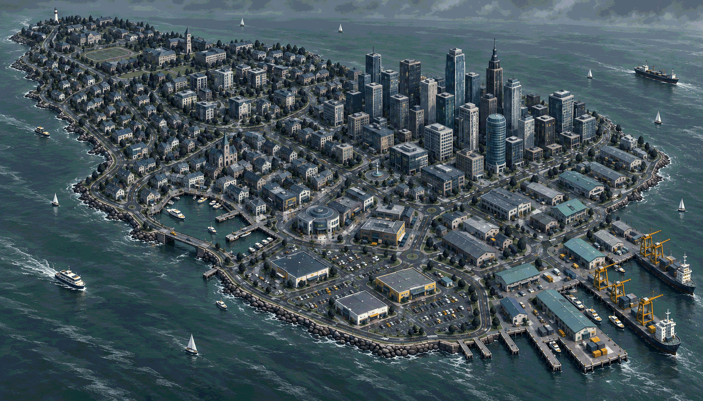

# Stage 1, round 3 — one island, five game-art images

9 October 2026 · Art direction exploration; owner style selection pending.

[Current five-image gallery](../review.html#round3) · [Prompts and provenance](prompts-v3.json) ·
[Owner decisions](../decisions.md#9-october-2026--standard-long-island-selected-for-further-exploration)

The owner chose the **standard Long Island image (07)** over the deeper-colour
variation, asked for an open harbour entrance with a bridge, then requested four
drastically different game-appropriate styles while preserving the overall layout.
The five images below are the current deliverable. Earlier conservative attempts
are superseded and retained only as provenance records.

## 1 — Long Island with harbour bridge

The selected standard treatment with a short bridge crossing an open water entrance
at the small marina's near-left edge. The bridge connects the two banks on this same
island; water now visibly connects the marina to the sea. Major district positions,
campus fields, downtown, car parks and docks remain recognisable.

This is the comparison baseline. The deck is intended to sit at road level with water
below, retaining flat land rather than requiring slopes. No clearance, traffic route,
collision, occlusion or boat passage is validated by the picture.

## 2 — Tideprint: graphic cel-shaded 3D

Chalk, vermilion, mustard and cyan against deep indigo; bold silhouettes, sparse facade
marks and hard graphic shading. It has the clearest graphic separation from the
standard image while retaining recognisable ordinary architecture.

Plausible implementation direction: simplified Blender assets, palette materials,
stepped lighting and selective silhouette outlines. The trade-off is visual clutter
if outlines and high-contrast roof details compete with actors. Use restraint at the
actual gameplay camera. **Recommended alternate to investigate**, not selected art.

## 3 — Softworks: soft sculpted 3D

Rounded, tapered, generously bevelled forms with pastel pink, cream, mint and lilac;
soft broad highlights and gentle daytime lighting. Geometry and materials both change,
rather than applying a filter to the original.

Plausible implementation direction: sculptural low-detail source meshes and matte
materials under soft filled lighting. The trade-off is a much sweeter tone, reduced
architectural character and overly rounded edges making collision bounds ambiguous.
Actor contrast would need careful value control against pale surroundings.

## 4 — Folded City: angular faceted 3D

Strong planes, wedge roofs and prismatic towers in mint, copper, apricot and violet,
with warm low-angle light and long cool shadows. The overall city arrangement remains,
while the model language becomes deliberately abstract.

Plausible implementation direction: economical flat-shaded meshes, broad material
panels and simple coherent shadows. The trade-off is that the towers now approach
abstract sculpture; a selected version may need more recognisable ordinary architecture.
The pronounced low-sun image is a lighting exploration, not a change to production
lighting or an approved sunset/day-cycle feature. Long shadows need readability checks.

## 5 — Stormwash: atmospheric painted 3D

Charcoal, storm-grey, muted petroleum green and chalk with scarce signal-yellow accents;
cool overcast light, subdued wet surfaces and painted-looking material variation.
This is deliberately a very different mood from the bright and playful alternatives.

Plausible implementation direction: simplified conventional meshes, broad hand-painted
albedo and roughness variation, restrained wet-road response and cool ambient fill.
The final image sells the restrained palette and atmosphere more strongly than the
brushwork, which remains subtler than requested. The trade-off is reduced playful
warmth and the highest risk of dark actors disappearing into streets. No rain/weather
simulation, dynamic reflections or expensive rendering technique is implied.

## Comparison

| Image | Geometry/material identity | Colour and light | Main question |
| --- | --- | --- | --- |
| Standard + bridge | Detailed smooth stylized city | Balanced familiar daytime | Is the accepted direction already the best fit? |
| Tideprint | Graphic shapes and cel bands | Indigo/chalk/orange, hard contrast | Does a stronger graphic identity help the action? |
| Softworks | Rounded sculpted masses | Cream/pastel, soft diffuse light | Is this playful charm too gentle for the desired tone? |
| Folded City | Angular broad facets | Mint/copper/violet, warm low sun | How abstract can architecture become? |
| Stormwash | Simplified painted surfaces | Storm-grey/teal/yellow, cool overcast | Is the atmosphere appealing without losing warmth/readability? |

## Review

Self-reviewed in this session. Each chosen image retains the broad island arrangement,
university/fields, larger downtown, marina bridge/open-water entrance, foreground car
parks and right-hand dock area. Fine buildings, prop quantities and some landmark
silhouettes change with style; this is layout continuity, not pixel-identical geometry.

The three most simplified variants change model proportions and detail substantially.
None is a measured Godot capture or demonstrates performance, camera visibility,
collision, traffic behaviour, precise blast spacing or source-asset feasibility.
A chosen style will need actual-camera evidence before production commitment.

All remain 3D game-art proposals. Every visible production model still requires
committed Blender sources and linked exports. The baseline and four final PNGs are
stored at 1600 px wide; exact prompts, references and superseded attempts are recorded.
No independent agent, worktree, production scene, TODO update or later-stage district
implementation is part of this round. Stage 1 remains open.

