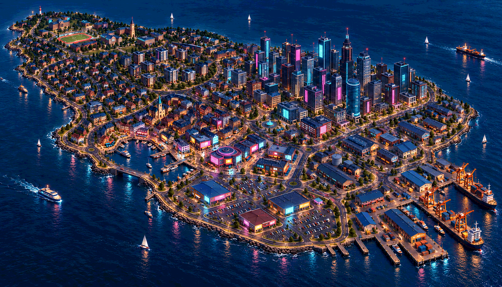

# Stage 1, round 4 — cyberpunk Long Island

9 October 2026 · **Selected by the owner as the direction to carry forward.**

[Gallery](../review.html#round4) · [Standard + bridge](10-long-island-bridge.png) ·
[Exact prompt and provenance](prompts-v4.json) · [Decisions](../decisions.md)

The owner initially requested a cyberpunk interpretation of Standard + bridge,
then selected this result. This image uses the standard smooth 3D treatment
and recognisable architecture, adding graphite/indigo surfaces, cyan/magenta sign
panels, warm harbour/shop lighting and industrial amber at the docks.

The major district arrangement, flat island, campus fields, enlarged downtown,
foreground retail car parks and harbour entrance bridge remain recognisable. The
marina retains its open-water connection to the sea. The image adds no mainland
connection, flying vehicles, elevated roads or new gameplay mechanic.

Blue-hour / early-night lighting began as an agent-proposed exploration outside the
daytime baseline. The owner subsequently selected this image, so its mood now carries
forward as the visual reference. Stage 5 must settle a readable fixed lighting setup;
no day/night system is requested. Lightly wet surfaces, reflections and emissive signs
remain mood references, not a chosen rendering implementation or performance claim.

Self-review: the strongest cyberpunk changes read in downtown, entertainment and
commercial frontage; housing and campus stay quieter and retain familiar character.
The bridge and broad layout are visible. Some lighting/window detail is still too
dense for a final gameplay view, and reflection/bloom/actor contrast need validation
at the actual vertical camera. No Godot or gameplay test was run for this concept.

One image generated with the built-in image tool, saved at 1600 px wide with its
exact prompt and project reference. Cyberpunk Long Island supersedes Standard + bridge
as the preferred direction. The owner subsequently named the city **Brackett** and
authorized Stage 2, completing Stage 1 with the tone electric, irreverent, workaday.
