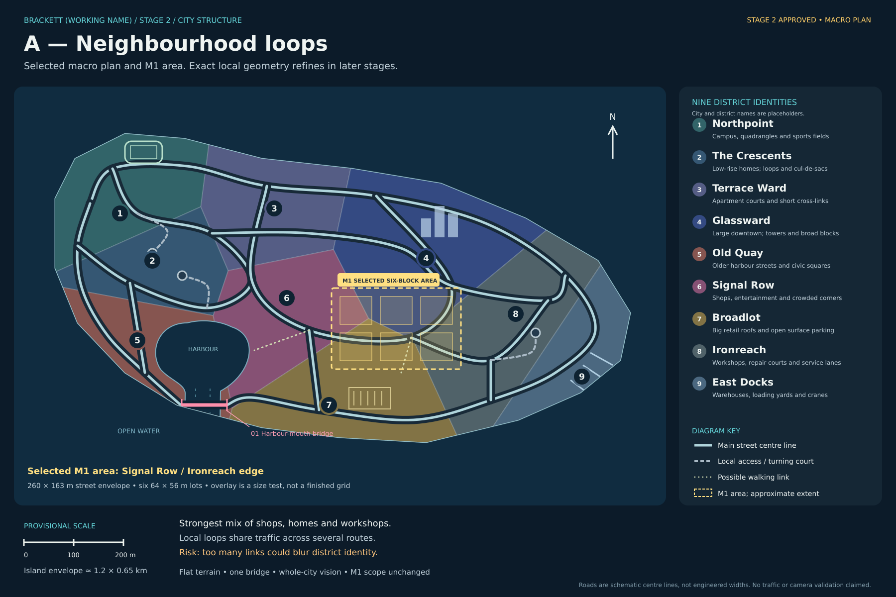
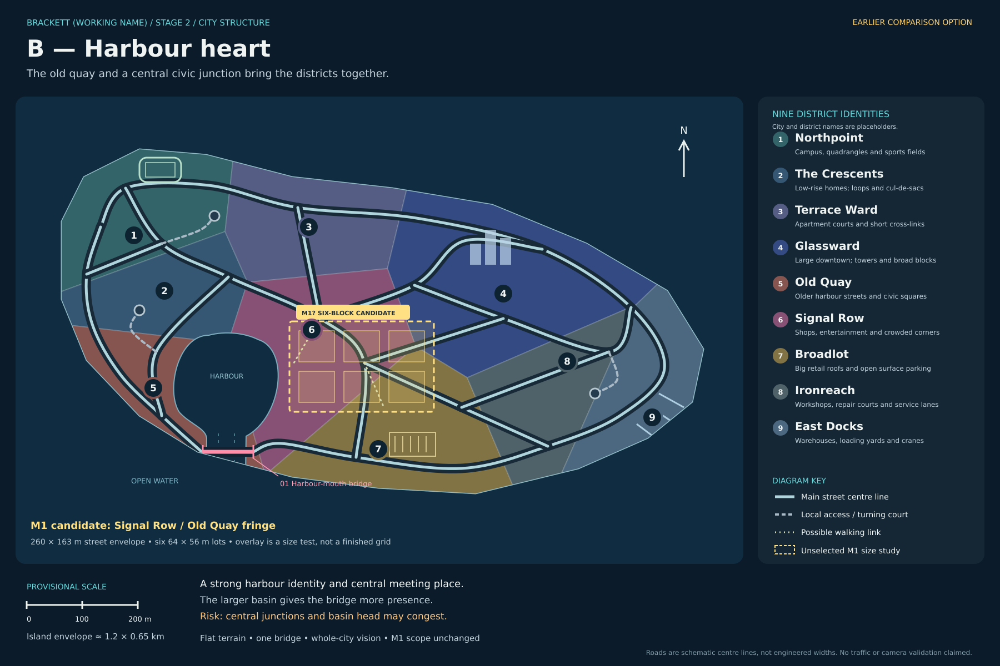
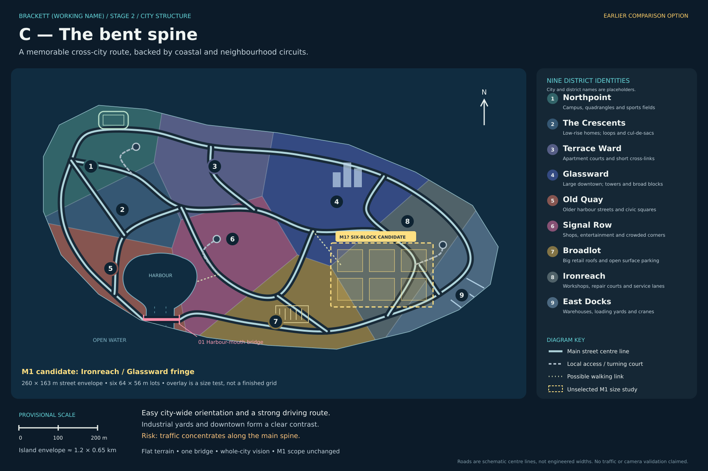

# Stage 2 — Brackett city structure

9 October 2026 · **Stage 2 complete: A — Neighbourhood loops selected.**

The nine district identities are accepted for now. **Brackett and every district name
are placeholders and likely to change.** The approximate **1.2 × 0.65 km planning
envelope is accepted for now**. The Signal Row / Ironreach transition is the selected
M1 slice, carrying forward the six-block programme. Precise boundaries and geometry
refine later. Options B and C are retained as comparison history.

[Visual gallery](../review.html#stage2) · [Stage 1 approval](../decisions.md#9-october-2026--brackett-named-stage-1-complete) ·
[Drawing method and provenance](methods.md)

The approved setting is Brackett: electric, irreverent and workaday, on a flat
elongated island with a cyberpunk-inspired look, larger downtown, campus/fields,
working docks, a small harbour connected to the sea beneath a road bridge, varied
housing and large commercial car parks. These maps preserve those anchors and test
how the city connects. Diagram colours identify districts; they are not new material
palettes or lighting keys.

## A — Neighbourhood loops (selected structure)

[Editable SVG](01-neighbourhood-loops.svg)

Interlocking local circuits join a coastal route. Northpoint, housing, downtown and
the industrial east have recognisable local routes, with several cross-links rather
than a single uninterrupted straight avenue. Signal Row sits between Old Quay,
Glassward, Broadlot and Ironreach.

This offers the best balance of navigation, alternate drives, pedestrian activity,
service escapes and car-cluster opportunities. It is closest to the selected city's
mixed character without forcing every trip through one junction. The risk is too
many similar links making districts hard to distinguish; retain differences in
block grain and roof families when the road kit is designed.

The M1 size study lies across the Signal Row / Ironreach edge, touching Glassward
and Broadlot. This offers shop frontage, a workshop/depot, parking/chain space and
a tower edge within a compact exterior play area. Housing would need to be mixed
into the commercial fringe; it is not a separate large housing district inside M1.

## B — Harbour heart

[Editable SVG](02-harbour-heart.svg)

A modestly deeper harbour basin and a central civic/commercial junction make Old
Quay and Signal Row the city's meeting place. Campus/housing routes, downtown
routes and southern retail routes converge toward this centre, with the coastal
circuit as an alternate. This is a deliberate small change to the approved basin's
proportions for comparison, not another island setting.

This gives the harbour and bridge stronger identity and supports concentrated
pedestrian activity, waterfront views and quick transitions between districts.
The trade-off is pressure on central junctions and routes around the basin head.
Car clusters would belong in nearby commercial/service courts, not block the bridge.

The M1 size study sits in Signal Row near the Old Quay fringe. It prioritises shops,
a civic plaza and walkable activity. It would need a compact workshop/chain-yard
edge, a small housing pocket and an edge tower to carry the original six-block
programme. The highlighted footprint does not include the bridge.

## C — The bent spine

[Editable SVG](03-bent-spine.svg)

One memorable, bending route leads from campus and housing through the central city
toward workshops and docks. Neighbourhood circuits and the coast route give alternate
paths. This is a connected main street with bends and offset junctions, not a straight
city-wide grid or an elevated expressway.

It is the easiest option to explain and orient around, with a strong longer driving
route and clear changes of district along it. The trade-off is concentrated traffic,
potentially predictable escapes and more effort to make side areas feel equally useful.

The M1 size study lies on the Ironreach / Glassward fringe, touching Broadlot. It
favours workshops, service escapes, large roofs and parking/chain activity beside
towers. To retain the earlier programme it needs small shop, housing and plaza pockets;
otherwise this would become a narrower industrial redesign requiring an owner choice.

## Proposed districts and relationships

The nine identities below are accepted for now. City and district names are expressly
temporary placeholders; precise boundaries remain proposals. Nine districts preserve
the distinct character ideas developed with the owner; the handover's usual five to
eight is guidance. Future refinements can be discussed without treating labels as fixed.

| # | Working name | One-line identity | Principal city relationships |
| --- | --- | --- | --- |
| 1 | Northpoint | University quadrangles and sports fields at the quieter western end | Leads into The Crescents and Terrace Ward; coast route returns around the point |
| 2 | The Crescents | Lower-rise homes with curving local streets and dead-end courts | Connects campus, apartments and the older harbour side |
| 3 | Terrace Ward | Apartment courts and shorter cross-links | Transition between campus/housing and Glassward, with routes toward Signal Row |
| 4 | Glassward | Large office/apartment downtown with strong cyan/indigo identity | Joins Terrace Ward, Signal Row and Ironreach; coastal route bypasses its centre |
| 5 | Old Quay | Older streets and civic spaces around the western harbour bank | Joins The Crescents and Signal Row; coast crosses the harbour mouth |
| 6 | Signal Row | Commercial and entertainment streets, crowds and rounded hall/plaza character | Meets the harbour, downtown, retail and workshop sides |
| 7 | Broadlot | Large commercial roofs and substantial surface parking | Connects Signal Row, Ironreach and the southern coast route |
| 8 | Ironreach | Workshops, repair courts and service routes | Transition between downtown, retail and the working port |
| 9 | East Docks | Warehouses, loading yards and cranes at the eastern end | Reached through Ironreach and the coast route; no off-island route |

These are functional connections, not an exhaustive list of polygon-border contacts.
Map symbols mark the campus fields, downtown towers, large parking courts and dock
piers; the harbour-mouth bridge is marked separately. They are location cues, not
approved landmark designs or authored building placement.

## Scale and street assumptions

All options share an **approximately 1.2 × 0.65 km island envelope**, now accepted by
the owner as the provisional planning size for A. One
drawing unit equals one metre before board translation; the 200 m scale bar and M1
footprint use that convention. The outline is about 0.521 km² **before subtracting the
harbour**, excluding any future pier extensions. This is a planning choice, not a
measurement recovered from the generated image or an immutable final city size.

A standard 64 × 56 m lot with 17 m shared street pitch gives an 81 × 73 m reference
module. The gross outline contains about 88 such modules by area before water and
large open facilities are considered. That is an area comparison, not 88 approved
blocks: campus fields, parking, piers, irregular blocks, plaza space and buffers
will change both the usable area and the number of assets.

[S07](../../../spikes/s07-environment-scale.md) last observed 96 **48 m-pitch repeated
test-kit blocks** at roughly 60 FPS on the development laptop. These are smaller,
different units and simple reused assets; our 88 reference modules are not equivalent
to 88 S07 blocks. The S07 test excluded production textures/materials, AI, population,
combat and multiplayer, and did not establish a Deck result. Its 384-block case
crashed before results. No map option here is a validated capacity or performance
promise. Representative production content must be measured later.

Main-road lines show connectivity and role, **not carriageway width or lane count**.
**Later owner refinement:** vary district areas, block sizes, plot subdivisions,
street widths and lane counts according to use; see the
[Stage 3 scale brief](../stage-03-district-identities/urban-scale.md).
The existing 9 m two-way carriageway plus 4 m sidewalks (17 m corridor) is one
reference type, not a universal road width. Narrower streets and wider multi-lane
connectors are authorized for exploration; final cross-sections remain Stage 4 work.
Housing dead ends need turning geometry
appropriate to the traffic admitted there; warehouse/service routes may use the
existing provisional 6 m service carriageway with foot strips where validated.
Campus and retail plots can combine several reference lots without widening every road.

All land remains flat. The one bridge is intended as a level road deck over lower
water, with no approach slope commitment. The mouth stays visually open to the sea.
Bridge width, spans, clearance, collision, traffic and camera behaviour remain unproven.
There is an inland route around the harbour; the bridge is not the sole connection
between the city's halves. Physical dead ends appear only as a few illustrative
local access branches, not as terminal points on the main driving circuits.
Turning circles are intent symbols, not measured vehicle swept paths.

## M1 versus the whole city

The whole island is the long-term world vision. **M1 remains one exterior playable
district of roughly six blocks**, not an island-wide populated release.

Each yellow footprint uses the existing **260 × 163 m street envelope** and six
**64 × 56 m lots** from the starting 3×2 brief. The previous 12 m outer buffer on each
side would bring that to 284 × 187 m and is not included in the yellow outline.
The overlays are comparable size studies; their neat little grid does not overrule
the curving macro routes underneath. Exact boundaries, road ownership and lot shape
must be resolved after a location is selected.

Recommendation for the six-block brief: **carry its programme forward, adapt its
placement**. Preserve shops/foot passage, workshop/depot/service escape, central
plaza, housing, tower exposure and a repair/chain yard. Keep at least two driving
loops and two yard exits. Do not insist on the old 3×2 rectangle if it fights the
chosen local streets; any change of footprint or scope needs to be presented with
the refined M1 proposal, not buried in a diagram.

Car clusters remain constrained by the existing 32-car district budget and 4.1 m
blast radius; pedestrian concentration must work with 64 district-wide pedestrians
plus four players. Open car parks are a character and opportunity, not a promise
that hundreds of pictured bays will be filled.

The water boundary helps contain a future whole-island game, but a six-block M1 area
still needs deliberate temporary edges and returning routes. These maps do not grant
off-map travel or build the remaining city. No streaming decision is made.

## Recommendation and owner choice

**Choose A, Neighbourhood loops, as the structure to refine.** It offers the best route
variety and the most flexible central mix without depending on a single junction.
B is the stronger harbour-centred option; C is the clearest driving-led option.

The owner has selected A's whole-city structure, accepted the nine identities and
agreed the provisional planning size. The coloured district boundaries remain a
schematic expression of that structure, not surveyed block edges. The subsequent
[highlighted Signal Row / Ironreach M1 slice](m1-candidate.md) is the area the owner
has now selected, retaining the six-block programme while fitting local streets to
the area. This completes Stage 2 at macro-plan level; Stage 3 develops district briefs.

## Review and limitations

Self-reviewed in this session against the handover. Three SVG sources and 1800×1200
PNGs are supplied; all options keep the accepted city anchors, flat land, one harbour
bridge and nine district characters. A now identifies the selected M1 area;
B and C retain unselected size studies for comparison.
The drawings are macro zoning/connectivity diagrams. They intentionally omit most
local streets and building placement; the broad coloured cells are district
territory, not single city blocks.

No actual traffic graph, lane turns, bridge behaviour, tower occlusion, camera
readability or capacity test ran. Drawing curves and turning symbols are not
engineering evidence. No Godot scenes, production models or district placement
were changed. Independent agents and worktrees were not used.
