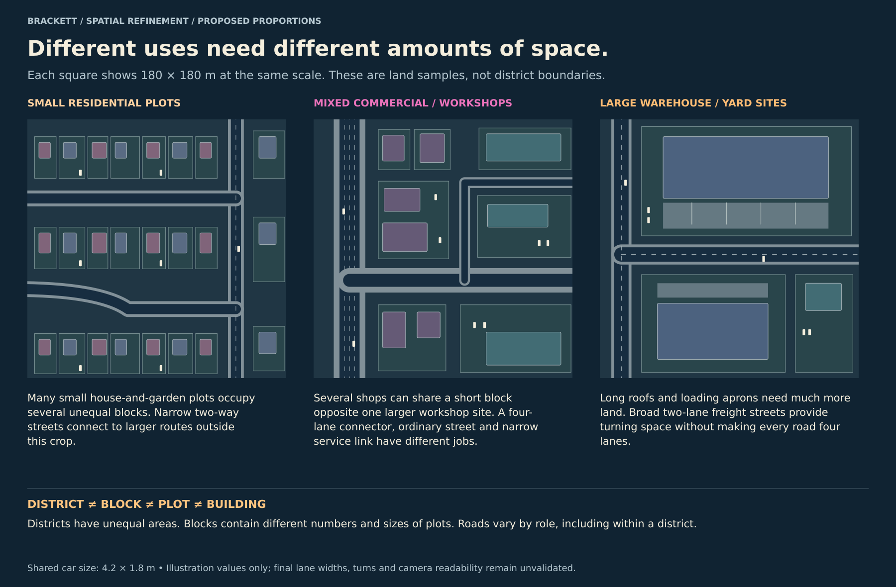
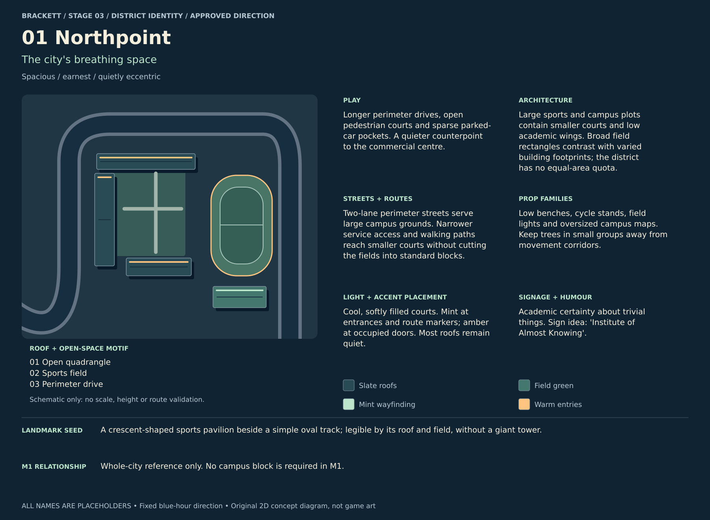
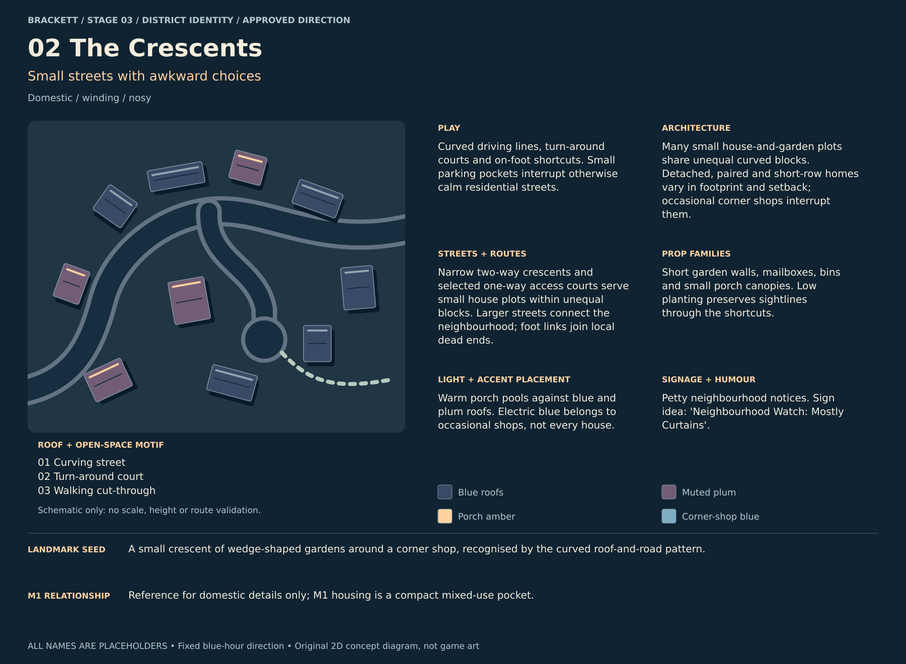
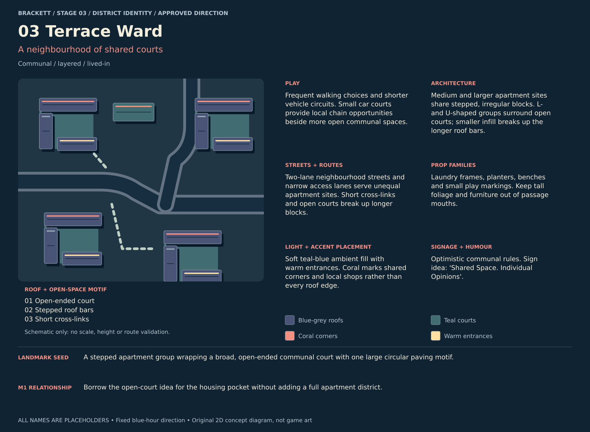
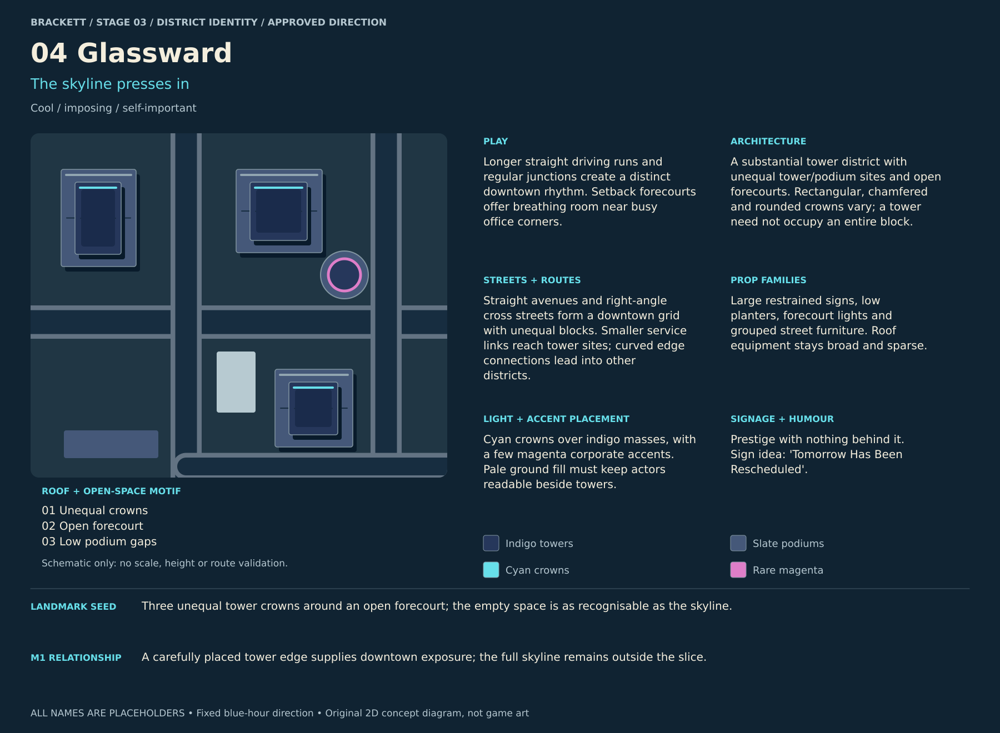
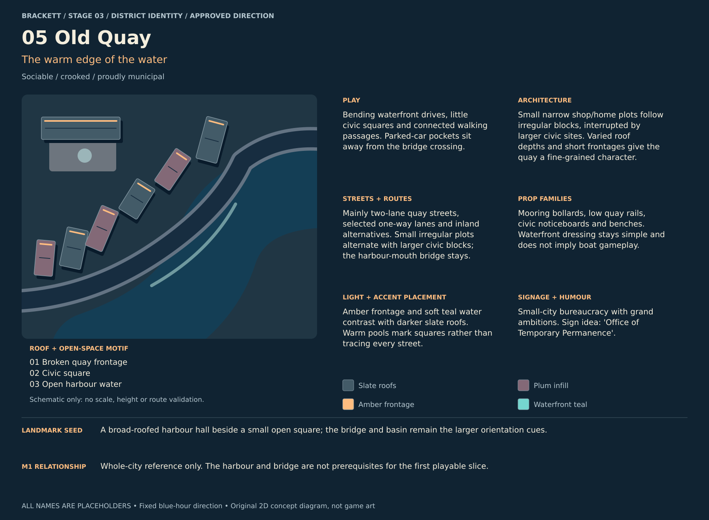
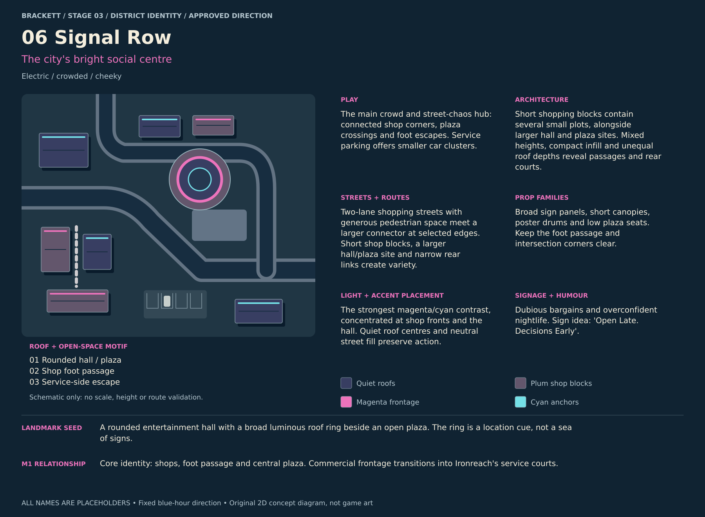
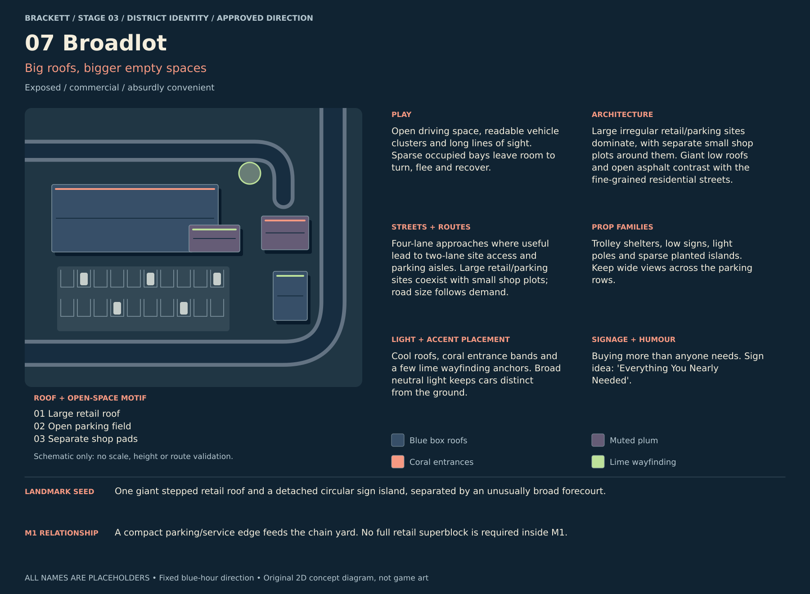
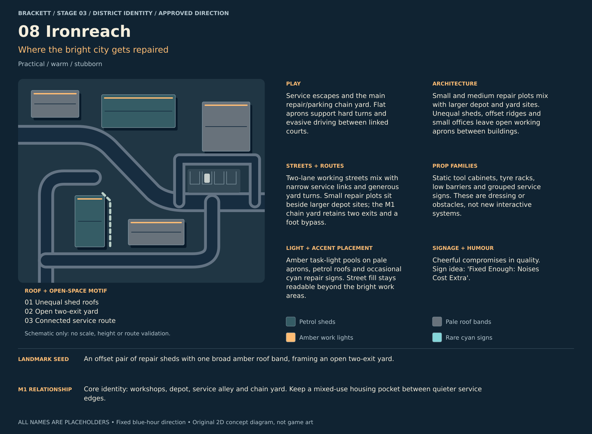
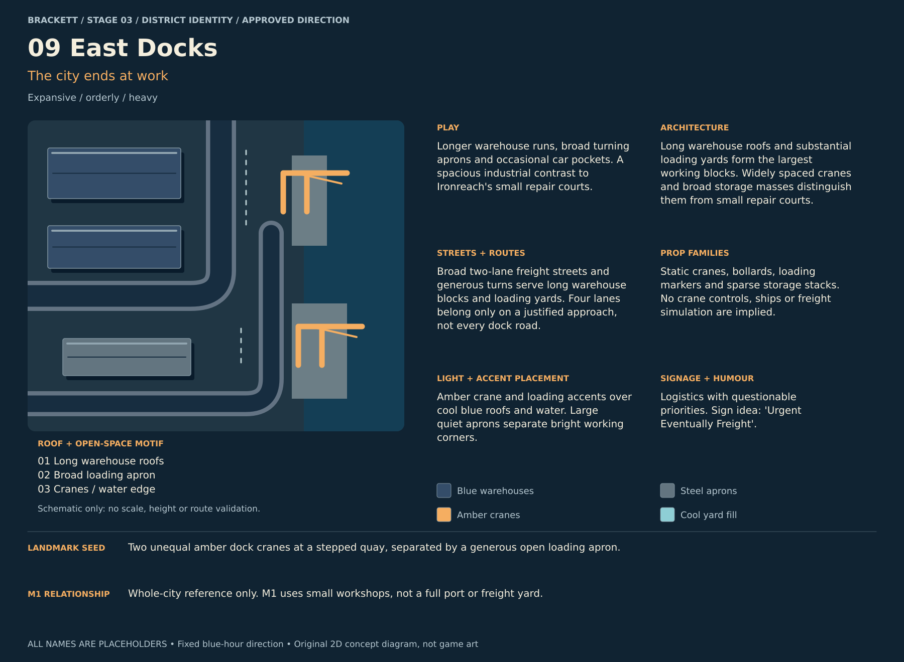

# Stage 3 — District identity briefs

9 October 2026 · **Stage 3 complete: district identities and spatial refinement approved.**

Brackett and every district name are placeholders and likely to change.

[Visual gallery](../review.html#stage3) · [M1 identity proposal](m1-identity.md) ·
[Method and provenance](methods.md) · [Owner decisions](../decisions.md)

The question is what makes each district distinct and what it contributes to play.
These nine identity boards develop the approved map and one-line district roles.
They use original 2D roof/open-space diagrams to communicate differences; the game
retains the accepted smooth stylised 3D cyberpunk direction. These are neither new
art-style options nor measured street layouts.

**Recommendation:** make Signal Row the busiest social hub, Ironreach its practical
service/chain counterpart, and Northpoint the calmest contrast. Across the city,
change building scale, roof patterns, open space, road character and accent placement
as well as colour. Dark and vibrant should not mean equally neon everywhere.

M1 combines selected parts of Signal Row and Ironreach, with a tower edge, housing
pocket and compact parking influence. It remains one exterior area of roughly six
blocks, with the existing population budget. The other district boards describe the
whole-city vision and do not expand the first playable scope.

## Unequal districts, blocks and streets

The owner supports the individual identities and wants their differences expressed
in actual space: unequal district areas, varied block sizes, small and large plots,
and a hierarchy of street widths and lane counts. The old M1 block dimensions are
references, not a universal city grid. Equal-sized board panels do not represent
equal-sized districts.

[Scale brief and per-district hierarchy](urban-scale.md)

The three squares above cover the same illustrative land area. Their building,
plot and street dimensions differ; the squares are crops, not districts. These
proportions are proposals, with final road cross-sections and traffic checks later.

## City-wide contrast

| District | Main distinction | Role in play |
| --- | --- | --- |
| Northpoint | Quadrangles and sports fields | Spacious perimeter drives and quieter walking courts |
| The Crescents | Varied small homes and curving streets | Turns, local dead ends and foot shortcuts |
| Terrace Ward | Stepped apartment groups and open courts | Short cross-links and multiple walking choices |
| Glassward | Large tower district with unequal crowns | Longer runs, bends and forecourt breathing room |
| Old Quay | Broken waterfront frontage and civic squares | Curved quay drives and waterfront walking |
| Signal Row | Bright shops and a rounded hall/plaza | Crowds, crossings and commercial foot escapes |
| Broadlot | Giant low roofs and broad surface parking | Open driving space and uneven vehicle clusters |
| Ironreach | Small sheds and linked repair courts | Service escapes and the main M1 chain yard |
| East Docks | Long warehouses, wide aprons and cranes | Longer industrial runs and spacious turning areas |

## District boards

Each board covers mood, play, architecture, roads, props, lighting, accent placement,
signage/humour and a landmark seed. Swatches express relationships; Stage 5 will
calibrate the shared fixed lighting. Landmark seeds remain broad until Stage 8.

### Northpoint — The city's breathing space

[Editable SVG](01-northpoint.svg)

**Mood:** Spacious / earnest / quietly eccentric

**Play:** Longer perimeter drives, open pedestrian courts and sparse parked-car pockets. A quieter counterpoint to the commercial centre.

**Architecture:** Large sports and campus plots contain smaller courts and low academic wings. Broad field rectangles contrast with varied building footprints; the district has no equal-area quota.

**Roads:** Two-lane perimeter streets serve large campus grounds. Narrower service access and walking paths reach smaller courts without cutting the fields into standard blocks.

**Props:** Low benches, cycle stands, field lights and oversized campus maps. Keep trees in small groups away from movement corridors.

**Light and accent placement:** Cool, softly filled courts. Mint at entrances and route markers; amber at occupied doors. Most roofs remain quiet.

**Signage and humour:** Academic certainty about trivial things. Sign idea: 'Institute of Almost Knowing'.

**Landmark seed:** A crescent-shaped sports pavilion beside a simple oval track; legible by its roof and field, without a giant tower.

**M1 relationship:** Whole-city reference only. No campus block is required in M1.

**Trade-off:** Too much lawn can feel empty; concentrate social corners without filling every open court.

### The Crescents — Small streets with awkward choices

[Editable SVG](02-the-crescents.svg)

**Mood:** Domestic / winding / nosy

**Play:** Curved driving lines, turn-around courts and on-foot shortcuts. Small parking pockets interrupt otherwise calm residential streets.

**Architecture:** Many small house-and-garden plots share unequal curved blocks. Detached, paired and short-row homes vary in footprint and setback; occasional corner shops interrupt them.

**Roads:** Narrow two-way crescents and selected one-way access courts serve small house plots within unequal blocks. Larger streets connect the neighbourhood; foot links join local dead ends.

**Props:** Short garden walls, mailboxes, bins and small porch canopies. Low planting preserves sightlines through the shortcuts.

**Light and accent placement:** Warm porch pools against blue and plum roofs. Electric blue belongs to occasional shops, not every house.

**Signage and humour:** Petty neighbourhood notices. Sign idea: 'Neighbourhood Watch: Mostly Curtains'.

**Landmark seed:** A small crescent of wedge-shaped gardens around a corner shop, recognised by the curved roof-and-road pattern.

**M1 relationship:** Reference for domestic details only; M1 housing is a compact mixed-use pocket.

**Trade-off:** Avoid the same three houses repeated. Vary footprint, spacing and setbacks before adding surface detail.

### Terrace Ward — A neighbourhood of shared courts

[Editable SVG](03-terrace-ward.svg)

**Mood:** Communal / layered / lived-in

**Play:** Frequent walking choices and shorter vehicle circuits. Small car courts provide local chain opportunities beside more open communal spaces.

**Architecture:** Medium and larger apartment sites share stepped, irregular blocks. L- and U-shaped groups surround open courts; smaller infill breaks up the longer roof bars.

**Roads:** Two-lane neighbourhood streets and narrow access lanes serve unequal apartment sites. Short cross-links and open courts break up longer blocks.

**Props:** Laundry frames, planters, benches and small play markings. Keep tall foliage and furniture out of passage mouths.

**Light and accent placement:** Soft teal-blue ambient fill with warm entrances. Coral marks shared corners and local shops rather than every roof edge.

**Signage and humour:** Optimistic communal rules. Sign idea: 'Shared Space. Individual Opinions'.

**Landmark seed:** A stepped apartment group wrapping a broad, open-ended communal court with one large circular paving motif.

**M1 relationship:** Borrow the open-court idea for the housing pocket without adding a full apartment district.

**Trade-off:** Courtyard walls can hide play; preserve openings, low corners and clear camera sightlines.

### Glassward — The skyline presses in

[Editable SVG](04-glassward.svg)

**Mood:** Cool / imposing / self-important

**Play:** Longer straight driving runs and regular junctions create a distinct downtown rhythm. Setback forecourts offer breathing room near busy office corners.

**Architecture:** A substantial tower district with unequal tower/podium sites and open forecourts. Rectangular, chamfered and rounded crowns vary; a tower need not occupy an entire block.

**Roads:** Straight avenues and right-angle cross streets form a downtown grid with unequal blocks. Smaller service links reach tower sites; curved edge connections lead into other districts.

**Props:** Large restrained signs, low planters, forecourt lights and grouped street furniture. Roof equipment stays broad and sparse.

**Light and accent placement:** Cyan crowns over indigo masses, with a few magenta corporate accents. Pale ground fill must keep actors readable beside towers.

**Signage and humour:** Prestige with nothing behind it. Sign idea: 'Tomorrow Has Been Rescheduled'.

**Landmark seed:** Three unequal tower crowns around an open forecourt; the empty space is as recognisable as the skyline.

**M1 relationship:** A carefully placed tower edge supplies downtown exposure; the full skyline remains outside the slice.

**Trade-off:** Near- and above-camera towers remain an occlusion risk. Crown diagrams do not prove street visibility.

### Old Quay — The warm edge of the water

[Editable SVG](05-old-quay.svg)

**Mood:** Sociable / crooked / proudly municipal

**Play:** Bending waterfront drives, little civic squares and connected walking passages. Parked-car pockets sit away from the bridge crossing.

**Architecture:** Small narrow shop/home plots follow irregular blocks, interrupted by larger civic sites. Varied roof depths and short frontages give the quay a fine-grained character.

**Roads:** Mainly two-lane quay streets, selected one-way lanes and inland alternatives. Small irregular plots alternate with larger civic blocks; the harbour-mouth bridge stays.

**Props:** Mooring bollards, low quay rails, civic noticeboards and benches. Waterfront dressing stays simple and does not imply boat gameplay.

**Light and accent placement:** Amber frontage and soft teal water contrast with darker slate roofs. Warm pools mark squares rather than tracing every street.

**Signage and humour:** Small-city bureaucracy with grand ambitions. Sign idea: 'Office of Temporary Permanence'.

**Landmark seed:** A broad-roofed harbour hall beside a small open square; the bridge and basin remain the larger orientation cues.

**M1 relationship:** Whole-city reference only. The harbour and bridge are not prerequisites for the first playable slice.

**Trade-off:** Old streets must keep usable movement widths. The flat bridge remains technically unvalidated.

### Signal Row — The city's bright social centre

[Editable SVG](06-signal-row.svg)

**Mood:** Electric / crowded / cheeky

**Play:** The main crowd and street-chaos hub: connected shop corners, plaza crossings and foot escapes. Service parking offers smaller car clusters.

**Architecture:** Short shopping blocks contain several small plots, alongside larger hall and plaza sites. Mixed heights, compact infill and unequal roof depths reveal passages and rear courts.

**Roads:** Two-lane shopping streets with generous pedestrian space meet a larger connector at selected edges. Short shop blocks, a larger hall/plaza site and narrow rear links create variety.

**Props:** Broad sign panels, short canopies, poster drums and low plaza seats. Keep the foot passage and intersection corners clear.

**Light and accent placement:** The strongest magenta/cyan contrast, concentrated at shop fronts and the hall. Quiet roof centres and neutral street fill preserve action.

**Signage and humour:** Dubious bargains and overconfident nightlife. Sign idea: 'Open Late. Decisions Early'.

**Landmark seed:** A rounded entertainment hall with a broad luminous roof ring beside an open plaza. The ring is a location cue, not a sea of signs.

**M1 relationship:** Core identity: shops, foot passage and central plaza. Commercial frontage transitions into Ironreach's service courts.

**Trade-off:** Too many signs, crowds and car clusters can compete. Put each activity in a distinct space within the same neighbourhood.

### Broadlot — Big roofs, bigger empty spaces

[Editable SVG](07-broadlot.svg)

**Mood:** Exposed / commercial / absurdly convenient

**Play:** Open driving space, readable vehicle clusters and long lines of sight. Sparse occupied bays leave room to turn, flee and recover.

**Architecture:** Large irregular retail/parking sites dominate, with separate small shop plots around them. Giant low roofs and open asphalt contrast with the fine-grained residential streets.

**Roads:** Four-lane approaches where useful lead to two-lane site access and parking aisles. Large retail/parking sites coexist with small shop plots; road size follows demand.

**Props:** Trolley shelters, low signs, light poles and sparse planted islands. Keep wide views across the parking rows.

**Light and accent placement:** Cool roofs, coral entrance bands and a few lime wayfinding anchors. Broad neutral light keeps cars distinct from the ground.

**Signage and humour:** Buying more than anyone needs. Sign idea: 'Everything You Nearly Needed'.

**Landmark seed:** One giant stepped retail roof and a detached circular sign island, separated by an unusually broad forecourt.

**M1 relationship:** A compact parking/service edge feeds the chain yard. No full retail superblock is required inside M1.

**Trade-off:** A large car park is not a promise of hundreds of cars. Open space needs route choices and uneven clusters, not endless identical bays.

### Ironreach — Where the bright city gets repaired

[Editable SVG](08-ironreach.svg)

**Mood:** Practical / warm / stubborn

**Play:** Service escapes and the main repair/parking chain yard. Flat aprons support hard turns and evasive driving between linked courts.

**Architecture:** Small and medium repair plots mix with larger depot and yard sites. Unequal sheds, offset ridges and small offices leave open working aprons between buildings.

**Roads:** Two-lane working streets mix with narrow service links and generous yard turns. Small repair plots sit beside larger depot sites; the M1 chain yard retains two exits and a foot bypass.

**Props:** Static tool cabinets, tyre racks, low barriers and grouped service signs. These are dressing or obstacles, not new interactive systems.

**Light and accent placement:** Amber task-light pools on pale aprons, petrol roofs and occasional cyan repair signs. Street fill stays readable beyond the bright work areas.

**Signage and humour:** Cheerful compromises in quality. Sign idea: 'Fixed Enough: Noises Cost Extra'.

**Landmark seed:** An offset pair of repair sheds with one broad amber roof band, framing an open two-exit yard.

**M1 relationship:** Core identity: workshops, depot, service alley and chain yard. Keep a mixed-use housing pocket between quieter service edges.

**Trade-off:** Yard props can choke escape routes. Chain spacing, vehicle turns and visibility need later measured layout checks.

### East Docks — The city ends at work

[Editable SVG](09-east-docks.svg)

**Mood:** Expansive / orderly / heavy

**Play:** Longer warehouse runs, broad turning aprons and occasional car pockets. A spacious industrial contrast to Ironreach's small repair courts.

**Architecture:** Long warehouse roofs and substantial loading yards form the largest working blocks. Widely spaced cranes and broad storage masses distinguish them from small repair courts.

**Roads:** Broad two-lane freight streets and generous turns serve long warehouse blocks and loading yards. Four lanes belong only on a justified approach, not every dock road.

**Props:** Static cranes, bollards, loading markers and sparse storage stacks. No crane controls, ships or freight simulation are implied.

**Light and accent placement:** Amber crane and loading accents over cool blue roofs and water. Large quiet aprons separate bright working corners.

**Signage and humour:** Logistics with questionable priorities. Sign idea: 'Urgent Eventually Freight'.

**Landmark seed:** Two unequal amber dock cranes at a stepped quay, separated by a generous open loading apron.

**M1 relationship:** Whole-city reference only. M1 uses small workshops, not a full port or freight yard.

**Trade-off:** Long sheds and overhead crane arms can obscure play. Keep major silhouettes away from important camera sightlines.

## Review and open decisions

All briefs retain ordinary city architecture, flat land, the island setting and the
approved fixed blue-hour/early-night visual reference. Physical dead ends reflect
the owner's recorded change; traffic returns still need validation. No interiors,
new interactions, elevated driving, day/night or weather system is proposed.
Props are family suggestions, not a final collision or interaction specification.

The vertical-down 47 m / 42-degree camera, lack of cutaways and readable actors remain
binding. Roof diagrams help describe silhouettes, but cannot prove tower occlusion
or actor contrast. Detailed streets, lighting and building families remain later
stages. The M1 yard's stunt role is flat-ground manoeuvring, as explained in the
[M1 proposal](m1-identity.md).

Self-review covered the nine rendered identity boards and shared-scale comparison, differing silhouettes/open spaces,
text legibility, source parsing, PNG dimensions/file sizes, local links and the
handover's scope constraints. Diagram overflow found during review was clipped to
its illustration panel; plaza/parking motifs were adjusted away from through routes.
No Godot, traffic, gameplay-camera, physics or performance test ran. These are concept
briefs and illustrative relationships, not validated layouts.

**Owner approval recorded:** the district identities, balanced M1 mix and spatial
refinement are accepted. Stage 4 develops the city-wide road hierarchy, varied block
outlines, road sections and junctions, then their application in M1. Exact illustration
dimensions and lane arrangements remain proposals; concept approval is not gameplay
or engineering validation.
