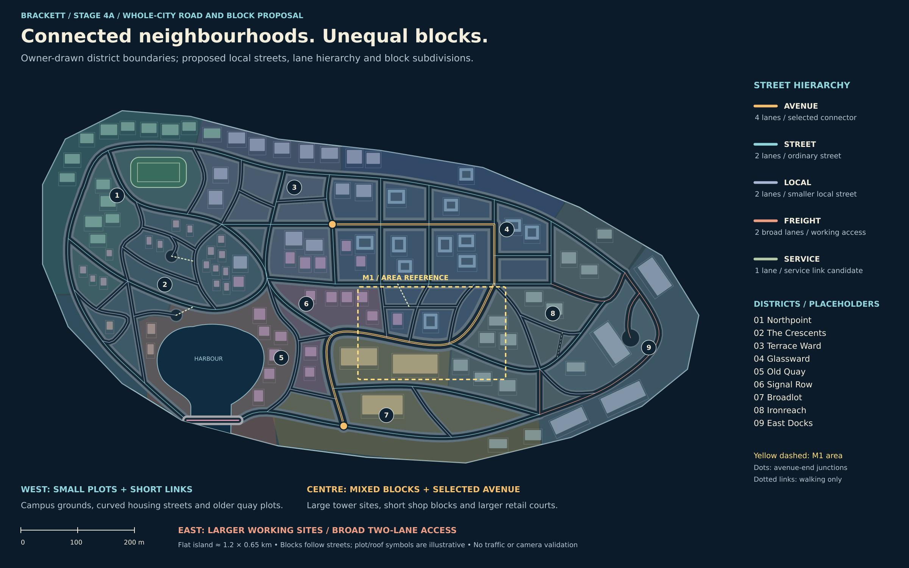
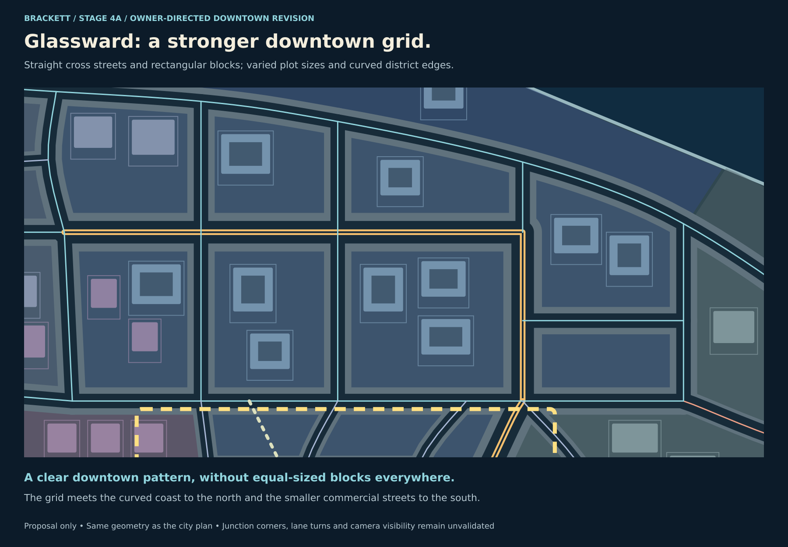
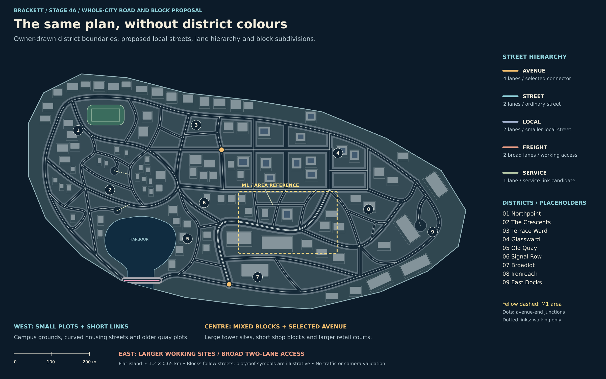
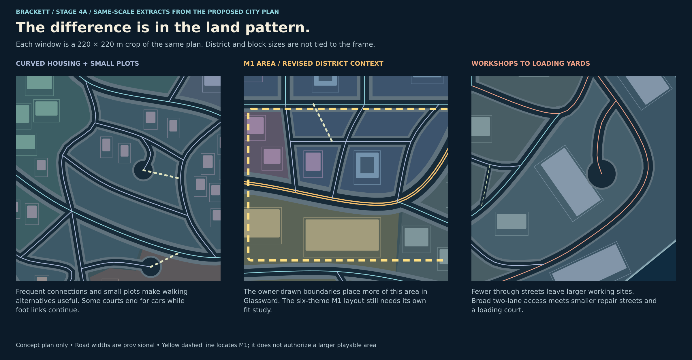

# Stage 4 — Streets and roads

9 October 2026 · **In progress. First review: whole-city road and block proposal.**

[Visual gallery](../review.html#stage4) · [Methods and provenance](methods.md) ·
[Approved district briefs](../stage-03-district-identities/README.md)

This first pass applies the approved hierarchy and varied urban scale to the actual
island. It retains map A's coastline, harbour entrance and bridge, nine district
relationships, coastal circuit and connected neighbourhood loops. Local connections
and some junction positions are refined to make blocks of different sizes. City and
district names remain placeholders.

## Recommended whole-city plan

[Editable SVG](01-city-road-block-plan.svg)

**Recommendation: one limited four-lane route through the central districts, with
smaller neighbourhood networks and broad two-lane working access.** The avenue runs
from the apartment/downtown junction, through Glassward, around the commercial and
workshop transition, then into the retail approach. It is not an island-wide highway.
Its two ends meet connecting streets at the yellow dots; lane distribution and
transition geometry are still to be designed.

The western housing and older harbour side use smaller streets and more frequent
connections. Campus and sports grounds occupy larger areas without a road through
every court. The centre mixes shorter shop blocks, apartment sites, larger tower
sites and a few open forecourts. Retail and dock areas have longer sites, fewer
public junctions and room for parking or loading. Repair streets are smaller and
more closely linked than the port roads they feed.

The main contrast is within as well as between districts. Small shops can stand
beside a larger civic site; small repair plots can meet a larger depot; a broad
avenue can connect to quieter local streets. District boundaries now use the owner's
[exported polygons](district-editor/brackett-districts.json), following the selected
roads, water and other divisions. They are not equal-area allocations, nor do they
dictate where lane counts change. The exact exported points are retained, including
small gaps and overlaps between independently drawn neighbouring polygons. Colours
are clipped at the coast and covered by harbour water; no automatic snapping or
boundary cleanup has been applied. The road and illustrative roof geometry is
unchanged by this boundary revision.

## Owner refinement — a gridded high-rise centre

[Editable SVG](04-downtown-grid.svg)

Glassward now has straight north–south streets and east–west cross streets, with
right-angle intersections and mainly rectangular blocks. The central avenue follows
this grid through the tower district. Its route bends again south of Glassward as it
enters the commercial/workshop transition.

Street spacing varies: larger tower/podium sites sit beside smaller blocks, rather
than repeating one square module. The northern streets meet the curved coastal
route, and the southern grid meets the less regular local network. The stronger
grid is specific to the high-rise centre; the western crescents and working yards
retain their contrasting patterns. Right-angle drawing corners indicate a grid,
not approved curb radii or vehicle turn paths.

## Check the spatial pattern without the district colours

[Editable SVG](02-city-without-zone-colours.svg)

This is the same geometry with neutral land and plot symbols. It is a visual check
that the smaller western divisions, mixed centre and larger working sites have a
recognisable structure. It is **not a minimap design** or a gameplay-camera capture.
Road-width differences are drawn to the proposal's common scale; coloured centre
lines and the avenue's double line are explanatory keys, not finished road markings.

## Equal-scale extracts

[Editable SVG](03-same-scale-extracts.svg)

The extracts are each **220 × 220 m** from this plan: housing, the selected M1
transition and the working east. They are not separately designed diagrams or
equal-sized districts. The larger roof/plot symbols in the working area therefore
occupy genuinely more of the same land area than the smaller residential examples.

Street-enclosed spaces express potential blocks. Thin rectangles and roof fills
are sparse illustrative plot/building examples, not final parcel subdivision,
asset quantities, authored building placements or maximum developable coverage.
Open areas can contain yards, gardens, parking, courts and additional plots later.
Small leftover wedges should become deliberate open spaces or be removed during
junction design, rather than automatically receiving a building.

## Preliminary street classes

These dimensions give the map meaningful relative widths. **They remain starting
values for the next street-section review**, not an approved road kit.

| Class | Intended use | Illustrative carriageway | Illustrative total corridor |
| --- | --- | --- | --- |
| Avenue | Selected central connector; two lanes each direction | 14 m | 24 m including 5 m pedestrian space each side |
| Ordinary street | Two-way neighbourhood and commercial connections | 9 m | 17 m including the existing 4 m sidewalks each side |
| Smaller local street | Two-way housing, court and local cross-links | 7 m | 12 m including 2.5 m sidewalks each side |
| Working access | Broad two-lane freight/yard approaches | 10 m | 14 m including 2 m pedestrian space each side |
| Service link | Single-lane one-way candidate between working streets | 4.5 m | 7.5 m including 1.5 m foot strips each side |

Widths exclude any additional parking/loading bays or medians. Parking aisles are
not counted as extra public through lanes. Large buildings do not automatically
need four-lane streets; turning space and loading aprons may matter more. Likewise,
pedestrian-heavy shopping streets can stay two-lane and use their space for walking.
Service-link direction is intentionally not selected at this city-plan stage.

## Loops, dead ends and the bridge

The coastal circuit and inland routes remain connected. The harbour bridge remains
one short, level-deck concept crossing over the open water entrance; an inland route
around the basin supplies an alternative. No hill, ramp or second water crossing is
introduced. Bridge engineering and movement remain unvalidated.

Three local access ends are shown with turning-space symbols: housing, the quay
fringe and dock loading. The first two have possible foot continuations. Their
circle sizes are space reservations, not measured turning radii. They must allow
the admitted vehicles to return; the earlier owner decision permitting physical
dead ends does not make a stranded directed traffic route acceptable.

All visible road crossings are intended to be at grade. Junctions are connection
locations, not resolved turn geometry, signal plans or traffic priority rules.
Staggered connections replace one overloaded working-side hub; a narrow downtown
sliver and nearly parallel quay links were simplified during self-review.

## M1 fit remains the next local study

The yellow dashed **260 × 163 m** area carries forward the selected location and
approximate extent. The six repeated reference rectangles have been removed.
The owner's revised boundaries put more of this envelope in Glassward, with Signal
Row on the west and Ironreach/Broadlot towards its other edges. The earlier
Signal Row / Ironreach identity mix remains the content brief; its fit within the
new district context needs to be reconciled in the local study.
This pass shows unequal nearby street-enclosed spaces, but does **not** certify
that the six-block programme fits those spaces or that the crop contains six final
blocks. Whole-city sites can extend across its outline.

The avenue reaches this transition in the proposal. Its larger corridor consumes
space and needs a deliberate local decision: whether to include it fully, keep it
at the edge or refine the local alignment while preserving the city connection.
The later M1 fit study must accommodate shops/foot passage, workshops, depot/service
escape, plaza, housing/tower exposure and the two-exit repair/chain yard within the
accepted scope. Large retail roof symbols are area references, not a requirement
to build a retail superblock inside M1.

Keep two playable driving loops, walking alternatives and authored inland limits.
Links into the unbuilt city do not count as M1 escape routes. The whole-island plan
does not expand the existing district budget of 32 cars, 64 pedestrians and four
players, or alter the 4.1 m car-blast radius. Any material M1 extent increase must
be presented explicitly.

## Technical review and remaining Stage 4 work

Reviewed the [S06 experiment](../../../spikes/s06.md) and
[S06 topology contract](../../../spikes/s06-contracts.md). The available evidence
is a bounded two-sector, two-lane fixture with particular opposing left turns and
one pedestrian crossing. Road geometry, directed lane links and walking links have
distinct roles, and the eventual minimap must derive from the same saved road data.
The drawing script is concept provenance, not a second production topology owner.

No S09/S10 result documents were found in this checkout. Four-lane junctions, lane
changes/merges, narrow local streets, one-way choices, returning from courts,
contested junctions and population behaviour are not established by the S06 result.
Right-hand traffic is the existing fixture assumption; this diagram does not choose
a different traffic convention or implement a traffic system.

The drawing check found one connected **undirected centre-line component**, and
sampled road centres stay on the island outside the harbour water except for the
explicit bridge. This catches disconnected pen strokes, not legal driving routes,
full road-corridor containment, swept turns or physical clearances. Finite-width
coastal and bridge approaches still need their own layout check.

Self-review covered all four rendered boards, source parsing, image sizes, local
links and whitespace. No Godot scenes, Blender production assets or gameplay code
were changed. No traffic, collision, camera, minimap or performance test ran.

Remaining Stage 4 work after feedback on this plan:

1. Refine street sections, lane transitions and junctions, including crossings,
   curb treatment, parking/loading and clear street-furniture zones.
2. Apply them to the M1 fit study, retaining its programme and route requirements.
3. Produce actual gameplay-camera street views and minimap-readability comparisons;
   flag unresolved tower and actor visibility rather than treating this map as proof.
4. Present the road kit and per-district variations for Stage 4 approval.

**Current owner choice:** whether this limited central four-lane route and the
smaller western / broader working-side networks have the right balance. I recommend
this distribution over widening the coastal circuit or carrying four lanes into
the housing and old-quay areas. Stage 4 remains open.
