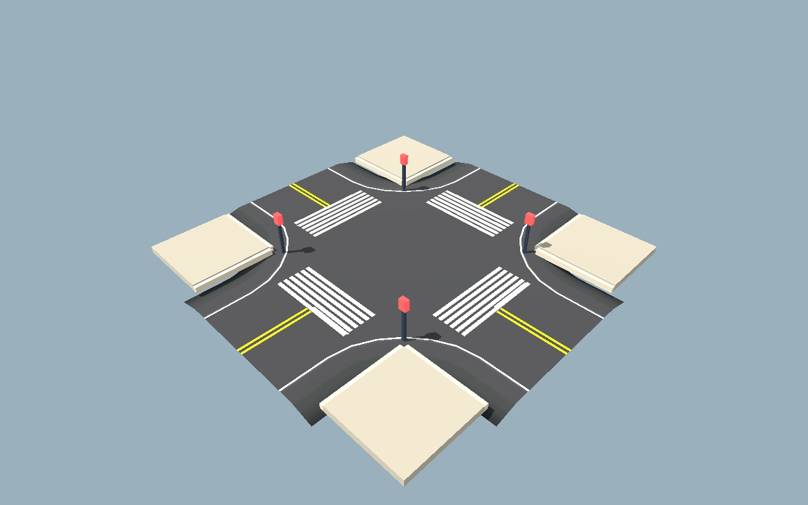

# Road authoring tool evaluation

9 October 2026. This spike evaluates TheDuckCow's Godot Road Generator against the
owner's spline-authored, explicit-bake road workflow. It changes no production scene,
asset, task record or addon. The addon and all generated geometry stayed in a disposable
project under `C:/tmp/ft/road-spike/`; only this record and compact evidence are
committed.

## Production decision supplement — 9 October 2026

Owner decisions 40–44 supersede this spike's proposed editor-only dependency,
explicit-bake workflow and addon-free package boundary. The project conditionally adopts
the tool, with RT-01 selecting and vendoring an exact release. Roads generate live in
the editor; road, sidewalk, curb, procedural-intersection and crosswalk surfaces may
also generate from the same saved road network at level load. The addon is therefore a
runtime dependency and must be present in desktop packages.

Traffic/foot graphs, crossings/reservations, spawn candidates and minimap data derive
from the road nodes at level load on host and clients. There is no bake command in the
current workflow. Common 3/4-way junctions use reusable Blender-authored prefab pieces;
procedural intersections remain the fallback for odd angles and unusual widths. Traffic
signals at selected signalized junctions and street lights configured by road type are
independent automatically placed Blender-authored fixtures. The section explicitly
headed **Historical evaluation and rejected bake proposal** preserves the pre-decision
evidence; the current maintenance and production sections after it own the live plan.

### RT-02 source contract

The production source layer now lives in `scripts/world/roads/` and
`resources/world/roads/`. `brackett_road_source.tres` records the frozen greybox JSON
hash and schema, accepted addon version, source revision, five typed class presets, and
50 stable route/section identities. `RoadJsonBootstrap` reads the source JSON only to
produce a transient first-pass point plan; it does not serialize a duplicate point list
into resources.

The five baseline presets preserve the accepted Brackett classification:

| Preset | Lanes | Lane width | Walk allocation per side | Speed |
| --- | ---: | ---: | ---: | ---: |
| avenue | 4 | 3.5 m | 5.0 m | 13.9 m/s |
| street | 2 | 4.5 m | 4.0 m | 11.1 m/s |
| local | 2 | 3.5 m | 2.5 m | 8.3 m/s |
| freight | 2 | 5.0 m | 2.0 m | 8.3 m/s |
| service | 1 | 4.5 m | 1.5 m | 5.6 m/s |

Defaults are applied at the `RoadPoint` boundary by `RoadNetworkAdapter`; intentional
section exceptions stay explicit in `RoadSectionSpec`. Validation fails rather than
silently accepting saved lane, width, shoulder/profile, graph, identity, transition, or
cross-container edge drift. Service direction and the Harbour bridge structural profile
remain mandatory bootstrap inputs. The JSON's intersection candidates are not promoted
automatically: stable junction specs are added only when an editor-authored
`RoadIntersection` is reviewed.

See [API contracts](../api-contracts.md#road-authoring-contracts) for identity forms,
revision rules, bootstrap behavior, and the cross-container interface contract.

### RT-01 release hardening results

RT-01 selected tag `0.9.4`, commit
`9d144dc4a28dd6bee870895d2b77d69174356281`, after checking that no newer tag existed
on 9 October 2026. The vendored addon is an unmodified exact archive; its provenance
note records the archive digest. The pinned-engine preflight builds an ordinary road,
a procedural four-branch intersection and the supplied `4way_1x1` custom container,
checks generated lanes/meshes, saves only the authored road source nodes, reloads and
regenerates the same counts, then repeats in a 60 FPS-capped graphical launch. Headless
and windowed runtime logs are diagnostic-free.

The editor-plugin clean import exits zero but has one exact upstream material-UID path
fallback and editor teardown reports one set of road preview renderer resources still
in use. RT-01 records those exact lines as known diagnostics and rejects every other
diagnostic; they are not represented as a fully clean shutdown. Disabling the plugin
makes the same clean-import command diagnostic-free, so that retained import resource
set is addon-editor lifecycle behavior on this engine. Runtime launches free their
fixture and exit cleanly.

The spike's automatic windowed-editor shutdown crash **does reproduce** with the
mise-pinned executable: a 60 FPS-capped editor exited with signal 11 after
`--quit-after 120`. The identical automatic exit also crashes with the road plugin
disabled and in a new empty project, so this reproduction is an engine/editor automatic
shutdown defect on this workstation, not addon-caused. A second distribution of the
same engine revision exited zero but retained renderer resources, which is not strong
enough to clear the pinned build. The owner trial remains the required normal
interactive close/disable/re-enable check; automated `--quit-after` editor exit is not
an accepted proxy for it.

The six failures previously reported under upstream's bundled GUT 9.4.0 are all
**harness-only**, not addon behavior failures:

- `test_road_container.gd::test_on_road_updated_single_segment`;
- `test_road_intersection.gd::test_on_road_updated_signal_after_container_refresh`;
- `test_road_intersection.gd::test_on_road_updated_signal_after_inter_moved`;
- `test_road_intersection.gd::test_on_road_updated_signal_after_rp_moved`;
- `test_road_intersection.gd::test_intersection_add_branch`; and
- `test_road_intersection.gd::test_intersection_remove_branch`.

Every failing assertion was GUT 9.4.0 rejecting a preloaded GDScript (`RoadSegment`,
`RoadIntersection` or `RoadPoint`) as argument 2 of `assert_is`; the road operations ran
before the assertion. In a fresh 0.9.4 scratch checkout using the project's pinned GUT
9.7.1, those assertions pass and the legacy-semantics run is 83/83. GUT 9.7.1's new
default error tracker separately makes 62 upstream tests fail because their fixture
construction emits transient `push_error` and engine diagnostics that GUT 9.4.0 did
not turn into test failures; disabling only that new tracker produces 83/83 and 473
passing assertions. This is a second upstream-harness compatibility gap, not a waiver
of those diagnostics. Production's independent valid-state preflight rejects runtime
diagnostics. No vendor patch was made.

## Historical evaluation and rejected bake proposal

The remainder of this historical section records the pre-decisions 40–44 evaluation.
Its editor-only dependency, explicit-bake, addon-free runtime and approval-request
language is rejected and must not be used as the production plan.

### Disposition

**Iteration time is the primary evaluation criterion under owner decision 34.** The
spike exists because changing a Blender-authored road currently requires too much
cross-tool regeneration, export, import and placement work. Geometry breadth, asset
purity and runtime efficiency remain gates, but they do not justify an authoring design
that puts Blender back into an ordinary point/width/junction edit.

**Recommend option A: adopt the addon as an editor-only authoring dependency and build a
project-owned incremental explicit-bake adapter around it.** Use its RoadPoint curves,
procedural road/intersection geometry, generated road-edge curves, generated `RoadLane`
paths and reusable custom `RoadContainer` prefabs. Prefer Blender-authored reusable 3/4-way
intersection prefabs containing sidewalk corners, crosswalk art and placement anchors;
use the procedural N-gon intersection for unusual angles. Our adapter should add only
the missing project semantics: typed road presets and stable IDs, sidewalk/crossing
semantics, traffic/foot graphs, reservation conflicts, spawn candidates, minimap ROAD
data, deterministic manifests, stale rejection and addon-free runtime output.

The target is the committed Brackett greybox: the full approximately 1.2 x 0.65 km,
nine-district island, not the earlier M1 six-block area. The follow-up benchmark reads
all 50 named Brackett routes (10.117 km of centreline), including the Harbour bridge,
and separately clips the real stage-04 downtown-grid area.

This is a **conditional adoption**, not approval to vendor immediately:

1. The requested `0.9.3` release ran the demo and scratch prototypes on the pinned
   engine without runtime diagnostics, but its bundled upstream suite is not green on
   `4.8-dev7`: 67/73 tests passed and six failed through a GUT type-argument
   incompatibility. GUT also reports a typed-`Nil` initializer diagnostic.
2. Upstream `main` had advanced to tag `0.9.4` during the evaluation, despite the brief
   calling `0.9.3` latest. It is explicitly a Godot 4.8 hotfix and adds substantial
   connection/intersection work, but its suite likewise passed 77/83 with the same six
   failures. Production must select and re-pin a release after a focused regression;
   do not silently track `dev`.
3. The addon's glTF export is not a complete static gameplay bake. The probe retained
   mesh/collision but zero `RoadLane` and zero scripts. An extractor and addon-free
   runtime resources are required.
4. Interactive authoring feel is not ratified. MCP/editor control was unavailable. A
   timed automatic windowed-editor shutdown hit the same unresolved engine memory crash
   on 0.9.3 and 0.9.4 under a contended workstation. The runtime fixture and headless
   imports are useful technical evidence, not a human snapping/undo trial.
5. Deterministic cross-machine bytes, dirty-chunk extraction time, source-scene diff
   quality, packaging exclusion, full connected island topology and movement acceptance
   remain production work.

The recommendation is still stronger than building our own tool: the addon already
owns the difficult spline editing, width transitions, lane markings, collision,
connections, intersection turns, edge curves and custom-container seams. Reimplementing
those before encountering a demonstrated blocker would duplicate mature work.

### Evidence and provenance

The exact requested release is tag `0.9.3` (there is no `v0.9.3` tag), commit
`980bc04c9f95a5c49b787f0a7a64a458156d5b9b`, plugin version `0.9.3`, dated
15 July 2026. A local `git archive` SHA-256 is
`b3daf57e9b436dc8ceb56b3f1873fbd0fceb3e49d62270b791fec71e5ef3ef1f`.
The source is MIT licensed. [Source provenance](road-tool-evidence/source-provenance.json),
[structured results](road-tool-evidence/results.json) and
[reproduction commands](road-tool-evidence/README.md) retain the detailed receipts.
All Godot commands used `4.8.dev7.official.c971f93e7`, a timeout and, for the capture,
a 60 FPS cap.



The capture instances upstream `custom_containers/4way_1x1.tscn`: its imported road
mesh, collision and twelve authored turn/approach `RoadLane` paths are unchanged.
Scratch-only primitives add four sidewalk corners, four zebra crossings, four stable
crossing-anchor placeholders and four signal/light placeholders. This proves that one
custom intersection prefab can carry these children and still expose addon road/lane
connectors. It does **not** prove accepted Blender sources, pedestrian legality,
reservation behavior, turning clearance or final art.

### Primary criterion: edit-to-visible iteration time

The meaningful loop is: manipulate the saved Godot road source, refresh a trustworthy
visual preview, then explicitly publish an addon-free accepted bake. The ordinary edit
must not open Blender, export glTF, reimport assets or rebuild unrelated districts.

A capped windowed scratch run used actual downtown RoadContainers, five samples per
local operation and two presented frames after each mutation. The current Blender
baseline was measured separately in a clean directory by running the committed coarse
whole-greybox pipeline. Subprocess startup is included in that baseline; human editing,
inspection and corrections are excluded from both sides. All iteration and Blender
phases ran on the contended shared workstation; they compare these two workflows but
are not quiet-machine or hardware-certification figures.

| Edit loop operation | Measured tool time to refreshed nodes/result |
| --- | ---: |
| Move/reroute one RoadPoint; rebuild affected container | 0.051 s median |
| Change one section between two and four lanes; rebuild affected container | 0.049 s median |
| Instance / remove reusable 4-way prefab | 0.033 / 0.033 s median |
| Move point through rebuild, plain mesh save/reload/instance + two frames | 0.123 s median |
| Rebuild all 20 downtown route containers + two frames | 0.194 s |
| Rebuild all 50 whole-island route containers, synchronous work only | 0.799 s |
| Current Blender author: regenerate 22 `.blend` sources | 4.501 s |
| Current Blender export: 40 GLBs | 3.480 s |
| Fresh Godot import: 40 GLBs | 8.915 s |
| Current Godot placement: 50 scenes | 5.871 s |
| **Current coarse Blender subprocess total** | **22.767 s** |

These are not yet an end-to-end production victory. The scratch dirty bake directly
moved a point, rebuilt its affected container and copied its meshes to a 348,732-byte
PackedScene with zero addon path references, then saved, cache-reloaded and instanced
it; it did not merge meshes or emit collision, semantics, manifest/fingerprint
validation or authoring-scene saves. Point/type edits were
programmatic rather than human gizmo/undo/save actions, and prefab insertion did not
rewire connected approaches. The Blender figure is the current full deterministic
batch, not a hypothetical optimized one-sector exporter. It is nevertheless the
relevant lower bound for the existing scripted round trip the owner wants removed. The
narrow Godot point-to-visible-bake proxy is about 185 times shorter in measured tool
time (0.123 versus 22.767 seconds), with the stated scope difference; that margin is the
main reason option A remains recommended. See
[iteration evidence](road-tool-evidence/iteration-result.json) and
[Blender round-trip evidence](road-tool-evidence/blender-roundtrip.json).

Make the following constraints part of option A rather than later optimization:

1. Dragging a point or changing an Inspector preset refreshes only the affected native
   RoadContainer/intersection preview. Do not serialize accepted output on every drag.
2. On **Bake Dirty Roads**, derive and save only touched 100-150 m chunks plus directly
   dependent junction/semantic records. Content-addressed unchanged chunks are reused;
   a final city-wide validation checks seams and references without regenerating them.
3. Directly extract Godot mesh arrays, curves and semantics. Do not use the addon's glTF
   export/reimport action in the ordinary edit loop.
4. Keep reusable junctions lightweight shared scenes/resources. Adding/removing one
   junction dirties that junction and its approaches, not all 69 junctions.
5. Signals, street lights and signs remain Blender-authored **fixture assets**, but the
   road bake only instances already imported assets at sockets/edge spacing. Moving a
   road or changing its type must never invoke Blender; Blender is required only when
   the fixture model itself changes.
6. Separate fast preview from accepted publish. A full publish may revalidate every ID,
   link and fingerprint, but collision generation, minimap/FOOT/TRAFFIC extraction and
   resource writes remain chunk-incremental.

Initial review triggers are `<=100 ms` for local visual preview, `<=1 s` from **Bake
Dirty Roads** to saved/reloaded visible chunk, and `<=10 s` for a clean whole-city
publish. Native preview and the narrow road-mesh save/reload probe support the order of
magnitude, but a complete dirty chunk and whole publish are production-pilot targets,
not accepted budgets. Record p50/p95 for point move, preset/lane change,
connected intersection add/remove and undo/redo/save/reopen. If the adapter cannot keep
the dirty-chunk loop under one second without weakening determinism or stale checks,
option A has not solved the owner's primary problem and must be reconsidered.

Features most likely to regress iteration time are rebuilding the full network after
every control-point change, generating one unique heavy prefab subtree per junction,
whole-island collision recooking, rewriting all semantic resources for a local edit,
and any mesh export/import round trip. The benchmark's low native refresh time supports
the recommendation only if production avoids those paths.

### 1. Compatibility and release comparison

| Observation | 0.9.3 requested release | 0.9.4 observed `main` |
| --- | --- | --- |
| Exact commit | `980bc04c9f95a5c49b787f0a7a64a458156d5b9b` | `9d144dc4a28dd6bee870895d2b77d69174356281` |
| Pinned-engine import | Exit 0; no script error; one road-texture UID path fallback | Same |
| Intersection runtime demo | Exit 0; no warning/error/script diagnostic | Same |
| Upstream GUT | 67/73 pass, exit 1 | 77/83 pass, exit 1 |
| Automatic windowed-editor shutdown | Unresolved memory/signal-11 crash | Same class of crash |

Headless editor exit also emitted dummy-renderer RID leakage on both refs. The clean
windowed fixture and clean runtime demo distinguish this from addon gameplay errors,
but neither teardown diagnostic is waived. The interactive editor crash reproduced on
both refs while the workstation was contended, so this spike cannot attribute it to the
addon or engine. A quiet manual editor session must exercise add/move/connect/snap,
undo/redo, save/reopen and plugin disable/re-enable before vendoring.

`0.9.4` is not a cosmetic change: comparison shows roughly 859 additions/364 deletions
inside the addon, including road/intersection/point/lane logic, connection tooling,
4.8 import cleanup and new gizmo resources. `dev` was
`d2ec61622acd7d3bbfb80518463b46611c5237b3` on 7 October 2026. Pinning `dev` would make
our adapter chase internal churn; the release should be vendored by exact commit and
upgraded deliberately.

Known source-level risks include disabled/unfinished editor actions due to crashes,
comments describing glTF replace-in-place instability, directionality and lane-reuse
TODOs, NodePath-based internal connections, and generated-node ownership complexity.
These are reasons for an adapter and regression suite, not reasons to fork immediately.

### 2. Authoring workflow and data model

The addon is not one arbitrary `Curve3D` free spline. Its authoring unit is:

- `RoadManager`: project-wide defaults, container discovery and auto refresh;
- `RoadContainer`: a connected road/prefab unit, material/collision/lane settings and
  cross-container edges;
- `RoadPoint`: positioned/rotated Bezier control with prior/next handle magnitude,
  lane directions/count, lane width, shoulders, gutter profile, alignment and optional
  generated geometry;
- `RoadIntersection`: references branch RoadPoints and an intersection settings
  generator; and
- `RoadLane`: a directional `Path3D` with next/prior/left/right NodePaths and lane tags.

The editor toolbar/gizmos create roads, insert points and intersections, snap compatible
container edges and visualize connection hints. Source inspection confirms useful
connection and snapping operations; it does not establish that the UX feels good.
RoadPoint settings interpolate along a segment, so width/lane/shoulder transitions are
native. Materials and collision defaults live mainly at manager/container scope.

Arbitrary Godot metadata works technically—the benchmark attached `road_type`—but
untyped metadata is not sufficient production UX. Add project-owned editor resources
without copying the spline:

```text
RoadTypePreset
  preset_id
  lane_directions, lane_width_m, shoulder_widths_m, gutter_profile_m
  sidewalk_width_left_m, sidewalk_width_right_m, curb_profile_id
  speed_limit_mps, surface_material_id, sidewalk_material_id
  street_light_asset_id, street_light_spacing_m, spawn_policy_id

RoadSectionSpec (attached to one RoadContainer/section)
  road_id, section_id, preset, allowed_overrides
  one_way, speed_override_mps, sidewalk overrides, spawn_enabled

RoadJunctionSpec (attached to one RoadIntersection/custom container)
  intersection_id, mode = PREFAB | PROCEDURAL
  prefab_id, traffic_control = NONE | SIGNAL
  marked_crossings, crossing_policy_id, street_lighting

RoadPoint identity metadata
  point_id, optional next-section preset transition
```

The preset is the owner of default values. An editor action applies it to the addon
fields; validation rejects drift unless a field is an explicit override. The bake
fingerprints the preset and actual validated point values. This avoids two authorities
while retaining native handles and Inspector feedback. IDs are project-owned strings;
never use generated child indices or transient scene names as durable gameplay IDs.

A road type change belongs at a stable section boundary/control point. The stage-04
Brackett source defines this provisional hierarchy; the lane widths below are exact
derivations of carriageway width/lane count, while speeds are recommended gameplay
starting points that still need owner and driving validation:

| Preset | Source carriageway / corridor | Initial addon lane layout | Walk allocation | Proposed speed |
| --- | --- | --- | --- | --- |
| `avenue` | 14 / 24 m | 4 x 3.5 m, two each way | 5 m each side | 13.9 m/s (50 km/h) |
| `street` | 9 / 17 m | 2 x 4.5 m | 4 m each side | 11.1 m/s (40 km/h) |
| `local` | 7 / 12 m | 2 x 3.5 m | 2.5 m each side | 8.3 m/s (30 km/h) |
| `freight` | 10 / 14 m | 2 x 5 m | 2 m each side | 8.3 m/s (30 km/h) |
| `service` | 4.5 / 7.5 m | 1 x 4.5 m | 1.5 m each side | 5.6 m/s (20 km/h) |

`service` is a one-lane candidate, not permission to guess its direction. The import
must require an explicit one-way direction before traffic bake. The 91 m Harbour bridge
inherits the `street` corridor for lane/foot semantics but uses a dedicated
Blender-authored structural profile. A preset may choose a custom surface
material/profile, but geometry, direction and semantic width must still agree at
connected endpoints.

#### Seeding the existing street plan

`docs/concepts/world-v1/stage-04-streets/district-editor/brackett-districts.json` contains
nine district polygons and coordinate metadata, not roads, so it cannot seed splines by
itself. The committed greybox `authoring_plan.json` does retain all 50 derived routes
with stable names, one of the five classes, point arrays and dead-end flags. A one-time
EditorScript can convert map `(x, y)` to Godot `(x - 630, 0, y - 355)`, simplify dense
sampling within a declared tolerance, create RoadContainers/RoadPoints, apply presets
and retain source route IDs. The benchmark proved that mechanical conversion for both
the downtown slice and all routes.

That import is only a bootstrap. Merely overlapping route strokes does not create
`RoadIntersection` connectivity: the source graph has 69 degree-3-or-greater junction
points, and they must become reviewed intersections/prefabs with stable approach IDs.
The importer must also stop for service direction, dead ends, bridge specialization and
ambiguous coincident paths. After review, the Godot spline scene becomes the sole
editable road source; the stage-04/greybox JSON and its hash remain provenance rather
than a second writer.

### 3. Geometry, collision, intersections and explicit bake

#### Native generation

The addon generates a low-poly road ribbon from paired RoadPoints, UV lane markings,
shoulders/gutters, optional underside and trimesh collision. It can generate N-gon
intersections from sorted branches, including non-orthogonal branches, and produces
turn lane curves. Reusable 3/4-way, roundabout, splitter and ramp custom containers
ship as examples. Per-point `create_geo = false` permits a custom mesh/collider while
retaining the graph and lanes.

That custom-mesh switch does not make an arbitrary Blender road segment follow any
spline. It is strongest for reusable fixed pieces and exceptional authored sections.
Likewise, a custom intersection can own its local Blender mesh, sidewalks, crossings
and anchors once, while road graph placement selects the prefab automatically. It is
not hand-placing every world road mesh.

#### Current export limitation

The plugin has a selected-`RoadContainer` glTF export action. Its own source warns that
replace-in-place is disabled because saving after replacement was unstable. The scratch
probe exported the custom 4-way to a 53,348-byte GLB and reimported it as:

```text
23 nodes; 1 mesh; 1 StaticBody3D; 1 CollisionShape3D;
0 RoadLane; 0 scripted nodes
```

Thus the game cannot use that button alone. Retaining authoring `RoadContainer` nodes
would execute addon scripts (`_ready` rebuilds containers even if auto refresh is off)
and preserve a runtime dependency. Production needs a project-owned bake that writes
plain runtime scenes/resources and never instances the authoring graph in play.

#### Proposed incremental explicit bake

Live native preview is disposable. **Bake Dirty Roads** extracts/reloads only affected
chunks for rapid review but does not advance accepted CityData. **Publish City Roads**
performs the following transaction in deterministic stable-ID order, reusing unchanged
content-addressed chunk outputs:

1. Validate IDs, reciprocal connections, preset/application agreement, finite values,
   legal widths/directions, prefab connector compatibility and sector ownership.
2. Turn off live auto refresh; invoke one explicit addon rebuild for dirty containers.
3. Sample the validated source curves at the contract's chosen interval and extract
   road surfaces/collision, edge curves and generated lanes/intersection turns.
4. Generate or instance adjacent presentation: sidewalk/curb surfaces, custom
   intersection pieces, crossings, signal/street-light assets and other selected props.
5. Build project semantic resources: directed TRAFFIC graph, undirected FOOT graph,
   crossing/reservation conflicts, spawn anchors and ROAD minimap polylines/widths.
6. Write addon-free runtime sector scenes plus one CityData-owned external bake resource
   and a human-readable manifest. Reload with cache replacement and validate the saved
   result before success.
7. Leave authoring scenes untouched except the assigned bake reference/revision. Runtime
   and network admission reject missing or stale output with `CONTENT_INVALID`; they
   never silently rebuild.

Generated runtime node names derive from stable IDs, for example
`road_<road_id>__section_<section_id>` and
`crossing_<intersection_id>_<arm_id>`. Output arrays sort by those IDs, use a fixed
curve sample interval/float quantization and exclude timestamps/absolute paths. The
signature includes district ID, topology revision, bake-tool version, addon pin,
preset/resource bytes, stable IDs, source transforms/handles/metadata, referenced
Blender/GLB/import bytes, materials, collision flags and generated semantic values. It
excludes the output resource itself. Reordering unrelated source nodes must not alter
meaning; changing geometry, anchors, referenced imports or semantics must stale the
bake.

Binary mesh/resources will not yield useful line diffs. Reviewability comes from small
source scenes, a deterministic JSON manifest (IDs, bounds, counts and hashes), stale
checks, a generated-content comparison summary and visual/movement tests. Do not save
large generated vertex arrays inline in hand-edited scenes. Stable project IDs, not
Godot-generated child names, preserve semantic identity across a rebake.

Deterministic bytes are **required but unproved** here. Production tests should bake
twice, save/reload, compare manifests and semantic resources, then repeat in clean
Windows and Linux imports. Mesh bytes may require semantic canonicalization if Godot's
resource serializer differs while geometry is equal.

### 4. Traffic lanes, turns and vehicle spawn data

With `generate_ai_lanes`, each segment gets directed `RoadLane` curves. Procedural
intersections generate separate through/turn paths, and custom prefabs can author their
own curves; the captured 1x1 four-way exposes twelve. Tags and next/prior NodePaths
connect compatible paths. This is a strong basis for S09 but is not itself the accepted
bounded traffic planner.

The baker should convert every validated lane/turn curve into immutable links:

```text
TrafficLink
  link_id = stable road/intersection + direction + lane/turn identity
  from_anchor_id, to_anchor_id, samples_world_m
  speed_limit_mps, lane_index, maneuver, road_type_id
  crossing_conflict_ids, signal_group_id, spawn_allowed
```

Resolve NodePaths while the authoring graph is live, then serialize only stable IDs and
samples. Validate every non-boundary lane has legal outgoing connectivity and that
turns stay within their declared maneuver. Keep S09's bounded reservation/blocked/stuck
logic in traffic simulation, not addon scripts. `RoadLaneAgent` is reference/demo code,
not the production authoritative AI owner.

Spawn candidates are deterministic samples on links marked `spawn_allowed`, outside
junction/crossing conflict envelopes and spaced by the preset. Each stores link ID,
distance, pose, vehicle class policy and clearance envelope. Runtime authoritative
Population still checks occupancy, threat, visibility and bounded retries; bake data
is a candidate set, never permission to spawn blindly.

### 5. Sidewalks and adjacent features

#### Addon-native mechanisms first

**Decoration edge curves are useful.** Setting `create_edge_curves` generates left,
right and center `Path3D` curves on road segments. Release 0.9.3 also generates exterior
curves around procedural intersections and reuses named path nodes on rebuild. The
whole-island proxy confirmed 993 per-segment edge/center curves across the 50 routes.
The bake must consume and merge them; it must not preserve all generated helper nodes
at runtime. They can drive:

- sampled sidewalk/curb sweeps;
- repeated Blender-authored curb or guard pieces;
- regular street-light/prop placement; and
- the centreline of the FOOT links after applying the declared clear-strip offset.

The curves are geometric boundaries, not pedestrian semantics. They do not define
crossing IDs, reservation conflicts, clear widths, legal joins or prop exclusions.
Those remain our bake output.

**Custom road meshes help selectively.** Turning off generated geometry lets a custom
road container carry a Blender-authored mesh/collider and manually authored lanes. A
fixed road-type module can include curbs/sidewalks, but a static mesh does not deform to
free spline edits. For ordinary variable-length curves, use the native generated road
plus an editor-baked edge-curve sidewalk sweep. Use custom meshes for exceptional fixed
pieces, bridge/ramp shapes and prefab junctions rather than converting the district
back into hand-placed modules.

**Prefab intersections are the preferred common case.** Create project 3-way and
4-way families for common compatible Brackett class pairings; a street/street fixture,
for example, uses the 9 m carriageway and 4 m walk allocation. Their linked Blender
source supplies local road surface, rounded sidewalk corners, curbs and crosswalk
markings; saved children carry connector RoadPoints/RoadLanes plus named crossing and
asset sockets. The graph chooses/places the prefab at a junction and roads snap to its
connectors. This gives better art and stable sockets than synthesizing corners on every
bake. Procedural intersections remain the fallback for odd branch angles or uncommon
width combinations, where the baker follows generated exterior curves to make corners
and crossings.

#### Project-owned post-bake semantics

For every sidewalk-enabled road section, sample its exterior edge, offset inward to the
clear-walk centre and write a FOOT link with width/corridor bounds. At each junction:

1. join compatible corner endpoints from the prefab sockets or procedural edge curves;
2. for each enabled marked crossing, generate/instance markings and a FOOT crossing link;
3. assign stable `crossing_id`, conflict TRAFFIC link IDs and reservation capacity;
4. emit the decision-32 data used by the finite API: pedestrians reserve; AI traffic
   yields to active reservations; player-driven cars do not auto-yield; and
5. reject disconnected sidewalks, crossings that do not meet both walk surfaces, and
   props intruding on clear corridors.

Traffic signals and street lights are separate concepts. The recommended interpretation
of the owner's “intersection lights” request is **both**, controlled independently:

- `traffic_control = SIGNAL` places Blender-authored signal poles/heads at named sockets
  and emits signal groups/conflicts. Per decision 32, start with selected landmark
  intersections only; ordinary crossings can use reservations without signals.
- `street_lighting = true` places Blender-authored street lights at prefab sockets and
  preset spacing along edge curves, with corner/crossing exclusion distances. Ordinary
  street-light meshes should be MultiMesh/instanced by sector rather than one authored
  runtime subtree per pole.

The bake places both asset families automatically. Signal timing/authority is City/
traffic gameplay data, not animation logic embedded in the visual mesh. This split
needs owner confirmation because the phrase is ambiguous; the technical recommendation
is not to make one flag mean both.

Forking the addon merely to add semantic resources would couple project contracts to
upstream internals. Start with composition and extraction. Fork only if a production
pilot proves a blocker in intersection edge continuity, stable rebuild hooks or custom
metadata UI that cannot be solved through documented public APIs.

### 6. Minimap from the same source

Minimap derivation is straightforward and should not use separate splines. The baker
samples the road centre curve—or derives the centre between validated road edges—into
S06 ROAD polylines, stores the semantic carriageway width and world XZ bounds, then
maps those same values at the accepted 3 px/m presentation scale. Intersection ROAD
polygons/joins come from the same prefab sockets or procedural intersection boundary.

CityData owns the one bake, map and topology revision. The minimap consumes
`MapData = {district_id, topology_revision, bake_fingerprint, bounds, road_polylines,
widths}`. A map whose IDs, samples, widths or fingerprint disagree with the current
source is `CONTENT_INVALID`; it is never hand-fixed. FOOT/TRAFFIC/ROAD may be distinct
outputs, but all derive in one transaction from one road graph and one set of junction
specs, satisfying “one authored representation” without pretending the semantics are
identical.

### 7. Contract and ownership fit

The authoring source belongs in saved sector/editor scenes. The City integrator is the
sole operation that can assign the whole-city bake revision and publish runtime
CityData. Asset prefabs own local Blender-linked presentation and sockets; they do not
own world placement. Traffic, pedestrian and minimap consumers cannot mutate or
reinterpret source curves.

Sector seams require exactly one owner per road/junction and explicit connector IDs.
A link crossing one of the current 4 x 3 ground-sector boundaries stores both endpoint
sector IDs but one stable link ID. Bake validation checks duplicate ownership, missing
endpoints and reciprocal geometry. Runtime sector scenes contain only plain Godot nodes
and project resources; authoring addon scenes/scripts are editor inputs and must not
enter exported dependencies.

The addon's live refresh model conflicts with the desired control unless wrapped. The
production plugin should disable global `RoadManager.auto_refresh` by default, refresh
only edited containers for **Preview**, expose **Bake Dirty Roads** for addon-free local
review, and reserve **Publish City Roads** for assignment of accepted CityData. Neither
preview state nor dirty-chunk output is accepted until whole-city validation succeeds.
Publish failure leaves the last valid assigned resource in place but reports the source
as dirty/stale; play and join still reject it.

### 8. Brackett replacement, measured scale and capacity

#### Replacing greybox road/walk surfaces

The current `city.tscn` composes twelve source-linked ground sectors and nine building
district scenes. Keep the district building scenes, land/coast/field visuals, water and
source-linked Blender ownership. Revise the `ground_*.blend` export collections so
road/walk presentation is omitted (or exported as separately disabled children) while
the terrain/coast source and review fingerprints remain intact. Do not overlay a
second final road on the existing grey strips.

Bake road, sidewalk, curb and junction presentation into addon-free runtime chunks
aligned to the same 4 x 3 sector grid and map origin `(-630, 0, -355)`. Keep the current
base terrain collision as the sole flat driving surface initially; generated coplanar
road collision would duplicate it. If later road materials or raised curbs need physics
collision, either cut the terrain collision beneath them or add only the non-overlapping
curb/bridge shapes. The Harbour bridge is a separate chunk: its 91 m route supplies
lanes, FOOT/TRAFFIC/ROAD semantics and sockets, while a source-linked Blender bridge
supplies deck structure, rails and structural collision.

The replacement should be atomic: bake and reload all outputs, verify sector bounds,
seams, collision ownership and source signatures, then switch the City bake revision.
A failed bake leaves the prior valid city intact. This preserves current buildings and
coast while replacing Blender-authored grey road/walk presentation with the one spline
source. It requires the asset exception in section 9 and a coordinated Blender ground
revision; this spike makes neither change.

#### Actual street-plan benchmark

The input is the committed Brackett `authoring_plan.json`, SHA-256
`064ddd567a68d9c0bf12ee641f58272292ee0c733d79be65cd42823909436e56`.
It has 50 named/type-tagged route strokes. A 0.5 m line simplification reduced dense
plot samples to 381 RoadPoints while preserving 10.117 km of centreline. The full proxy
contains 5.517 km street, 2.934 km local, 0.901 km avenue, 0.717 km freight and 0.048 km
service routes. The downtown case clips the same data to map `(540,155)-(1000,385)`,
the Glassward-centred area shown by `04-downtown-grid`, rather than inventing an M1 grid.
These timings were collected on the contended shared workstation and are comparative
spike evidence, not quiet-machine or hardware-certification figures.

| Measurement | Downtown slice | Whole island including bridge stroke |
| --- | ---: | ---: |
| Route strokes / simplified points | 20 / 58 | 50 / 381 |
| Centreline length | 2,388.230 m | 10,117.166 m |
| Initial setup through two frames | 523.501 ms | 2,647.372 ms |
| Explicit warmed rebuild | 177.834 ms | 799.110 ms |
| Nodes | 429 | 3,466 |
| Mesh instances / draw surfaces | 38 / 38 | 331 / 331 |
| Triangles | 17,044 | 66,878 |
| Static bodies / collision shapes | 38 / 38 | 331 / 331 |
| RoadLane paths | 84 | 717 |
| Edge/centre curves | 114 | 993 |

The full result is measured, not extrapolated, and includes the bridge centreline as an
ordinary generated `street` ribbon. It does **not** include the structural bridge mesh,
connected RoadIntersections, sidewalks/curbs/crosswalks, signals/lights, buildings,
semantic serialization, clean import/load or runtime frames. Crossings overlap, so the
counts are a generation envelope rather than accepted topology. See
[the downtown result](road-tool-evidence/brackett-downtown.json),
[whole-island result](road-tool-evidence/brackett-whole-island.json) and
[reproduction input/source](road-tool-evidence/README.md).

At the measured 2 m road tessellation, ordinary road ribbons are only about 67 thousand
triangles. Allowing two sidewalk/curb sweeps, intersection patches and crosswalk
surfaces gives a conservative **0.1-0.2 million static infrastructure triangles** for
planning before reusable props and the Blender bridge; this is an estimate to replace
with the connected bake, not an accepted budget. Road-only generation took 0.8 seconds
warmed and 2.65 seconds including construction/two frames on the contended workstation,
so a full pipeline should target single-digit seconds but must separately time extraction,
merging, serialization, import and reload.

#### S07 capacity and chunking

S07's preserved 384-block run hit an access violation before expanded-count
instrumentation; scene composition implied 52,998 nodes and 3,072 static colliders. S08
later instantiated those counts twice without reproducing the crash, so this is a
capacity warning, not a proven engine ceiling. The naive
road proxy alone already has 3,466 nodes and 331 trimesh colliders; retaining generated
RoadSegment, RoadLane and edge-helper nodes at runtime would spend capacity on editor
implementation details and magnify it again for sidewalks, props and intersections.

The bake should therefore flatten runtime output, but not into one island-wide mesh or
collider:

- own output by the existing twelve sectors and split long routes at sector boundaries;
- coalesce road/sidewalk surfaces by spatial chunk plus material/preset, with a
  100-150 m maximum span or explicit vertex cap for culling and localized rebakes;
- keep collision spatially smaller (roughly 50-100 m), separate the bridge, and never
  duplicate the retained terrain collision;
- merge semantic curves into project resources with stable IDs rather than preserving
  hundreds of Path3D nodes; and
- instance lights/props by sector and keep junction gameplay nodes only where runtime
  behavior actually requires them.

For the first connected whole-city pilot, use `<=120` road/sidewalk draw surfaces and
`<=200` infrastructure collision shapes as review triggers, not silently accepted
budgets. Report total city nodes/colliders as well as the road subsystem, broadphase and
physics time, visibility/culling, load/reload cost and 60-capped runtime. Raise or lower
those triggers from measured evidence. This directly guards the S07 failure mode while
preserving sector streaming/culling and a debuggable bridge boundary.

### 9. Required asset-rule owner decision

Current guidance forbids generated render meshes and requires visible 3D models from
Blender. Free spline roads and swept sidewalks cannot satisfy that literally without
hand-authoring every unique curve—the workflow the owner rejected. Adopt only with an
explicit exception. Proposed wording for owner review:

> **Editor-baked infrastructure exception.** This exception exists to keep ordinary
> point, width, lane and junction edits inside the Godot edit-to-bake loop; requiring
> unique road surfaces to return through Blender would defeat owner decision 34. Road,
> sidewalk, curb, procedural intersection and generated crosswalk-marking surfaces may
> be deterministic editor-bake outputs from the accepted saved road graph and pinned
> bake tool. Their authored
> source is the road graph, typed road/intersection presets and committed source
> materials/textures; each output records the source signature, tool/addon versions and
> stable semantic IDs, and stale/missing output fails validation. Do not hand-edit or
> generate these surfaces at runtime. Reusable visible fixtures—including traffic
> signals, street lights, signs, barriers and common custom intersection/road pieces—
> remain Blender-authored linked assets placed/instanced by the bake. A road edit may
> reposition or reselect those already imported fixtures but must not invoke Blender;
> Blender is only in the loop when fixture art itself changes. Collision,
> traffic/foot graphs, spawn anchors and minimap data are derived non-render data and
> remain separately validated. Exceptional custom road/intersection meshes retain
> their committed Blender source and explicit export link.

This is an owner decision, not a change made by this spike. Prefab intersections and
custom fixed pieces reduce the exception's surface area, but ordinary curved road and
sidewalk ribbons still need it.

## Current license, maintenance and upgrade policy

MIT permits vendoring and modification with the copyright and license notice retained.
The project vendors exact tag `0.9.4` plus its LICENSE and project provenance record;
the upstream files have no local patch. The addon is a runtime dependency. Desktop
packages include its scripts and generated-road dependencies while excluding bundled
GUT, tests and development tooling.

The addon remains pre-1.0 and exposes transient generated nodes and NodePaths. Project
systems consume a project-owned, validated view of the saved road network rather than
coupling gameplay identities to generated child names or private addon methods. The
saved network revision, addon pin and project derivation-schema revision identify the
road state used by generation and load-time derived data.

Upgrade procedure:

1. Fetch a candidate tagged release into scratch and record its exact commit, archive
   digest, date, license changes and selection rationale; never track a branch or
   auto-upgrade from AssetLib.
2. Review the addon-only diff, especially saved properties, RoadPoint/RoadLane and
   intersection connections, generated geometry, lane curves and node lifecycle.
3. Run upstream tests and the pinned-engine preflight, including ordinary roads,
   procedural and prefab intersections, lanes, save/reload, headless runtime and the
   capped graphical check.
4. Re-run fixed-network regression fixtures and compare generated road, sidewalk, curb,
   crosswalk and intersection output plus collision and placement anchors.
5. Re-derive traffic and foot graphs, crossings/reservations, spawn candidates and
   minimap data at load; compare stable IDs, topology, bounds and revisions, and reject
   stale or internally inconsistent results.
6. Manually exercise editor snapping, undo/redo, save/reopen and representative prefab
   and procedural junctions, then verify Windows/Linux packages include the candidate
   runtime addon and exclude GUT, tests and development content.
7. Update the vendor pin and provenance only after generated-output, derived-data,
   editor and package regressions pass together. There are no bake artifacts to update.

## Historical options comparison (pre-decisions 40–44)

This table explains the rejected bake framing evaluated before the owner selected the
live runtime-addon architecture. It is not an implementation choice still awaiting
approval.

| Option | Advantages | Costs/risks | Historical disposition |
| --- | --- | --- | --- |
| **A. Release plus incremental-bake adapter** | Reused spline editing and generated geometry while proposing addon-free runtime output. | Added extraction, stale-bake and publish machinery now rejected by decision 41. | Superseded by the live runtime-addon plan. |
| **B. Fork and extend addon** | Offered deep control over presets and bake UI. | Permanent merge burden against active 0.x internals. | Rejected unless a demonstrated blocker later requires a minimal documented patch. |
| **C. Build a replacement** | Offered full control over identities and serialization. | Duplicated spline gizmos, snapping, transitions, intersections, lanes and collision before proving need. | Rejected for the production pilot. |

## Production breakdown — decisions 40–44 no-bake plan

Sizes are implementation estimates, not commitments. M = roughly 3–5 focused days,
L = roughly 6–10; art and owner review time are separate. No task produces a road bake
or addon-free runtime scene.

| Task | Size | Depends on | Acceptance focus |
| --- | --- | --- | --- |
| RT-01 release hardening and vendor decision | M | Decision 40 | Exact release/provenance, pinned-engine construction and save/reload regression, classified upstream tests, owner editor trial, and runtime addon present in desktop exports. |
| RT-02 road preset, identity and revision adapter | M | RT-01, whole-city integrator owner | Five Brackett presets/specs, stable road/section/point/junction IDs, source revision ownership, preset drift rejection, class transitions, JSON bootstrap and connection validation without duplicating the spline. |
| RT-03 live infrastructure generation | L | RT-02, decision 42, accepted materials | Addon roads plus project-script sidewalks, curbs and crosswalk markings generate from the saved network in the editor and at level load; collision ownership, seam checks and local edit-to-visible timing remain bounded. |
| RT-04 hybrid intersection system | L + art | RT-02/03, decision 44, Blender sources | Reusable Blender-authored common 3/4-way prefab pieces with compatible connectors and crosswalk/fixture anchors; procedural fallback for odd angles and widths; generated turns, clearance and save/reload regression. |
| RT-05 load-time derivation and consistency core | L | RT-02–04, CityData/content contracts | One bounded derivation pass reads the validated live road network and publishes traffic, foot, crossing/reservation, spawn and minimap datasets with stable IDs and a common source/schema revision; host/client results and dependent counts/references must agree or admission fails `CONTENT_INVALID`. |
| RT-06 traffic graph and spawn derivation | L | RT-05, S09 rules | Directed lane/turn links, stable maneuvers, work caps, legal spawn candidates, signal/crossing conflicts and blocked/stuck integration tests derived at load. |
| RT-07 foot graph, crossings and reservations | L | RT-05/06, decision 32, S10 | Continuous sidewalk links, marked crossing IDs, conflict sets, reservation/yield behavior, work caps and illegal-road negatives derived at load. |
| RT-08 traffic signals and street lights | M + art | RT-04/06/07, decision 43 | Independently configured signal control and street lighting; automatically place linked Blender-authored fixtures from road/junction metadata; authoritative signal groups at selected junctions and road-type light spacing. |
| RT-09 minimap derivation | M | RT-05, UI contract | ROAD centre/area data, widths, bounds and seams derive from the same source revision at load; 3 px/m consumption plus stale, corrupt and cross-dataset mismatch negatives. |
| RT-10 connected whole-Brackett production pilot | L | RT-03–09, twelve-sector composition | All 50 routes/69 junctions, downtown slice and bridge; point/type/intersection edit p50/p95; generation/load cost, nodes/collision/culling, graph turns, crossings, reservations, spawns, signals/lights and minimap consistency. |
| RT-11 runtime packaging and upgrade gate | M | RT-10, export tooling | Windows/Linux clean import and Boot; PCK contains the pinned runtime addon and all road-generation dependencies but no GUT/test/development content; candidate re-pin repeats generated-output and load-time-derived-data regression. |

The critical path is RT-01 → RT-02 → RT-03/04 → RT-05 → RT-06/07/09 → RT-10.
The whole-city CityData integrator remains the sole world integrator. Traffic and
pedestrian simulation can consume validated load-time datasets once RT-06/07 schemas
settle; final signal and street-light art does not block their schema work.

## Owner decisions 40–44 — resolved

1. **Decision 40:** conditionally adopt the Road Generator pilot and select an exact
   release through regression; RT-01 selected and vendored `0.9.4`.
2. **Decision 41:** use no bake command; generate live in the editor and at level load,
   ship the addon in runtime packages, and derive gameplay data at load.
3. **Decision 42:** permit generated road, sidewalk, curb, procedural-intersection and
   crosswalk-marking surfaces from the saved road network as the narrow asset exception.
4. **Decision 43:** provide independently configured traffic signals and street lights,
   using automatically placed Blender-authored fixtures.
5. **Decision 44:** use reusable Blender-authored common 3/4-way intersection prefabs
   with procedural fallback for unusual angles and widths.

These decisions authorize the conditional production pilot subject to the RT-01 owner
editor trial and the current regression, consistency and packaging gates above.
