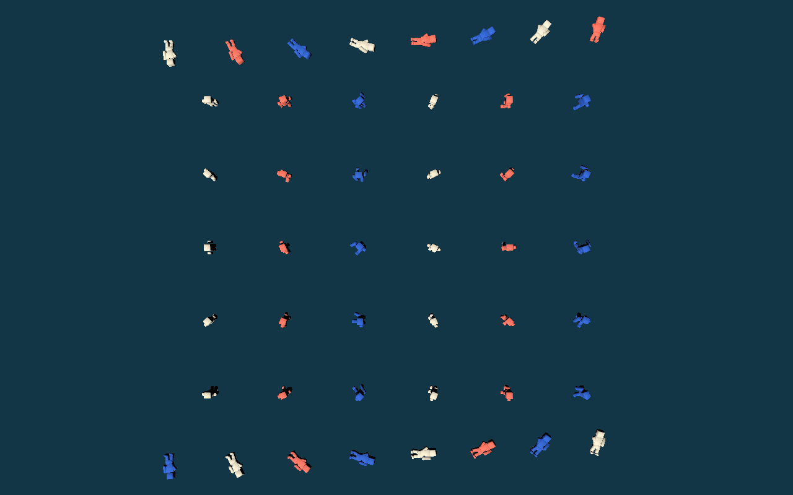

# S13 — character rig, animation and crowd rendering cost

> **Historical run instructions.** Commands in this record that target `prototypes/` describe
> the original runnable checkout; they do not run in the current checkout because the archive
> is hidden by `.gdignore`. Follow the
> [restore-from-Git procedure](../../prototypes/README.md) at pre-cleanup commit
> `66400c26a01bf917dfe631af4762c2b444d9c48f`, then drop the `prototypes/<group>/`
> prefix from every listed archived path before running it. For example,
> `res://prototypes/s02/tests/fixtures/s02/corner.tscn` becomes
> `res://tests/fixtures/s02/corner.tscn`.

9 October 2026. The S13 character foundation workstream owns this research,
technical blockout and measurement. **Decision proposal:** use one shared skinned
humanoid rig with linked mesh/animation data, wrapper-owned palette or compatible
mesh variants, direct `AnimationPlayer` hard-state playback for M1, frozen animated
death poses, and presentation-only off-screen animation throttling. Add an
`AnimationTree` only when production locomotion blending demonstrates that need.
Do not adopt VAT/MultiMesh or ragdolls for the M1 population without a new measured
constraint.

This is a foundation proposal and technical blockout, not production art or an M1
performance gate. Results were collected under substantial desktop contention and
are labelled accordingly.

## Question and constraints

Can a single chunky humanoid rig provide imported `idle`, `walk`, `run` and `death`
coverage, three readable palette variants and the M1 worst-case presentation count
of 64 pedestrians + 4 players + 16 corpses without requiring a crowd-specific render
pipeline?

The fixture uses the accepted fixed north-up camera at 47 m and 42° FOV, Forward+,
1280×800 and a 60 FPS cap. It deliberately contains 68 live presentations, about 30
inside the camera frustum, 38 outside it and 16 visible final-pose corpses. It does
not include AI, physics, collision, traffic, combat, networking, city geometry or
four-player replication. Consequently it cannot close the design budget of host
physics/simulation p95 <= 4 ms and p99 <= 8 ms, nor the integrated 60 FPS target.

## Research

| Source | Relevant current practice / constraint |
| --- | --- |
| [Godot AnimationPlayer](https://docs.godotengine.org/en/latest/classes/class_animationplayer.html) and [AnimationMixer](https://docs.godotengine.org/en/latest/classes/class_animationmixer.html) | `AnimationPlayer` is an `AnimationMixer`; process/callback modes and explicit `advance()` permit normal or manually scheduled presentation updates. Method/audio/discrete callbacks require care during seeks and replay. |
| [Godot AnimationTree](https://docs.godotengine.org/en/latest/classes/class_animationtree.html) | `AnimationTree` consumes animations from an `AnimationPlayer` and adds transition/blend graphs. It is appropriate for a real blending requirement, not mandatory merely to select four hard states. |
| [VisibleOnScreenNotifier3D](https://docs.godotengine.org/en/latest/classes/class_visibleonscreennotifier3d.html) | Renderer/camera visibility signals can gate presentation work. The notifier depends on rendering and cannot own simulation, AI, lifecycle or authority. Bounds/culling margins must cover animation. |
| [Skeleton3D](https://docs.godotengine.org/en/latest/classes/class_skeleton3d.html), [Skin](https://docs.godotengine.org/en/latest/classes/class_skin.html), and pinned [`skeleton_storage.cpp`](https://github.com/godotengine/godot/blob/c971f93e7e76b0ef919bf6009e7b868bea04db7f/servers/rendering/renderer_rd/storage_rd/skeleton_storage.cpp) | A shared mesh/skin definition can feed per-instance skeleton pose buffers. The pinned renderer source is implementation evidence for GPU-visible skeleton buffers, not a stable public promise or a separately exposed skinning timer. |
| [Performance](https://docs.godotengine.org/en/latest/classes/class_performance.html) and [RenderingServer](https://docs.godotengine.org/en/latest/classes/class_renderingserver.html) | Public monitors provide process, draw-call, primitive/object and memory data; measured viewport CPU/GPU render times provide renderer totals. They do **not** expose an isolated skinning cost, so differences must be labelled proxies rather than exact attribution. |
| [Godot MultiMesh](https://docs.godotengine.org/en/latest/classes/class_multimesh.html) | MultiMesh reduces draw overhead for many copies of one mesh, but does not provide this per-character skeleton/state/attachment contract. It is a different crowd representation, not a free replacement for skinned actors. |
| [Godot visibility ranges/HLOD](https://docs.godotengine.org/en/latest/tutorials/3d/mesh_lod.html#visibility-ranges-hlod) | Distance-based visual simplification is useful when measured; it changes presentation only and must not change actor collision, AI or authoritative state. |
| [SideFX Labs VAT 3.0](https://www.sidefx.com/docs/houdini/nodes/out/labs--vertex_animation_textures-3.0.html) and [GPU Gems 3 crowd rendering](https://developer.nvidia.com/gpugems/gpugems3/part-i-geometry/chapter-2-rendering-crowds) | Baked vertex/pose data and instancing can scale much larger crowds, at the cost of a separate export/shader/state pipeline, memory, clip/blend constraints and weaker bone-attachment interoperability. That trade is not justified by 68 live actors here. |

The pinned engine is `4.8.dev7.official.c971f93e7`; the project remains on that
version. Links to “latest” class documentation describe the public concepts, while
API use was compiled and exercised against the pin.

## Options and decision proposal

### Animation representation

| Option | Fit for this M1 | Trade-offs | Disposition |
| --- | --- | --- | --- |
| One `AnimationPlayer` per actor, shared imported libraries, hard state changes | Four clips and immediate top-down state readability need no blend graph | Smallest state owner; easy to stop off-screen and freeze death. Abrupt production transitions may look poor. | **Recommend for initial M1 implementation**, then measure/observe. |
| `AnimationTree` state machine/blend spaces per actor | Useful if acceleration, aim overlays or locomotion blending become visible requirements | More saved graph state/evaluation and transition complexity on every actor; still relies on `AnimationPlayer`. | Defer until production motion review identifies a concrete blend. |
| VAT clips + MultiMesh/instanced shader | Can reduce actor/draw overhead at much larger populations | Separate Blender bake/import/shader path; awkward unique attachments, transitions and corpse state; loses normal skeleton API. | Reject for M1 at 68 live actors; retain as an evidence-triggered fallback. |

For update policy, keep visible player/near-pedestrian animation at render cadence.
Set off-screen mixers inactive while continuing simulation normally. A later far,
still-visible tier may set `AnimationMixer` to manual processing and call `advance()`
at a measured cadence (for example 15–30 Hz), but only after phase continuity,
transition callbacks, camera-edge behavior and readability are tested. The prototype
implements only the simpler off-screen gate; it does not claim far-cadence quality.

### Variants and death

Start palette variation with saved external materials on a shared linked mesh. Add
mesh/outfit variants only when they preserve the same rest pose, skin, bone names,
clip and attachment contract. Palette alone is not claimed sufficient for final
player/pedestrian readability.

Use the authored one-shot death clip and freeze its final pose. The dead presentation
then has no ongoing mixer work. Ragdolls would introduce extra bodies/constraints,
network/lifecycle questions, unstable top-down silhouettes and substantially wider
validation; they are out of M1 unless the owner explicitly changes the death policy.

## Prototype

The [asset handoff](../assets/s13_humanoid.md) maps source, export and consumers.
The blockout is original project work authored through the committed
`prototypes/s13/tools/s13/author_humanoid.py` in Blender 5.2.2 LTS. Normal re-export opens the
committed `.blend` and runs `export_humanoid.py`. The result is one 1.8 m linked GLB
with 297 vertices, 396 triangles, seven bones, one material surface and four imported
actions. Scratch re-export is byte-identical to the committed GLB and contains no
images or extensions.

The editor was unavailable, as declared in the lane brief. The fixture therefore
used the permitted direct-file fallback: the authoring script generated the repetitive
saved crowd composition; minimal `.tscn`/`.tres` resources were loaded/resaved and
then exercised through isolated pinned-engine imports. No runtime script constructs
nodes or render geometry.

- `character.tscn` instances the GLB at
  `PresentationAnchor/Visuals/Model`, applies one of three saved palette materials,
  exposes clip/detail APIs, and owns a `VisibleOnScreenNotifier3D` with humanoid bounds.
- `crowd.tscn` saves all 84 instances, camera, lighting and environment. Runtime only
  chooses the live clip and full/throttled update policy; 16 corpses seek to the
  final death pose and remain inactive.
- Full mode updates all 68 live mixers. Throttled mode updates the 30 saved/in-frustum
  live mixers and deactivates 38 off-screen mixers. Simulation is absent and therefore
  cannot accidentally be gated by the notifier.
- `benchmark.gd` validates population, clips, bones and triangle ceiling through the
  wrapper API, then records public engine monitors. `prototypes/s13/tools/s13/run.py` stages an
  addon-free external project, imports once, runs bounded owned children and retains
  logs/JSON. It never kills unrelated Godot processes.



The image is an actual Forward+ fixture capture with 30 live animated characters and
16 frozen corpses in view. It demonstrates technical placement/palette/pose output,
not production readability or animation quality.

## Measurements

Complete compact results are in [`s13-evidence/results.json`](s13-evidence/results.json).
The receipt applies to its recorded revision `741646a`; it does not claim that later
runner or project-setting bytes are equivalent to that measured tree. The staged S13
fixture, model, and palette inputs remained unchanged in the reviewed base advance,
but that scoped observation is not a new final-tree measurement.

Each mode ran three times after a five-second warmup, for ten measured seconds per
run. Every pre-run `tasklist` sample found **6–13 other Godot processes** and one-second
CIM CPU snapshots ranged **1–87%**. All timings are therefore **contended upper
bounds**. A quiet remeasurement
must replace them before using tails as target acceptance.

Graphical environment: Windows 11, Forward+, D3D12, NVIDIA GeForce RTX 4070 Laptop
GPU, 1280×800, VSync enabled and `Engine.max_fps = 60`.

| Graphical mode | Frame ms median / p95 / p99 / worst | Viewport CPU median / p95 / p99 | Viewport GPU median / p95 / p99 | Draw calls / primitives |
| --- | --- | --- | --- | --- |
| Full, 68 active | 16.666 / 17.050 / 461.269 / 514.104 | 0.610 / 1.077 / 1.256 | 0.369 / 1.572 / 1.848 | 163 / 64,548 |
| Throttled, 30 active | 16.666 / 16.906 / 450.507 / 504.307 | 0.578 / 1.058 / 1.229 | 0.304 / 1.594 / 1.775 | 163 / 64,548 |

The frame p95 stayed near the cap, but p99 was dominated by roughly 0.5 s contention
hitches in both modes. This is **not sustained-60 acceptance**. GPU and
draw counts did not improve because the same 30 live + 16 dead presentations were
visible in both modes; off-screen animation throttling targets CPU mixer work, not
visible draw work. The small cross-mode renderer differences are within differently
contended runs and do not isolate skinning.

`Performance.TIME_PROCESS` is a coarse monitor whose hitch value persisted across
multiple samples in graphical runs, so its graphical p95 is not treated as an
animation cost. The bounded headless comparison is the useful process proxy:

| Headless mode | Frame ms median / p95 / p99 | Process ms median / p95 / p99 | Active mixers |
| --- | --- | --- | ---: |
| Full | 8.278 / 16.256 / 21.347 | 5.896 / 25.536 / 225.378 | 68 |
| Throttled | 8.056 / 16.190 / 18.117 | 3.781 / 11.260 / 13.036 | 30 |

The aggregate median process proxy fell **2.115 ms (35.9%)** when 38 mixers were
inactive. Run-to-run CPU load was not paired and the full-mode p99 includes a 225.378
ms contention sample, so this supports the direction but does not prove a stable or
pure animation-only saving. Godot exposes no dedicated skinning timer; viewport GPU
is the combined renderer total. The fixture ended at 847 nodes and about 96.3 MB of
reported video memory, neither of which is an incremental/resident asset measurement.

## Proven, inferred and not proven

Proven for this bounded fixture:

- Blender source -> explicit linked GLB -> saved wrapper/crowd path, with byte-identical
  re-export, exact action names, exact technical bones, no embedded image/extension
  and no generated/copied Godot render mesh;
- one 396-triangle shared-rig blockout can expose all four clips and three palette
  variants through the saved wrapper API;
- 68 live + 16 dead instances load and run in isolated pinned-engine processes;
- off-screen detail mode changes active mixer count from 68 to 30 while final-pose
  corpses remain inactive; and
- public frame/render/process/draw monitors and actual screenshot capture work in a
  bounded three-repeat Windows runner.

Supported inference: mixer deactivation is likely worthwhile for this population,
because the contended headless median proxy decreased. It is not isolated proof of
per-character animation or GPU skinning cost.

Not proven: production mesh/rig/motion quality, local-player or remote-player
readability, weapon attachments, animation blending/root-motion policy beyond this
hard-state wrapper, animated bounds at every production pose, AI/simulation/network
cost, integrated city/effects/traffic load, bandwidth, Linux, exports, Steam Deck,
LCD/OLED readability, ragdoll or VAT suitability, final LOD/material strategy, quiet
p99/worst timing, or any M1/production acceptance gate.

## M1 production requirements

1. Keep gameplay state, movement, health, authority and AI independent of animation
   visibility/detail. Presentation consumes state and never emits authoritative hits,
   movement or death outcomes.
2. Establish the production shared rig once: bone hierarchy/rest pose, skin influence
   limit, weapon/attachment bones and sockets, clip naming, animated bounds and LOD
   compatibility. Validate every player/pedestrian mesh variant against it.
3. Author production `idle`, `walk`, `run` and one-shot `death` in place. Save reviewed
   loop metadata/seams for locomotion and retain the death final pose. Suppress method,
   audio and effect callbacks during prediction/replay or manual presentation seeks.
4. Start with direct `AnimationPlayer` state selection. Introduce `AnimationTree`
   blending only with a named visual requirement and remeasure the full population.
5. Keep visible local/near actors at render cadence. Gate only presentation off-screen;
   use conservative animated bounds/culling margins and test camera-edge churn. Any far
   manual cadence must retain phase, final poses and callback rules.
6. Use external palette materials first; use compatible mesh/outfit variants for
   silhouette readability. Review local player, three pedestrians and remote players
   at the actual 42°/47 m camera in motion and death states.
7. Use frozen animated corpses for M1. Do not add ragdoll physics/network state without
   a separate product decision and population/lifecycle measurement.
8. Re-run at 64 pedestrians + 4 players + 16 dead inside the integrated city with AI,
   chains, traffic, shadows, weapons/HUD and real multiplayer roles. Record host/client
   frame, simulation, renderer, memory and bandwidth budgets separately.
9. Run a quiet Windows pass and a Linux desktop pass on the pinned engine. Steam Deck
   remains later per the owner decision; desktop evidence cannot accept Deck targets.
10. Retain Blender source, explicit GLB, import metadata, rig/clip/material compatibility
    checks and affected wrapper/world review in every source change.

## Reproduction

From the repository root, with the pinned tools on `PATH`, this **one command**
reproduces the complete graphical + headless timing comparison and writes JSON to a
fresh external directory:

```sh
timeout 900 python prototypes/s13/tools/s13/run.py \
  --output C:/tmp/ft/lanes/s13-characters/<fresh> \
  --warmup 5 --duration 10 --repeats 3
```

The runner itself verifies exact Godot version, stages/imports the saved closure,
uses per-child user directories and deadlines, records process count/CPU load before
each run, and reaps only its children. Re-export separately with
`timeout 180 python prototypes/s13/tools/s13/reexport.py --output <fresh-external-dir>`.

No owner decision blocks this technical recommendation. Production still requires
human art/readability acceptance and selection of the local/remote player identity
treatment; this spike deliberately does not make those product choices.
