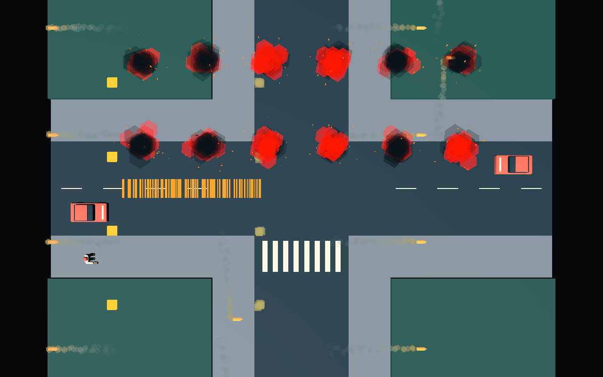
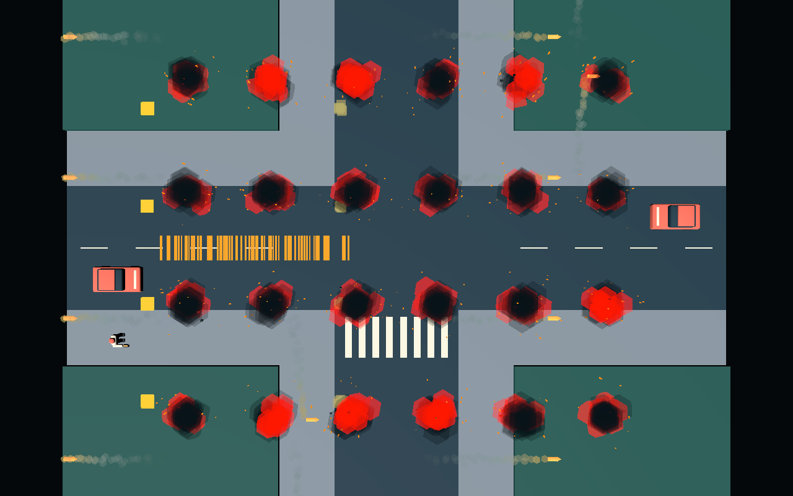

# S15 — weapon and explosion VFX cost foundation

9 October 2026. Foundation spike, not M1 performance acceptance. The owner requires every
explosion to receive an effect; this record does not reintroduce an on-screen effect cap.

## Question and constraints

What saved VFX composition gives muzzle, impact, tracer, rocket-trail, explosion, smoke,
sparks, and bounded cosmetic-debris feedback without making the 60 FPS target implausible?
The relevant stress load is 12 and 24 simultaneous explosions, four continuous SMG shooters,
and 16 rocket trails over a city-like view. The current target is desktop Forward+ at
1280×800. Deck is a later, separate renderer/device comparison.

The fixed top-down 42° perspective camera makes broad smoke cards overlap much of the same
screen area. Alpha blending and fragment work can therefore matter more than the modest world
volume suggests. Effects are presentation only: they cannot own damage, hit, or replication
outcomes.

## Research

Primary sources, read against the pinned `4.8.dev7` API:

- Godot's [GPUParticles3D class](https://docs.godotengine.org/en/latest/classes/class_gpuparticles3d.html)
  exposes GPU simulation, `amount_ratio`, one-shot/restart behavior, fixed FPS, visibility
  bounds, draw passes, and renderer-dependent trails. The pinned implementation is
  [`gpu_particles_3d.cpp`](https://github.com/godotengine/godot/blob/c971f93e7e76b0ef919bf6009e7b868bea04db7f/scene/3d/gpu_particles_3d.cpp).
- [CPUParticles3D](https://docs.godotengine.org/en/latest/classes/class_cpuparticles3d.html)
  is the CPU alternative and supports conversion from GPU particles, but does not make GPU
  particle load disappear for free: work moves onto the CPU and feature parity is incomplete.
  That is a poor default while the host's 60 Hz simulation, AI, and chains share a strict CPU
  budget.
- Godot's [3D particle tutorial](https://docs.godotengine.org/en/latest/tutorials/3d/particles/index.html)
  recommends authored process materials and documents draw-pass meshes, emission, and bounds.
  [Particle trails](https://docs.godotengine.org/en/latest/tutorials/3d/particles/trails.html)
  document the Forward+-specific ribbon path and the mesh requirements it adds.
- The [renderer comparison](https://docs.godotengine.org/en/latest/tutorials/rendering/renderers.html)
  distinguishes Forward+, Mobile, and Compatibility. Mobile remains GPU-based but trades
  features and rendering paths for simpler hardware. A Mobile desktop run is not a Deck result;
  production must compare the exact selected renderer on the device.
- Godot's [GPU optimization guide](https://docs.godotengine.org/en/latest/tutorials/performance/gpu_optimization.html)
  calls out transparency and overdraw as expensive, especially where transparent geometry
  layers cover the same pixels. It also recommends reducing geometry/material/state cost and
  measuring on target hardware.
- [Decal](https://docs.godotengine.org/en/latest/classes/class_decal.html) is a renderer feature,
  not a gameplay record. Its projection/culling limitations and renderer availability make a
  small recycled scorch pool preferable to unbounded persistent marks.
- Valve's [Steam Deck performance guidance](https://partner.steamgames.com/doc/steamdeck/perf)
  reinforces device testing and frame-time analysis rather than inferring Deck behavior from a
  faster Windows laptop.

### Options

| Option | Strengths | Costs and M1 fit |
| --- | --- | --- |
| Layered `GPUParticles3D`, low-poly opaque meshes for solid lobes/sparks/debris, limited transparent particles for smoke/flash | GPU simulation, saved reusable layers, low CPU submission, all explosions retain visible feedback; common Forward+/Mobile foundation | Each emitter still adds an object/draw submission. Transparent smoke accumulates overdraw. Renderer/device differences still require measurement. **Recommended.** |
| Mostly flipbook billboard particles | Very low vertex count, atlas animation can produce authored shape changes, easy distance LOD | Broad top-down cards can shade many pixels repeatedly; sorting/blending artifacts and texture memory; needs authored atlas/source work absent from this technical spike. Use selectively for smoke/flash, not as the only effect representation. |
| `CPUParticles3D` default or fallback | Works without GPU compute paths and is easy to inspect | Moves simulation into the CPU budget shared with host gameplay and AI, with feature differences. Keep only as a Compatibility-renderer contingency, not the Forward+/Mobile quality tier. |

The production direction should mix opaque low-poly meshes for fire lobes, sparks, and debris
with a small number of soft transparent smoke/flash particles. Use a flipbook atlas only where
it replaces several overlapping cards with one authored animation. Do not switch all effects to
CPU particles for Deck without device evidence.

## Decision proposal

1. Use saved, restartable `GPUParticles3D` assemblies. Pool/restart one-shot roots rather than
   rebuilding node hierarchies per event.
2. Give every explosion a root and a visible fire/smoke/spark/debris response. At more than 12
   active explosions, select a reduced tier for each new and still-active explosion instead of
   dropping any event. This needs owner confirmation as the intended meaning of “every
   explosion gets its effect.”
3. Prefer opaque low-poly fire/spark/debris geometry. Keep smoke particles few, short, separated,
   and visually porous. The 24-full capture is already too opaque at the centre of several
   bursts.
4. Use emitted trail puffs as the renderer-common baseline. A Forward+-only ribbon trail may be
   an optional desktop tier, not the sole rocket feedback before the Mobile/Deck comparison.
5. Pool short-lived roots. Size the normal pool from peak lifetime × observed event rate, allow
   overflow saved-scene instances, and immediately select the minimum tier during overflow.
   Pool exhaustion cannot suppress an explosion.
6. Treat scorch decals separately: show the immediate blast regardless, retain at most 32 nearby
   marks for a proposed 10 seconds, and recycle oldest/farthest marks. Decals never represent
   authoritative damage or persistent world state.

## Prototype

[`tests/fixtures/s15/`](../../tests/fixtures/s15/) contains saved scenes for:

- one four-layer explosion: 12 fire + 16 smoke + 24 sparks + 10 debris (`62` configured
  particles, four emitters) at full quality;
- muzzle flash (6), tracer stream (24), impact puff (8), and rocket trail (32);
- a saved shooter assembly and rocket-with-trail assembly;
- a saved stress scene with 24 explosion instances, four shooters, 16 rockets, and a read-only
  instance of the S06 intersection through `static_backdrop.tscn`;
- public root APIs for trigger/quality/active state and a headless saved-composition check.

Visible draw geometry is source-linked rather than embedded in those scenes. The committed shared
Blender 5.2 source, nine explicit GLB exports, import sidecars, geometry dimensions, consumer map,
and re-export procedure are recorded in the
[`s15_vfx` technical handoff](../assets/s15_vfx.md). Each particle fixture assigns the imported
mesh resource to its draw pass while retaining wrapper-owned material/process settings.

The stress coordinator selects 12 or 24 active explosion roots. Its experimental adaptive tier
uses `amount_ratio = 0.5` on all four layers, with a minimum of one particle per layer. It does
not hide, omit, queue, or replace an explosion. Explosions retrigger together every two seconds;
shooters pulse at 10 Hz; rockets continuously move and wrap without collision or damage.

The editor was unavailable, so the scenes were hand-authored as the brief permits, imported with
the pinned engine, then loaded and resaved with `ResourceSaver` to establish engine UIDs and
normal serialization. Blender authored the visible technical geometry through a reproducible
script and explicit collection exports. The full authoring project emitted its already-known
development-plugin shutdown diagnostics; those are not treated as validation. The addon-free
staged project then imported without diagnostics, and the public saved-scene check passed.

[`tools/s15/run.py`](../../tools/s15/run.py) stages only the saved fixture closure and linked S02,
S04, S06, and S15 model imports into a fresh external project. It rejects dirty scoped inputs, checks
the exact engine pin, imports, runs the headless public-API check, and runs this fixed matrix three
times each:

- 12 explosions, full (`1,408` configured particle capacity including weapons/rockets);
- 24 explosions, full (`2,152` capacity);
- 24 explosions, adaptive (`1,408` capacity, no dropped roots).

Each case is a real 1280×800 window with VSync enabled and `Engine.max_fps = 60`. Five seconds of
warmup precede 20 measured seconds. Per drawn frame it retains interval, measured render CPU/GPU,
process/physics time, draw calls, primitives, objects, and video memory. The runner also records
ambient Godot-process count and a short total-CPU sample before each repetition, uses bounded
owned-child cleanup, and never runs uncapped.

Reproduction (fresh output path required):

```sh
export PATH="$(dirname "$(mise -C C:/GameDev/git/fun-things which godot)"):$PATH"
timeout 600s python tools/s15/run.py \
  --godot "$(mise -C C:/GameDev/git/fun-things which godot)" \
  --output C:/tmp/ft/lanes/s15-vfx/measurement-repro \
  --warmup 5 --duration 20 --repeats 3
```

## Results

Hardware: Windows 11 `10.0.26200`, NVIDIA GeForce RTX 4070 Laptop GPU, D3D12 12_0,
Forward+, pinned `4.8.dev7.official.c971f93e7`. All nine accepted cases exited 0 with no engine
or script diagnostics. Import and the saved public-API check passed. The source-bound compact
receipt is [`measurement-summary.json`](s15-evidence/measurement-summary.json); complete raw
case receipts remain outside the repository at
`C:/tmp/ft/lanes/s15-vfx/measurement-review1-postbase/`. This run followed the required rebase and
is source-bound directly to the fixture, project settings, linked models, and runner revision
recorded in the receipt.

These are **contended upper bounds**, not quiet capacity results. The runner counted 2–9
Godot-named processes present before cases, and sampled 23.12–54.76% total CPU load. Two earlier attempts
at 11 Godot processes/50.16% CPU and 7 processes/53.74% CPU failed before timing results when
D3D12 pipeline creation returned `0x8007000e`; the concise retained receipt is
[`failed-contended-run.json`](s15-evidence/failed-contended-run.json). They are environment-failure
evidence, not accepted measurements.

### Three-repeat aggregate

Each cell is **median across the three repetition-specific percentile values / worst repetition**.
Times are milliseconds.

| Load | Particle capacity | Frame p50 | Frame p95 | Frame p99 | Render CPU p95 | Render GPU p95 | Draw calls p50 |
| --- | ---: | ---: | ---: | ---: | ---: | ---: | ---: |
| 12 full | 1,408 | 16.664 / 16.683 | 18.002 / 18.284 | 18.787 / 18.916 | 1.215 / 1.376 | 1.756 / 1.756 | 128 / 128 |
| 24 full | 2,152 | 16.664 / 16.686 | 18.445 / 18.482 | 19.621 / 19.797 | 1.324 / 1.429 | 1.735 / 1.843 | 176 / 176 |
| 24 adaptive | 1,408 | 16.671 / 16.697 | 17.885 / 19.147 | 18.585 / 20.243 | 1.283 / 1.908 | 1.673 / 1.701 | 176 / 176 |

Measured render p50/p95/p99 medians were:

| Load | Render CPU p50 / p95 / p99 | Render GPU p50 / p95 / p99 |
| --- | ---: | ---: |
| 12 full | 0.766 / 1.215 / 1.359 | 1.524 / 1.756 / 1.784 |
| 24 full | 0.840 / 1.324 / 1.607 | 1.495 / 1.735 / 1.788 |
| 24 adaptive | 0.803 / 1.283 / 1.480 | 1.476 / 1.673 / 1.714 |

The first matrix load, 12 full, had one frame over 33.4 ms in its first repetition and none in
its latter two, with mean rates 59.99–60.00 FPS. The fixed run order and external contention
remain confounders. Likewise, 24 full had one long frame in its first repetition and none in its
latter two, with mean 59.95–60.01 FPS. All three 24-adaptive repetitions had zero long frames and
mean 60.00–60.01 FPS. During the long intervals,
Godot's measured render CPU/GPU values stayed low. OS scheduling, presentation, pipeline
preparation, and competing Godot windows therefore remain live confounders. **This run does not
accept or disprove the 60 FPS target.** A quiet, order-balanced exported-build pass is required.

The median p50 primitive/object observations were 25,570/145 for 12 full and 37,186/193 for both
24-root loads. The source-authored low-poly meshes reduce submitted primitives compared with the
superseded engine-primitive carrier, but the runs differ in content and environment, so timing
changes are not attributed to geometry alone. Adaptive retained 176 draw calls because all 24
effect roots and their emitters remain. The primitive monitor also did not change, so this experiment
does not prove that `amount_ratio` reduces submitted geometry or cost on this path. The GPU-time
difference between 24 full and adaptive is confounded by order and contention and cannot be
claimed as a production win.

### Drawn and overdraw observations





Both are actual viewport captures. Twelve full bursts remain individually locatable, although
several smoke layers already accumulate into near-black centres. At 24 full, adjacent transparent
smoke/fire lobes cover a substantial fraction of road and sidewalk pixels and obscure local
background detail. The top-down view makes that overlap conspicuous. Tracer lines are readable,
but four 10 Hz streams become a dense band; production tracers should represent bullets
selectively while preserving firing cadence through muzzle/audio feedback.

The images prove drawability and composition only. They are not readability approval, production
art, overdraw heatmaps, or evidence that every actor/target remains legible during gameplay.
No flipbook texture was authored. The committed Blender-source low-poly shapes and untextured
cards follow the source-asset workflow, but remain technical cost carriers rather than production
art.

## Proposed per-effect budgets

These are M1 starting budgets to validate, not accepted capacity limits:

| Effect | Full near tier | Reduced/congested tier | Lifetime / notes |
| --- | --- | --- | --- |
| Explosion | 4 emitters, 62 configured particles: 12 fire, 16 smoke, 24 sparks, 10 debris | Keep all 4 layers; at most 6/8/12/5 (31 total), then a minimum tier of at least one visible fire and smoke lobe plus spark/debris response | Fire 0.45 s, sparks 0.75 s, debris 1.2 s, smoke 1.6 s; no gameplay collision |
| Muzzle flash | 1 emitter, 6 particles | 1 authored flash card/mesh | 0.12 s; pulse on visual shot feedback |
| Tracer | At most 24 live particles per shooter in this stress carrier | Prefer one mesh/flipbook tracer for selected bullets rather than every simulated round | Prototype lifetime 0.45 s; production cadence is presentation policy |
| Impact puff | 1 emitter, 8 particles | 4 particles | 0.45 s; no authoritative hit logic |
| Rocket trail | 1 emitter, 32 puffs per rocket | 16 puffs, then 8 at distance | 0.7 s; emitted-puff baseline works without Forward+-only ribbons |
| Scorch | Proposed 32 nearby pooled decals | Recycle oldest/farthest; never suppress the immediate explosion | Proposed 10 s; cosmetic, nonpersistent |

For the integrated M1 scene, reserve no more than four emitters per normal explosion and one per
other effect family until a representative quiet/device run justifies more. Count draw objects as
well as particles: halving particle emission did not halve the 24-root draw-call count. Prefer
combining layers or an authored flipbook when draw submission, not fill rate, is dominant.

## What is proven

- All requested feedback families have reusable saved technical scenes and true UID sidecars.
- The saved stress composition contains exactly 24 explosions, four shooters, and 16 rockets over
  the linked S06 intersection; a public-API check asserts those counts.
- Twelve/full, 24/full, and 24/adaptive all drew source-linked meshes and completed three bounded
  Forward+ repetitions under desktop contention without runner diagnostics in the accepted run.
- The prototype never drops an active explosion root. Its adaptive tier retains every layer.
- Configured capacities, renderer counters, per-frame distributions, contention snapshots, and
  two actual captures are reproducible and retained.

## What is not proven

- Sustained 60 FPS, quiet desktop headroom, integrated host simulation/AI performance, exported
  build behavior, or any Deck/Mobile result.
- Causal VFX responsibility for the 0.45–0.53 second presentation stalls. Reported render CPU/GPU
  counters stayed low during them.
- That `amount_ratio` produces a useful cost reduction. Draw calls were unchanged, primitive
  counts barely moved, and renderer timing differences are within noisy contention.
- Production visuals, flipbook assets, alpha-overdraw heatmaps, effect readability during real
  gameplay, lighting/bloom tuning, or scorch-decals performance.
- A safe maximum event rate. The owner policy forbids cosmetic drops, so adversarial burst rates
  need a minimum-tier and overflow-allocation policy rather than a fixed hard cap.
- Mobile renderer feature/performance parity. Built-in ribbon trails, decals, and particle
  behavior must be checked against the selected renderer and exact target device.

## M1 production requirements

1. Keep VFX downstream of authoritative events; effect code cannot decide damage, hits, chain
   timing, rocket collision, or replication.
2. Author production effects as saved scenes with source-linked art/atlases. Keep all runtime
   spawning at saved-scene boundaries and expose small trigger/quality/reset APIs.
3. Implement full, reduced, and minimum tiers using actual lower-count resources or emitter
   amounts selected before emission; do not assume this spike's `amount_ratio` reduces GPU work.
4. Preserve one effect root per explosion. Tier by simultaneous active count, projected screen
   size, and visibility; never silently drop a visible explosion because a pool is full.
5. Prewarm shader/pipeline variants and pool normal one-shot demand. Permit bounded-lifetime
   overflow instances and recycle only after completion.
6. Minimize transparent screen coverage: porous smoke, short lifetimes, limited overlapping
   layers, opaque fire/debris where acceptable, and no dense full-screen smoke sheet.
7. Give every particle system authored visibility bounds and verify culling through the real
   camera route. Distance/visibility LOD may simplify work but cannot change gameplay state.
8. Bound debris per explosion and keep it non-colliding/non-networked. Pool scorch decals
   independently from immediate effects and document their lifetime/eviction rule.
9. Run a quiet Windows exported-build matrix, then the same representative matrix on Linux and
   the selected Deck renderer/device. Record GPU/CPU frame time, presentation intervals,
   draw calls, primitives, overdraw captures, memory, thermals/power where available, and host
   simulation time together.
10. Test 12/24 bursts inside the representative population and chain workload, not only this
    two-sector visual carrier. Keep the M1 host p95/p99 simulation budget separate from render
    and presentation timing.

## Open owner question

Does “every explosion gets its effect” explicitly permit the proposed full → reduced → minimum
visual tiers when more than 12 explosions overlap, provided every event still creates a visible
root with fire, smoke, spark, and bounded-debris feedback? This spike assumes yes only as a
proposal; production policy needs Regner's confirmation.
