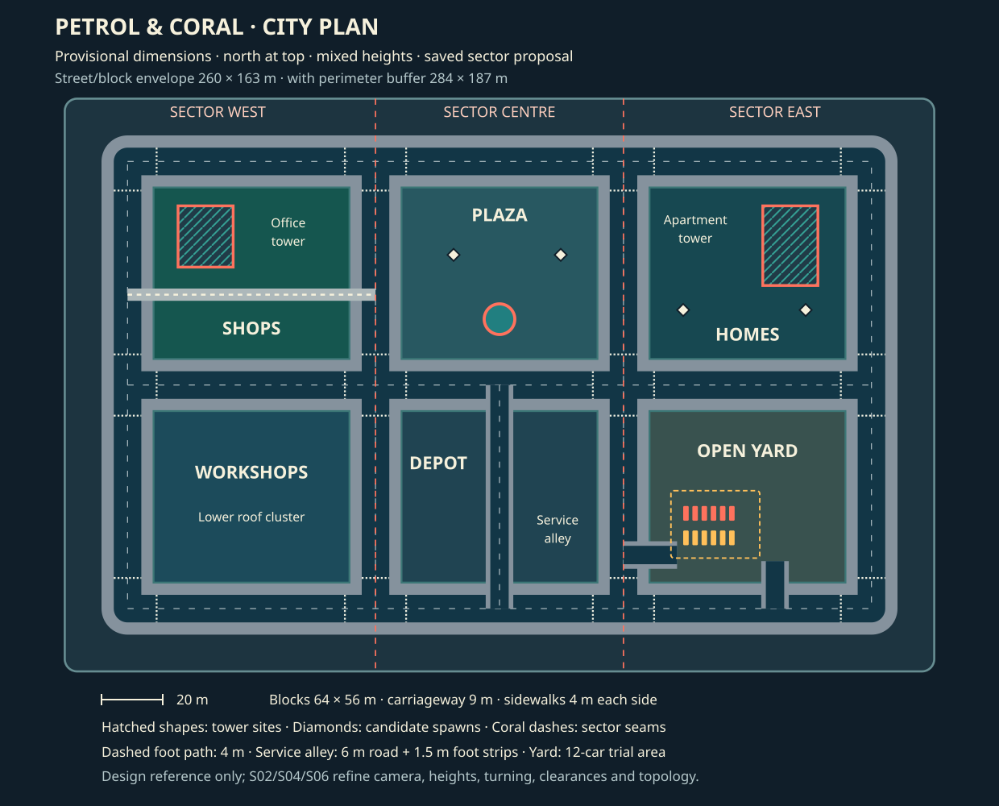

# P0-04 — city layout for review

Status, 7 October 2026: accepted starting district brief for Petrol & Coral.
Regner accepted the combined concepts as sufficient to continue, including the
mixed-height city and vertically downward perspective camera. Codex owns the
layout record. This acceptance closes P0-04's concept round; subsequent proofs
refine the design without treating the reference plan as finished authored placement.
Dimensions are initial design targets for S02/S04/S06 and P0-GATE, not validated
movement, collision or performance results.

[See the whole concept set](concepts/p0-04/review.html).

## District character and routes

Six blocks in a three-by-two arrangement, with a connected perimeter driving
loop and internal streets that form shorter alternatives. West: shops with an
office tower and a low workshop cluster. Centre: open landmark plaza and depot.
East: housing with an apartment tower and an open repair/stunt yard. These are
exterior themes; no missions, building interiors or new civilian systems.

A four-metre foot passage crosses the shops. A six-metre service alley through
the depot, with narrower foot strips, gives a possible car escape as well as a
walking route. The yard has two street entrances and room for a provisional
12-car chain-test arrangement. Blast spacing is an S05 outcome; the depicted cars
do not prove a chain. Stunt geometry and safe landing space need S04 evidence.

The road graph has no intended dead ends: the outer loop, inner cross-links and
service alley connect. The yard must also allow entry and exit when one entrance
is blocked. Keep alternate pedestrian exits from the plaza and spawn recesses.

## Provisional measurements

| Element | Initial design target / owner of refinement |
| --- | --- |
| Street-and-block envelope | 260 × 163 m, comprising three 64 m block widths plus four 17 m street corridors, and two 56 m block depths plus three corridors |
| Perimeter buffer | 12 m each side; total reference envelope 284 × 187 m |
| Individual block lot | 64 × 56 m, available for buildings, yards, recesses and passages |
| Ordinary street | 9 m two-way carriageway with 4 m sidewalk on each side: 17 m corridor |
| Depot service alley | 6 m carriageway + 1.5 m foot strip on each side: 9 m corridor |
| Shop foot shortcut | 4 m clear corridor; entrances and corner visibility need S02/S06 checks |
| Visual cars | Approximately 3.4 m hatchback and 4.8 m sedan, about 1.8 m wide; S04 owns final bodies, turning and interaction clearances |
| Visual people | Approximately 1.8 m tall, 0.75 m shoulder breadth; S02 owns actor/collision/aim envelope |
| Low-rise height | Approximately 4–9 m; roof shape/readability is a camera question |
| Office/apartment height | Starting ranges 36–50 m / 48–65 m; include a fixture extending above camera height |
| Camera fixture | Start around 47 m above street with 50° vertical field of view, 8:5 framing, fixed yaw and vertical downward perspective; S02 refines this, including on-foot/car differences |

The camera starting values imply approximately a 70 × 44 m ground view on a flat
street; this is a geometric estimate, not measured framing in the concept PNG.
Ground scale changes with perspective/depth. Towers near/above camera height
need actual near-plane, facade, visibility and follow-motion tests. Do not cap all
buildings below the camera or tilt the camera to avoid that work.

Desktop evidence supplement, 7 October 2026: the 50° row above preserves the
historical starting brief. The [reviewed S02 handoff](spikes/s02.md#reviewed-desktop-handoff)
and [source kit](assets/s02_kit.md) now provide a 47 m/42° provisional desktop
candidate, with 50° retained in the inherited comparison scene and actual 1280×800
captures. This corner/alley checks bounded foot collision/aim outcomes; it does not
validate the six-block layout or final camera/clearance choices. Human feel,
moving-camera/roof/held-weapon readability and physical-key Alt-Tab remain pending;
current native focus revalidation is incomplete, historical passes separate.
Deck input/readability/native 1280×800/60 FPS remain unproved. Subsequent
[accepted S04 technical evidence](spikes/s04.md#accepted-exact-final-disposition)
provides a reproducible collider1.8×1.5×3.4 m/visual1.88×1.54×3.4 m candidate and
flat-track body/contact/brake/reverse outcomes. These are provisional technical
bounds, not final product dimensions or body selection. One-second steering
extent13.609/13.343 m is displacement, not full radius, swept corridor, legal
district turn or grounded exit acceptance. Full turns/exits, slopes/rollover,
car camera/readability, physical keys/focus and Regner controls/feel remain pending;
zero drawn receipts cannot ratify those choices. S04/S06 and P0-GATE still settle
layout interaction envelopes; this result does not accept the six-block routes.

[S07 preparation](spikes/s07.md) owns map/content-capacity, culling and diagnostic
recommendations, with measurements unexecuted and no maximum map size or selected
streaming implementation. S06 retains topology/seams, S08 exact exports/input,
and M1-D3 integrated target acceptance. The six-block scope and provisional
reference dimensions above are unchanged; growth research does not expand M1.

Units are metres. The plan's local reference origin is the northwest outer edge
of the street/sidewalk envelope; +X is east and +Z is south in Godot, with +Y up
and -Z north. These coordinates describe a design reference, not saved identities
or a runtime placement generator.

Street centre lines: X = 8.5, 89.5, 170.5, 251.5 m; Z = 8.5, 81.5, 154.5 m.
Block intervals: X = 17–81, 98–162, 179–243 m; Z = 17–73, 90–146 m.
Curb rounding and exact crossing positions are schematic until movement proofs.

## Sidewalks, spawns and boundaries

Continuous sidewalk bands follow both sides of every street, round corners and
connect through crossings at junctions. Keep decorative props outside the clear
walking corridor. The diagram shows connections rather than approved crossing
geometry or traffic priority. S06 settles route/navigation representation.

Four candidate spawn recesses appear in the plaza and residential block, away from
traffic lanes and the chain yard. A marked candidate is not guaranteed safe:
the authoritative spawn owner must check current threats, clearance, reservations
and bounded retry under P0-02. Tower shadows/overlap must not make spawn control
unreadable. Keep both walking exits and room for multiplayer arrivals.

Low walls, non-enterable frontage and simple perimeter masses define the boundary.
Roads return into the district; no off-map travel is promised. High-rise art is
set back within its block, with original conventional facades. Selected tall
masses create city-canyon moments; lower blocks provide clear breaks and landmarks.
The plan does not establish camera-visible tower expansion/occlusion.

## Saved sectors and derived map

Propose three saved sectors: West, Centre and East, split at X = 89.5 and 170.5 m.
Each contains two block themes; the lines deliberately cross the central junctions
so S06 can prove continuous movement, topology and minimap data across a seam.
Agree road/junction asset ownership at each seam before assembly to avoid duplicate
ground or conflicting lane authorship. Start fully loaded; this is organization,
not a streaming requirement.

Saved Godot scenes own placement. Derived lane, sidewalk, minimap and occlusion
data reference that placement and relevant revisions. This SVG does not become a
second placement writer. The initial road minimap shows connected roads and the
local controlled-entity marker; no new minimap marker commitment here.

## Acceptance still needed

The accepted block mix, high-rise placement, route shape and open-yard proportion
are the starting design. Test actual actors and cars in linked Blender/Godot fixtures:

- Both driving directions and all allowed turns, including service-alley entries.
- Continuous sidewalks/crossings and seam traversal; current minimap agreement.
- Foot facing/aiming, unblocked/blocked car exits and spawn clearance.
- Camera follow beside towers below, near and above camera height; street/target
  visibility, transitions, clipped facades and any documented visual fading.
- Boundary recovery, yard blockage, chain bursts and distant multiplayer views.

Refine with S02/S04/S06 and retain S07 graphical cost evidence. Screenshots do not
certify movement or load. The [initial unmeasured sketch](concepts/p0-04/city-shape.svg)
is retained as comparison; this is the current proposed plan.

## Accepted partial S05 chain evidence and capacity prerequisites

8 October 2026. [Exact754a0b5 partial S05](spikes/s05.md#accepted-exact-final-disposition)
and its [single fixture contract](spikes/s05-contracts.md) provide finite fixed-car
work, not acceptance of the depicted yard/routes or final blast spacing. Saved S05
car/boot/burst reuse unchanged [S04 source imports](assets/s04_kit.md); current wreck
appearance is the neutral car and its original stationary box. Moving contacts,
legal district turns/exits and final clearance remain S04/S06/M1 acceptance.

At provisional four-metre grid spacing/radius4.1 m, one root yields144 target visits,
peak4/tick, normal queue5/completion46 ticks; finite reserved pressure reaches queue12/
completion tick41. Both twelve-car rows reserve8 TOKEN slots/drop4 with hidden visuals
and completed gameplay outcomes. These are finite work separation receipts, not actual
drawn effect cost, sustained capacity, a ratified range or a maximum map/load.
Regner still ratifies blast/obstruction/falloff/delay/order/occupant/wreck policies;
affected spacing/contact rows must rerun after final S02/S04 dimensions.

[S07](spikes/s07.md#accepted-partial-s05-prerequisite-supplement) still needs real S06
seam/topology and actual source-linked drawable effects, named hardware, four separated
player views/processes, residency/lifetime and sustained load. Sentinel death does
not prove admitted-player lifecycle; settled wreck hydration before input with zero
historical tokens does not prove during-chain journal/reset races. Six-block scope,
Regner policy, native LCD/OLED1280×800/60 FPS, standalone/ENet/Steam/Windows/Linux,
input/feel and S05/S07/P0/M1/production gates remain unchanged. No renderer, streaming,
integration or maximum is selected from this result.
